# Design Document 

Authors:
- Fabio Orazio Mirto
- Roberto Sirigu
- Peter Alhachem
- Stefano De Venuto

Date: 25-04-2022

Version: .0

# Contents

- [Design Document](#design-document)
- [Contents](#contents)
- [Instructions](#instructions)
- [High level design](#high-level-design)
- [Low level design](#low-level-design)
  - [Manager Package](#manager-package)
- [Verification traceability matrix](#verification-traceability-matrix)
- [Verification sequence diagrams](#verification-sequence-diagrams)
  - [UC1](#uc1)
    - [Scenario 1.1](#scenario-11)
  - [UC2](#uc2)
    - [Scenario 2.2](#scenario-22)
  - [UC3](#uc3)
    - [Scenario 3.1](#scenario-31)
  - [UC4](#uc4)
    - [Scenario 4.1](#scenario-41)
  - [UC5](#uc5)
    - [Scenario 5.1.1](#scenario-511)
    - [Scenario 5.2.3](#scenario-523)
    - [Scenario 5.3.1](#scenario-531)
  - [UC6](#uc6)
    - [Scenario 6.1](#scenario-61)
  - [UC7](#uc7)
    - [Scenario 7.1](#scenario-71)
  - [UC9](#uc9)
    - [Scenario 9.2](#scenario-92)
  - [UC10](#uc10)
    - [Scenario 10.1](#scenario-101)
  - [UC11](#uc11)
    - [Scenario 11.1](#scenario-111)
  - [UC12](#uc12)
    - [Scenario 12.3](#scenario-123)

# Instructions

The design must satisfy the Official Requirements document, notably functional and non functional requirements, and be consistent with the APIs

# High level design 

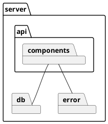
The architetural pattern choosed is MVC + 3 tier.<br>
# Low level design

To make the diagram more readable, every component will be presented separated from the rest.

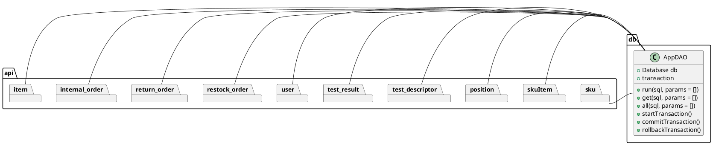

### User Component

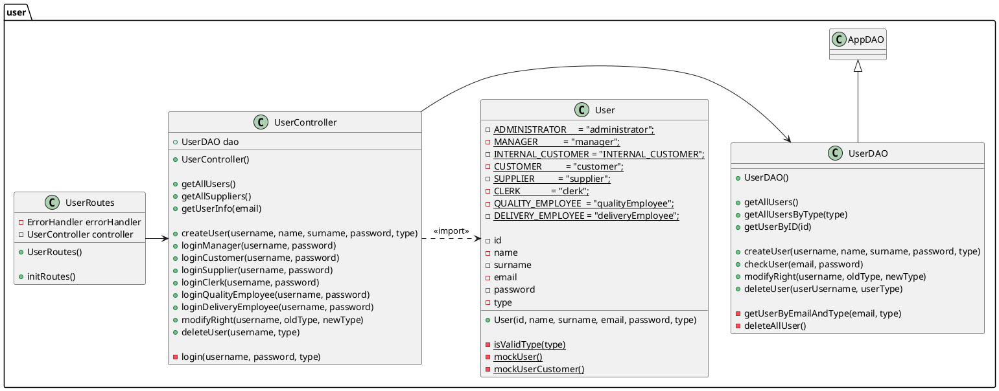

### Sku Component

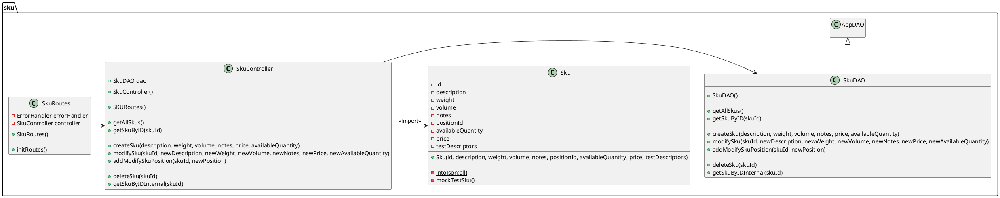

### Sku Item Component

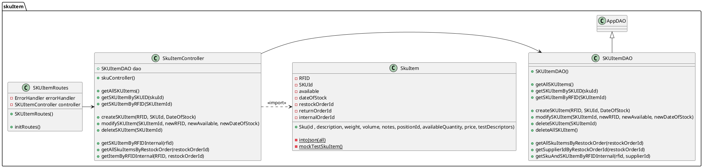

### Position Component

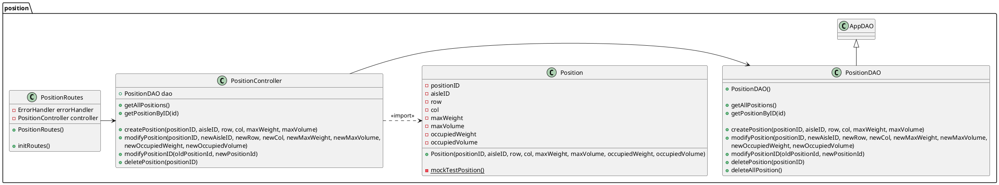

### Test Descriptor Component

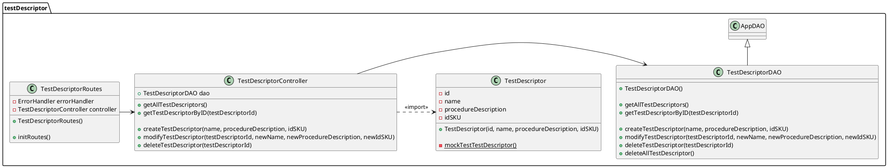

### Test Result Component
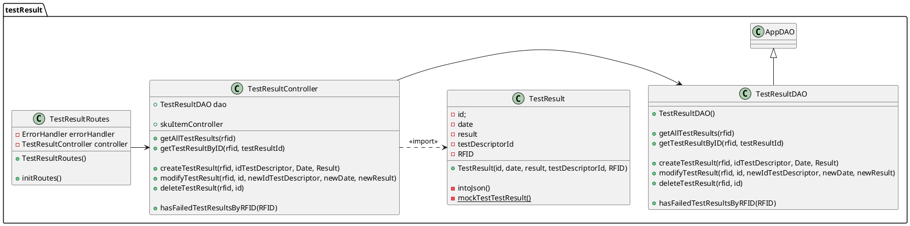

### Restock Order Component

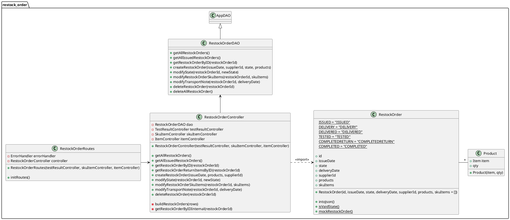

### Return Order Component

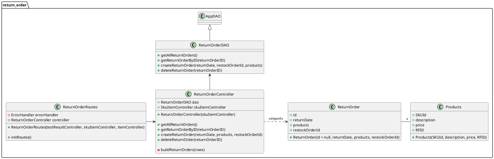

### Internal Order Component

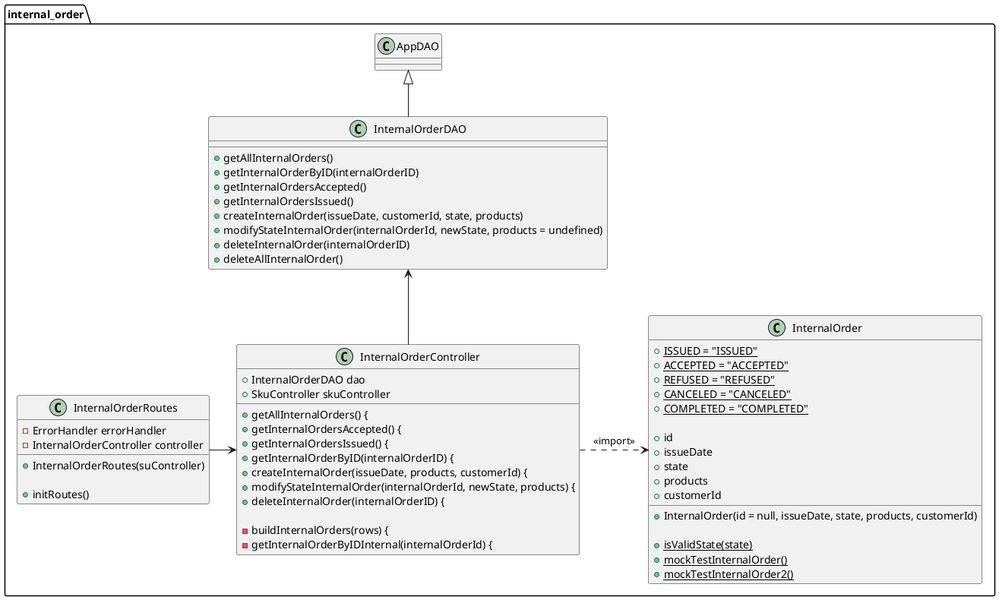

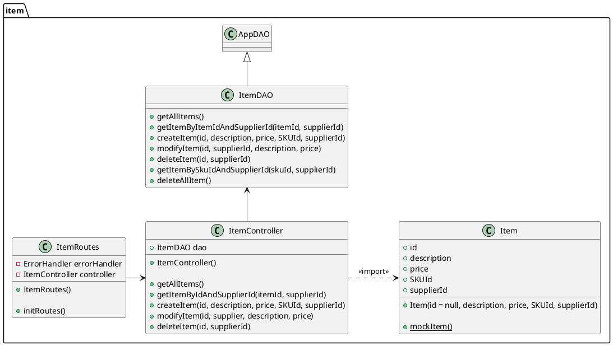
To make the diagram more readable, we extrapolated the Error classes in the following diagram:

```plantuml
@startuml ErrorDiagram
package user {
    Class UserErrorFactory {
        + {static} newCustomerNotFound
        + {static} newUserNotFound
        + {static} newWrongCredential
        + {static} newTypeNotFound
        + {static} newUserConflict
        + {static} newAttemptCreationPrivilegedAccount
    }
}

package sku {
    Class SkuErrorFactory {
        + {static} newSkuNotFound
        + {static} newPositionNotCapable
        + {static} newPositionAlreadyOccupied
        + {static} newSkuWithAssociatedSkuItems
    }
}

package skuItem {
    Class SkuItemErrorFactory {
        + {static} newSKUItemNotFound
        + {static} newSKUItemRFIDNotUnique
        + {static} newSKUItemRelatedToItemNotOwned
    }
}

package position {
    Class PositionErrorFactory {
        + {static} newPositionNotFound
        + {static} newPositionIdNotSymmetric
        + {static} newPositionIDNotUnique
        + {static} newGreaterThanMaxWeightPosition
        + {static} newGreaterThanMaxVolumePosition
    }
}

package test_descriptor {
    Class TestDescriptorErrorFactory {
        + {static} newTestDescriptorNotFound
        + {static} newSKUAlreadyWithTestDescriptor
        + {static} newTestDescriptorWithAssociatedTestResults
    }
}

package test_result {
    Class TestResultErrorFactory {
        + {static} newTestResultNotFound
        + {static} newTestDescriptorOrSkuItemNotFound
    }
}
 package restock_order {
     Class RestockOrderErrorFactory {
        + {static} newRestockOrderNotFound()
        + {static} newRestockOrderNotReturned()
        + {static} newRestockOrderNotDelivered()
        + {static} newRestockOrderNotDelivery()
        + {static} newRestockOrderDeliveryBeforeIssue()
    }
 }

package return_order {
    Class ReturnOrderErrorFactory {
        + {static} newReturnOrderNotFound()
    }
}

package item {
    Class ItemErrorFactory {
        + {static} itemNotFound()
        + {static} skuAlreadyAssociatedForSupplier()
        + {static} itemAlreadySoldBySupplier()
        + {static} newSkuOrSupplierNotFound()
    }
}
@enduml
```

# Verification traceability matrix

|       FR Code           |  FR1  |  FR2  |  FR3  |  FR4  |  FR5  |  FR6  |  FR7  |
| :------------------:    | :---: | :---: | :---: | :---: | :---: | :---: | :---: |
|         EZWH            |   X   |   X   |   X   |   X   |   X   |   X   |   X   |
|     UserController      |   X   |       |       |   X   |       |       |       |
|         User            |   X   |   X   |   X   |   X   |   X   |   X   |   X   |
|    SKUItemController    |       |       |       |       |   X   |   X   |       |
|       SKUItem           |       |       |       |       |   X   |   X   |       |
|      TestResult         |       |       |       |       |   X   |       |       |
|     ItemController      |       |       |       |       |       |       |   X   |
|         Item            |       |       |       |       |       |       |   X   |
|   WarehouseController   |       |       |   X   |       |       |       |       |
|       Position          |       |       |   X   |       |       |       |       |
|  ReturnOrderController  |       |       |       |       |   X   |       |       |
|     ReturnOrder         |       |       |       |       |   X   |       |       |
| InternalOrderController |       |       |       |       |       |   X   |       |
|    InternalOrder        |       |       |       |       |       |   X   |       |
| RestockOrderController  |       |       |   X   |       |   X   |       |       |
|     RestockOrder        |       |       |       |       |   X   |       |       |
|    TestDescriptor       |       |       |   X   |       |       |       |       |
|      SKUController      |       |   X   |       |       |   X   |   X   |       |
|         SKU             |       |   X   |       |       |   X   |   X   |       |

# Verification sequence diagrams

## UC1

### Scenario 1.1
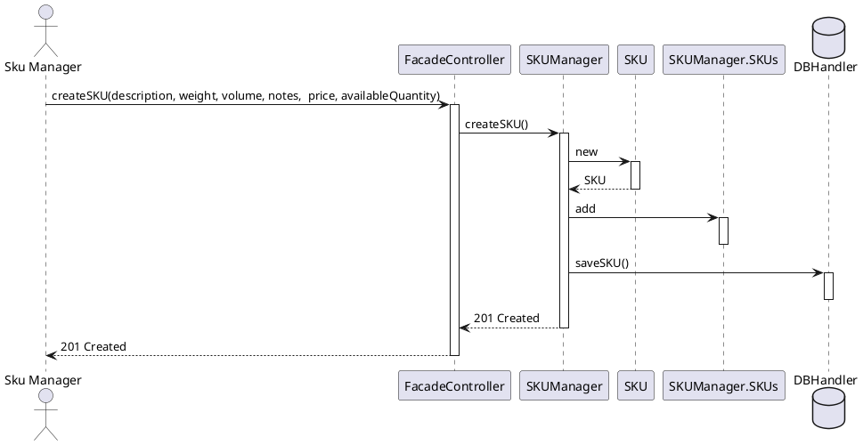

## UC2

### Scenario 2.2
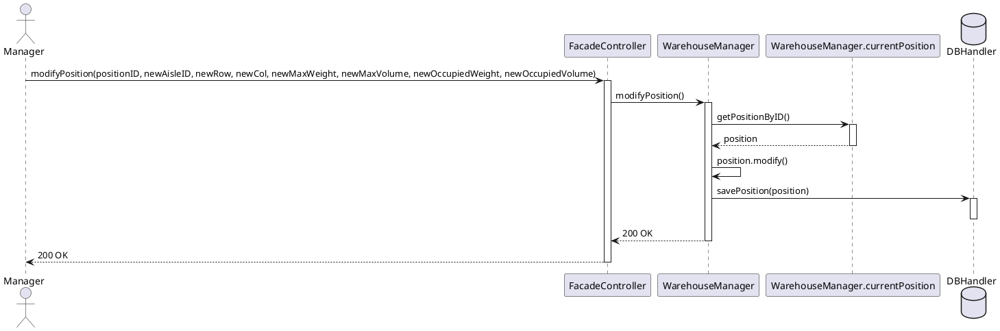
## UC3

### Scenario 3.1
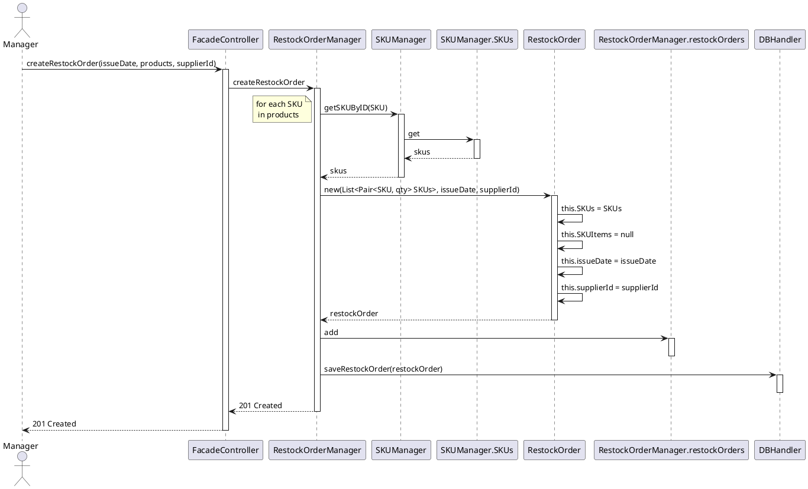
## UC4

### Scenario 4.1

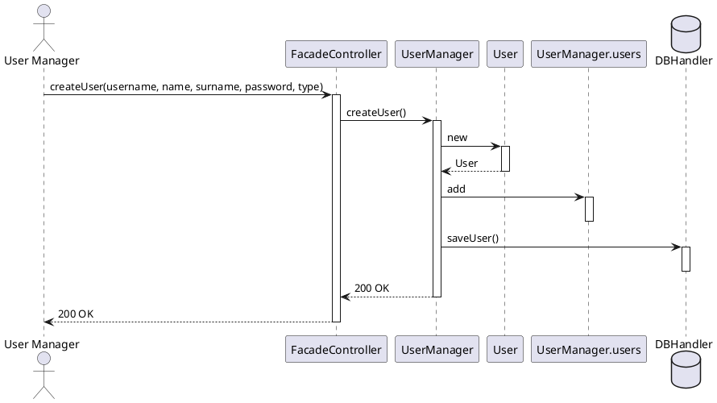
## UC5

### Scenario 5.1.1

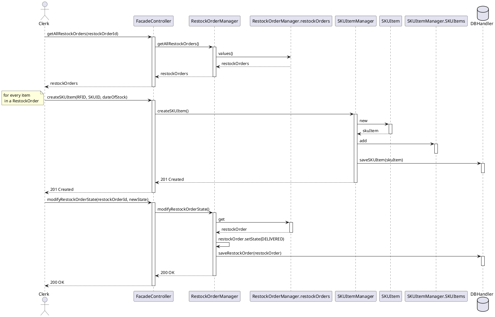
### Scenario 5.2.3

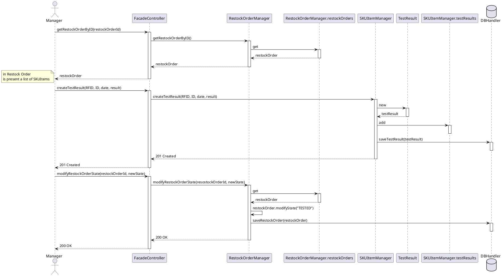
### Scenario 5.3.1
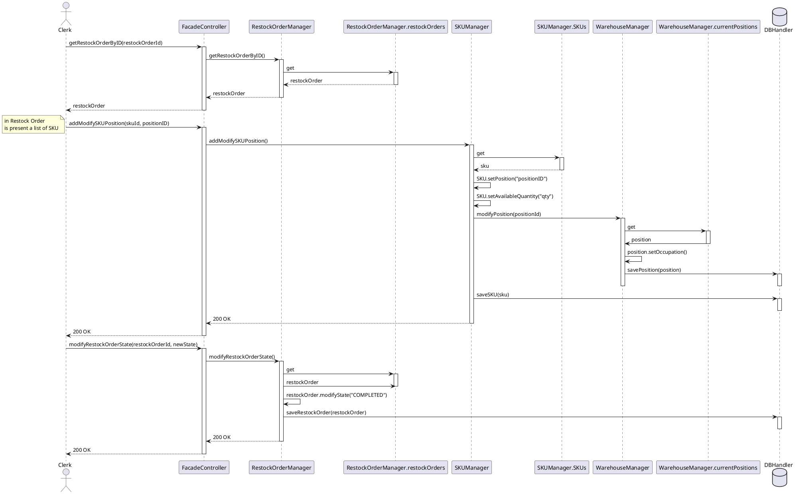
## UC6

### Scenario 6.1

```plantuml

@startuml
    actor Manager
        
        FacadeController -> ReturnOrderManager :  createReturnOrder(returnOrderId, returnDate, products, restockOrderId)
        activate ReturnOrderManager

        ReturnOrderManager -> RestockOrder.restockOrders : get
        activate RestockOrder.restockOrders

        RestockOrder.restockOrders --> ReturnOrderManager : restockOrder
        deactivate RestockOrder.restockOrders

        ReturnOrderManager -> SKUItemManager : setNotAvailable(skuItemId)
        activate SKUItemManager
        note left: for every skuItem\n in internalOrder

        SKUItemManager -> SKUItemManager.SKUItems : get
        activate SKUItemManager.SKUItems
        SKUItemManager <-- SKUItemManager.SKUItems: skuItem
        deactivate SKUItemManager.SKUItems

        SKUItemManager -> SKUItemManager : skuItem.setAvailable(false)
        
        database "DBHandler" as DBHandler
        
        SKUItemManager -> DBHandler : saveSKUItem(skuItem)
        activate DBHandler
        deactivate DBHandler

        deactivate SKUItemManager

        ReturnOrderManager -> TestResult.testResults : values()
        activate TestResult.testResults

        TestResult.testResults --> ReturnOrderManager : testResults
        deactivate TestResult.testResults

        ReturnOrderManager -> ReturnOrderManager : testResults.filter(test.result === "false")
        ReturnOrderManager -> ReturnOrder : new
        activate ReturnOrder

        ReturnOrder --> ReturnOrderManager : returnOrder
        deactivate ReturnOrder

        ReturnOrderManager -> ReturnOrderManager.returnOrders : add
        activate ReturnOrderManager.returnOrders
        deactivate ReturnOrderManager.returnOrders

        database "DBHandler" as DBHandler
        ReturnOrderManager -> DBHandler :  saveReturnOrder(returnOrder)
        activate DBHandler
        deactivate DBHandler

        ReturnOrderManager --> FacadeController: 201 Created
        deactivate ReturnOrderManager
        FacadeController --> Manager : 201 Created
        deactivate FacadeController
@enduml
```
## UC7

### Scenario 7.1

```plantuml

@startuml

actor "User Manager" as User_Manager 

User_Manager -> FacadeController : login(username, password)
activate FacadeController

FacadeController -> UserManager : login()
activate  UserManager

database "DBHandler" as DBHandler
UserManager -> DBHandler : login()
activate DBHandler

deactivate DBHandler

UserManager --> FacadeController : 200 OK
deactivate UserManager

FacadeController --> User_Manager : 200 OK
deactivate FacadeController
@enduml 

```
## UC9

### Scenario 9.2

```plantuml

@startuml 
actor Customer
actor Manager
    ' Customer
    Customer -> FacadeController : createInternalOrder(issueDate, products, customerId)
    activate FacadeController

    FacadeController -> InternalOrderManager: createInternalOrder()
    activate InternalOrderManager

    InternalOrderManager -> InternalOrder : new()
    activate InternalOrder

    InternalOrderManager <-- InternalOrder : internalOrder
    deactivate InternalOrder

    InternalOrderManager -> WarehouseManager : increaseOccupation(positionId, qty)
    activate WarehouseManager

    WarehouseManager -> WarehouseManager.positions : get
    activate WarehouseManager.positions

    WarehouseManager <-- WarehouseManager.positions : position
    deactivate WarehouseManager.positions

    WarehouseManager -> WarehouseManager : position.increaseOccupation(qty)

    database DBHandler

    WarehouseManager -> DBHandler : savePosition(position)
    activate DBHandler
    deactivate DBHandler

    deactivate WarehouseManager

    InternalOrderManager -> InternalOrderManager.internalOrders : add
    activate InternalOrderManager.internalOrders
    deactivate InternalOrderManager.internalOrders

    FacadeController <-- InternalOrderManager: 201 Created
    deactivate InternalOrderManager

    FacadeController --> Customer  : 201 Created
    deactivate FacadeController

    ' Manager
    Manager -> FacadeController : modifyInternalOrderState(internalOrderId, newState)
    activate FacadeController
    database DBHandler
    FacadeController -> InternalOrderManager: modifyInternlOrderState()
    activate InternalOrderManager

    InternalOrderManager -> InternalOrderManager.internalOrders : get
    activate InternalOrderManager.internalOrders

    InternalOrderManager <-- InternalOrderManager.internalOrders : internalOrder
    deactivate InternalOrderManager.internalOrders

    InternalOrderManager -> InternalOrderManager : internalOrder.setState(REFUSED)
    
    InternalOrderManager -> DBHandler : saveInternalOrder(internalOrder)
    activate DBHandler
    deactivate DBHandler

    FacadeController <-- InternalOrderManager: 200 OK
    deactivate InternalOrderManager

    FacadeController --> Manager  : 200 OK
    deactivate FacadeController

@enduml

```
## UC10

### Scenario 10.1

```plantuml

@startuml 
actor DeliveryEmployee

    DeliveryEmployee -> FacadeController : modifyStateInternalOrder(internalOrderId, newState, skuItemIDs)
    activate FacadeController

    FacadeController -> InternalOrderManager: modifyStateInternalOrder()
    activate InternalOrderManager

    InternalOrderManager -> InternalOrderManager.internalOrders : get
    activate InternalOrderManager.internalOrders

    InternalOrderManager <-- InternalOrderManager.internalOrders: internalOrder
    deactivate InternalOrderManager.internalOrders

    InternalOrderManager -> SKUItemManager : setNotAvailable(skuItemId)
    activate SKUItemManager
    note left: for every skuItem\n in internalOrder

    SKUItemManager -> SKUItemManager.SKUItems : get
    activate SKUItemManager.SKUItems

    SKUItemManager <-- SKUItemManager.SKUItems: skuItem
    deactivate SKUItemManager.SKUItems

    SKUItemManager -> SKUItemManager : skuItem.setAvailable(false)
    deactivate SKUItemManager.SKUItems

    database DBHandler

    SKUItemManager -> DBHandler : saveSKUItem(skuItem)
    activate DBHandler
    deactivate DBHandler

    deactivate SKUItemManager

    InternalOrderManager -> InternalOrderManager : internalOrder.setSKUItems(skuItems)
    InternalOrderManager -> InternalOrderManager : internalOrder.setState(COMPLETED)
    InternalOrderManager -> DBHandler : saveInternalOrder(internalOrder)
    activate DBHandler
    deactivate DBHandler

    InternalOrderManager --> FacadeController : 200 OK
    deactivate InternalOrderManager

    FacadeController --> DeliveryEmployee : 200 OK
    deactivate FacadeController

@enduml

```
## UC11

### Scenario 11.1

```plantuml

@startuml
actor Supplier

    Supplier -> FacadeController : createItem(description, price, skuId, supplierId)
    activate FacadeController

    FacadeController -> ItemManager: createItem()
    activate ItemManager

    ItemManager -> Item : new
    activate Item

    ItemManager <-- Item : item
    deactivate Item

    ItemManager -> ItemManager.items : add
    activate ItemManager.items
    deactivate ItemManager.items

    ItemManager -> DBHandler : saveItem(item)
    activate DBHandler
    deactivate DBHandler

    ItemManager --> FacadeController : 201 Created
    deactivate ItemManager

    FacadeController --> Supplier : 201 Created
    deactivate FacadeController

@enduml

```
## UC12

### Scenario 12.3

```plantuml

@startuml 
actor Manager

    Manager -> FacadeController : deleteTestDescriptor(testDescriptorId)
    activate FacadeController

    FacadeController -> RestockOrderManager: deleteTestDescriptor()
    activate RestockOrderManager

    RestockOrderManager -> RestockOrderManager.testDescriptors : remove
    activate RestockOrderManager.testDescriptors
    deactivate RestockOrderManager.testDescriptors

    database DBHandler

    RestockOrderManager -> DBHandler : deleteTestDescriptor(testDescriptorId)
    activate DBHandler
    deactivate DBHandler

    RestockOrderManager --> FacadeController : 204 No Content
    deactivate RestockOrderManager

    FacadeController --> Manager  : 204 No Content
    deactivate FacadeController

@enduml

```
