# Design Document 

Authors:
- Fabio Orazio Mirto
- Roberto Sirigu
- Peter Alhachem
- Stefano De Venuto

Date: 25-04-2022

Version: 1.0

# Contents

- [Design Document](#design-document)
- [Contents](#contents)
- [Instructions](#instructions)
- [High level design](#high-level-design)
- [Low level design](#low-level-design)
  - [Manager Package](#manager-package)
  - [Busines Logic Package](#busines-logic-package)
- [Verification traceability matrix](#verification-traceability-matrix)
- [Verification sequence diagrams](#verification-sequence-diagrams)
  - [UC1](#uc1)
    - [Scenario 1.1](#scenario-11)
  - [UC2](#uc2)
    - [Scenario 2.2](#scenario-22)
  - [UC3](#uc3)
    - [Scenario 3.1](#scenario-31)
  - [UC4](#uc4)
    - [Scenario 4.1](#scenario-41)
  - [UC5](#uc5)
    - [Scenario 5.1.1](#scenario-511)
    - [Scenario 5.2.3](#scenario-523)
    - [Scenario 5.3.1](#scenario-531)
  - [UC6](#uc6)
    - [Scenario 6.1](#scenario-61)
  - [UC7](#uc7)
    - [Scenario 7.1](#scenario-71)
  - [UC9](#uc9)
    - [Scenario 9.2](#scenario-92)
  - [UC10](#uc10)
    - [Scenario 10.1](#scenario-101)
  - [UC11](#uc11)
    - [Scenario 11.1](#scenario-111)
  - [UC12](#uc12)
    - [Scenario 12.3](#scenario-123)

# Instructions

The design must satisfy the Official Requirements document, notably functional and non functional requirements, and be consistent with the APIs

# High level design 

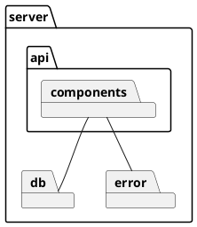
The architetural pattern choosed is MVC + 3 tier.<br>
# Low level design

## Manager Package

```plantuml
@startuml LowLevelDesign
package api {

    Class AppDAO {

    }

    package user {
        Class UserRoutes {
            - ErrorHandler errorHandler
            - UserController controller

            + UserRoutes()

            + getAllUsers()
            + getAllSuppliers()
            + getUserInfo(email)

            + newUSer(username, name, surname, password, type)
            + managerSessions(username, password)
            + customerSessions(username, password)
            + supplierSessions(username, password)
            + clerkSessions(username, password)
            + qualityEmployeeSessions(username, password)
            + deliveryEmployeeSessions(username, password)

            + modifyRight(username, oldType, newType)
            + deleteUser(username, type)
        }

        Class UserController {
            + UserDAO dao

            + UserController()

            + getAllUsers()
            + getAllSuppliers()
            + getUserInfo(email)

            + createUser(username, name, surname, password, type)
            + loginManager(username, password)
            + loginCustomer(username, password)
            + loginSupplier(username, password)
            + loginClerk(username, password)
            + loginQualityEmployee(username, password)
            + loginDeliveryEmployee(username, password)
            + modifyRight(username, oldType, newType)
            + deleteUser(username, type)

            - login(username, password, type)
        }

        Class UserDAO extends AppDAO {
            + UserDAO()

            + getAllUsers() 
            + getAllUsersByType(type) 
            + getUserByID(id)

            + createUser(username, name, surname, password, type) 
            + checkUser(email, password) 
            + modifyRight(username, oldType, newType) 
            + deleteUser(userUsername, userType) 

            - getUserByEmailAndType(email, type)
            - deleteAllUser()
        }

        Class UserErrorFactory {
            + {static} newCustomerNotFound
            + {static} newUserNotFound
            + {static} newWrongCredential
            + {static} newTypeNotFound
            + {static} newUserConflict
            + {static} newAttemptCreationPrivilegedAccount
        }

        Class User {
            - {static} ADMINISTRATOR     = "administrator";
            - {static} MANAGER           = "manager";
            - {static} INTERNAL_CUSTOMER = "INTERNAL_CUSTOMER";
            - {static} CUSTOMER          = "customer";
            - {static} SUPPLIER          = "supplier";
            - {static} CLERK             = "clerk";
            - {static} QUALITY_EMPLOYEE  = "qualityEmployee";
            - {static} DELIVERY_EMPLOYEE = "deliveryEmployee";

            - id
            - name
            - surname
            - email
            - password
            - type

            + User(id, name, surname, email, password, type)

            - {static} isValidType(type)
            - {static} mockUser()
            - {static} mockUserCustomer()

        }

        UserRoutes -> UserController
        UserController -> UserDAO
        UserController -> UserErrorFactory
    }


package sku {
        Class SkuRoutes {
            - ErrorHandler errorHandler
            - SkuController controller

            + SkuRoutes()

            + getAllSkus()
            + getSkuByID(skuId)

            + createSku(description, weight, volume, notes, price, availableQuantity)
            + modifySku(skuId, newDescription, newWeight, newVolume, newNotes, newPrice, newAvailableQuantity)
            + addModifySkuPosition(skuId, newPosition)

            + deleteSku(skuId)

        }

        Class SkuController {
            + SkuDAO dao

            + SkuController()

            + SKURoutes()

            + getAllSkus()
            + getSkuByID(skuId)

            + createSku(description, weight, volume, notes, price, availableQuantity)
            + modifySku(skuId, newDescription, newWeight, newVolume, newNotes, newPrice, newAvailableQuantity)
            + addModifySkuPosition(skuId, newPosition)
            
            + deleteSku(skuId)
            + getSkuByIDInternal(skuId) 
        }

        Class SkuDAO extends AppDAO {
            + SkuDAO()

            + getAllSkus()
            + getSkuByID(skuId)

            + createSku(description, weight, volume, notes, price, availableQuantity)
            + modifySku(skuId, newDescription, newWeight, newVolume, newNotes, newPrice, newAvailableQuantity)
            + addModifySkuPosition(skuId, newPosition)
            
            + deleteSku(skuId)
            + getSkuByIDInternal(skuId) 
        }

        Class SkuErrorFactory {
            + {static} newSkuNotFound
            + {static} newPositionNotCapable
            + {static} newPositionAlreadyOccupied
            + {static} newSkuWithAssociatedSkuItems
        }

        Class Sku {

            - id
            - description
            - weight
            - volume
            - notes
            - positionId
            - availableQuantity
            - price    
            - testDescriptors

            + Sku(id, description, weight, volume, notes, positionId, availableQuantity, price, testDescriptors)

            - {static} intoJson(all)
            - {static} mockTestSku()
        }

        SkuRoutes -> SkuController
        SkuController -> SkuDAO
        SkuController -> SkuErrorFactory
    }
    

package skuItem {
        Class SKUItemRoutes {
            - ErrorHandler errorHandler
            - SKUItemController controller

            + SKUItemRoutes()

            + getAllSKUItems()
            + getSKUItemBySKUID(skuId)
            + getSKUItemByRFID(SKUItemId)

            + createSKUItem(RFID, SKUId, DateOfStock)
            + modifySKUItem(SKUItemId, newRFID, newAvailable, newDateOfStock)
            + deleteSKUItem(SKUItemId)

        }

        Class SkuItemController {
            + SKUItemDAO dao

            + skuController()

            + getAllSKUItems()
            + getSKUItemBySKUID(skuId)
            + getSKUItemByRFID(SKUItemId)

            + createSKUItem(RFID, SKUId, DateOfStock)
            + modifySKUItem(SKUItemId, newRFID, newAvailable, newDateOfStock)
            + deleteSKUItem(SKUItemId)

            + getSKUItemByRFIDInternal(rfid) 
            + getAllSkuItemsByRestockOrder(restockOrderId)
            + getItemByRFIDInternal(RFID, restockOrderId)
        }

        Class SKUItemDAO extends AppDAO {
            + SKUItemDAO()

            + getAllSKUItems()
            + getSKUItemBySKUID(skuId)
            + getSKUItemByRFID(SKUItemId)

            + createSKUItem(RFID, SKUId, DateOfStock)
            + modifySKUItem(SKUItemId, newRFID, newAvailable, newDateOfStock)
            + deleteSKUItem(SKUItemId)
            + deleteAllSKUItem()

            + getAllSkuItemsByRestockOrder(restockOrderId) 
            + getSupplierIdByRestockOrderId(restockOrderId)
            + getSkuAndSKUItemByRFIDInternal(rfid, supplierId)
        }

        Class SkuItemErrorFactory {
            + {static} newSKUItemNotFound
            + {static} newSKUItemRFIDNotUnique
            + {static} newSKUItemRelatedToItemNotOwned
        }

        Class SkuItem {

            - RFID
            - SKUId
            - available
            - dateOfStock
            - restockOrderId
            - returnOrderId
            - internalOrderId

            + Sku(id , description, weight, volume, notes, positionId, availableQuantity, price, testDescriptors)

            - {static} intoJson(all)
            - {static} mockTestSkuItem()
        }

        SKUItemRoutes -> SkuItemController
        SkuItemController -> SKUItemDAO
        SkuItemController -> SkuItemErrorFactory
    }


package position {
        Class PositionRoutes {
            - ErrorHandler errorHandler
            - PositionController controller

            + PositionRoutes()

            + getAllPositions()
            + getPositionByID(id)

            + createPosition(positionID, aisleID, row, col, maxWeight, maxVolume)
            + modifyPosition(positionID, newAisleID, newRow, newCol, newMaxWeight, newMaxVolume,
        newOccupiedWeight, newOccupiedVolume)
            + modifyPositionID(oldPositionId, newPositionId)
            + deletePosition(positionID)

        }

        Class PositionController {
            + PositionDAO dao

            
            + getAllPositions()
            + getPositionByID(id)

            + createPosition(positionID, aisleID, row, col, maxWeight, maxVolume)
            + modifyPosition(positionID, newAisleID, newRow, newCol, newMaxWeight, newMaxVolume,
        newOccupiedWeight, newOccupiedVolume)
            + modifyPositionID(oldPositionId, newPositionId)
            + deletePosition(positionID)
        }

        Class PositionDAO extends AppDAO {
            + PositionDAO()

            + getAllPositions()
            + getPositionByID(id)

            + createPosition(positionID, aisleID, row, col, maxWeight, maxVolume)
            + modifyPosition(positionID, newAisleID, newRow, newCol, newMaxWeight, newMaxVolume,
        newOccupiedWeight, newOccupiedVolume)
            + modifyPositionID(oldPositionId, newPositionId)
            + deletePosition(positionID)
            + deleteAllPosition()
        }

        Class PositionErrorFactory {
            + {static} newPositionNotFound
            + {static} newPositionIdNotSymmetric
            + {static} newPositionIDNotUnique
            + {static} newGreaterThanMaxWeightPosition
            + {static} newGreaterThanMaxVolumePosition
        }

        Class Position {

            - positionID
            - aisleID
            - row
            - col
            - maxWeight
            - maxVolume
            - occupiedWeight
            - occupiedVolume

            + Position(positionID, aisleID, row, col, maxWeight, maxVolume, occupiedWeight, occupiedVolume)

            - {static} mockTestPosition()
        }

        PositionRoutes -> PositionController
        PositionController -> PositionDAO
        PositionController -> PositionErrorFactory
    }

    package testDescriptor {
        Class TestDescriptorRoutes {
            - ErrorHandler errorHandler
            - TestDescriptorController controller

            + TestDescriptorRoutes()

            + getAllTestDescriptors()
            + getTestDescriptorByID(testDescriptorId)

            + createTestDescriptor(name, procedureDescription, idSKU)
            + modifyTestDescriptor(testDescriptorId, newName, newProcedureDescription, newIdSKU)
            + deleteTestDescriptor(testDescriptorId)

        }

        Class TestDescriptorController {
            + TestDescriptorDAO dao

            
           
            + getAllTestDescriptors()
            + getTestDescriptorByID(testDescriptorId)

            + createTestDescriptor(name, procedureDescription, idSKU)
            + modifyTestDescriptor(testDescriptorId, newName, newProcedureDescription, newIdSKU)
            + deleteTestDescriptor(testDescriptorId)
        }

        Class TestDescriptorDAO extends AppDAO {
            + TestDescriptorDAO()

            + getAllTestDescriptors()
            + getTestDescriptorByID(testDescriptorId)

            + createTestDescriptor(name, procedureDescription, idSKU)
            + modifyTestDescriptor(testDescriptorId, newName, newProcedureDescription, newIdSKU)
            + deleteTestDescriptor(testDescriptorId)
            + deleteAllTestDescriptor()
        }

        Class TestDescriptorErrorFactory {
            + {static} newTestDescriptorNotFound
            + {static} newSKUAlreadyWithTestDescriptor
            + {static} newTestDescriptorWithAssociatedTestResults
        }

        Class TestDescriptor {

            - id
            - name
            - procedureDescription
            - idSKU

            + TestDescriptor(id, name, procedureDescription, idSKU)

            - {static} mockTestTestDescriptor()
        }

        TestDescriptorRoutes -> TestDescriptorController
        TestDescriptorController -> TestDescriptorDAO
        TestDescriptorController -> TestDescriptorErrorFactory
    }

    package testResult {
        Class TestResultRoutes {
            - ErrorHandler errorHandler
            - TestResultController controller

            + TestResultRoutes()

            + getAllTestResults(rfid)
            + getTestResultByID(rfid, testResultId)

            + createTestResult(rfid, idTestDescriptor, Date, Result)
            + modifyTestResult(rfid, id, newIdTestDescriptor, newDate, newResult)
            + deleteTestResult(rfid, id)

        }

        Class TestResultController {
            + TestResultDAO dao

            + skuItemController
           
            + getAllTestResults(rfid)
            + getTestResultByID(rfid, testResultId)

            + createTestResult(rfid, idTestDescriptor, Date, Result)
            + modifyTestResult(rfid, id, newIdTestDescriptor, newDate, newResult)
            + deleteTestResult(rfid, id)

            + hasFailedTestResultsByRFID(RFID)
        }

        Class TestResultDAO extends AppDAO {
            + TestResultDAO()

           + getAllTestResults(rfid)
            + getTestResultByID(rfid, testResultId)

            + createTestResult(rfid, idTestDescriptor, Date, Result)
            + modifyTestResult(rfid, id, newIdTestDescriptor, newDate, newResult)
            + deleteTestResult(rfid, id)

            + hasFailedTestResultsByRFID(RFID)
        }

        Class TestResultErrorFactory {
            + {static} newTestResultNotFound
            + {static} newTestDescriptorOrSkuItemNotFound
        }

        Class TestResult {

            - id;
            - date
            - result
            - testDescriptorId
            - RFID

            + TestResult(id, date, result, testDescriptorId, RFID)

            - intoJson()
            - {static} mockTestTestResult()
        }

        TestResultRoutes -> TestResultController
        TestResultController -> TestResultDAO
        TestResultController -> TestResultErrorFactory
    }


    Class SKUItemController {
        - SKUItemDAO dao
        - SkuController skuController

        + List<SKUItem> getAllSKUItems()
        + List<SKUItem> getSKUItemBySKUID(String SKUID)
        + List<SKUItem> getSKUItemByRFID(String RFID)

        + void createSKUItem(String RFID, String SKUID, Date dateOfStock)
        + void modifySKUItem(String newRFID, boolean newAvailable, newDateOfStock)
        + void deleteSKUItem(String RFID)

        - SKUItem getSKUItemByRFIDInternal(String RFID)
        - RestockOrder getAllSkuItemsByRestockOrder(int restockOrderId)
        - Sku getItemByRFIDInternal(String RFID, int restockOrderId)
    }

    Class SKUItemDAO extends AppDAO {
        + Rows getAllSKUItems()
        + Rows getSKUItemBySKUID(int SKUId)
        + Rows createSKUItem(SKUItem SKUItem)
        + Rows modifySKUItem(String RFID, SKUItem skuItem)
        + Rows deleteSKUItem(String RFID)
        + Rows getAllSkuItemsByRestockOrder(int restockOrderId)
        + Rows getSupplierIdByRestockOrderId(int restockOrderId)
    }

    Class TestResultController {
        - TestResultDAO dao
        - SkuItemController skuItemController

        + List<TestResult> getAllTestResults(String RFID)
        + TestResult getTestResultByID(String RFID, String ID)

        + TestResult createTestResult(String RFID, String ID, Date date, boolean result)
        + void modifyTestResult(String RFID, String ID, String newIdTestDescriptor, Date newDate, newResult)
        + void deleteTestResult(String RFID, String ID)

        - boolean hasFailedTestResultsByRFID(String RFID)
    }

    class TestResultDAO extends AppDAO {
        + getAllTestResults(String RFID)
        + getTestResultByID(String rfid, int id)
        + createTestResult(TestResult testResult)
        + modifyTestResult(int id, String rfid, TestResult testResult)
        + deleteTestResult(String rfid, int id)
        + hasFailedTestResultsByRFID(String rfid)
    }

    ' Item Management
    Class ItemController {
        - ItemDAO dao

        + List<Item> getAllItems()
        + Item getItemByID(int ID)
        + void createItem(int ID, String description, float price, String SKUId, String supplierId)
        + void modifyItem(int ID, String newDescription, float newPrice)
        + void deleteItem(int ID)

        - Item getItemBySkuIdAndSupplierId(int skuId, int supplierId)
        - Item getItemByIDInternal(int itemId)
    }

    class ItemDAO extends AppDAO {
        + getAllItems()
        + getItemByID(int itemId)
        + createItem(Item item)
        + modifyItem(int itemId, Item item)
        + deleteItem(int itemId)
        + getItemBySkuIdAndSupplierId(int skuId, int supplierId)
    }

    ' Warehouse Management
    Class PositionController {
        - PositionDAO positionDAO

        + List<Position> getAllPositions()
        + Position getPositionByID()
        + void createPosition(String positionID, String aisleID, int row, int col, int maxWeight, int maxVolume)
        + void modifyPosition(String positionID, String newAisleID, int newRow, int newCol, int newMaxWeight, int newMaxVolume, int newOccupiedWeight, int newOccupiedVolume)
        + void modifyPositionID(String oldPositionID, String newPositionID)
        + void deletePosition(String positionID)
    }

    class PositionDAO extends AppDAO {
        + getAllPositions() 
        + getPositionByID(String positionID)
        + createPosition(Position position)
        + modifyPosition(String oldPositionID, String newPositionID, Position position)
        + modifyPositionID(String oldPositionID, String newPositionID, String newAisleId, String newRow, String newCol)
        + deletePosition(positionID)
    }

    ' Return Order Management
    Class ReturnOrderController {
        - ReturnOrderDAO returnOrderDAO
        - SkuItemController skuItemController

        + List<ReturnOrder> getAllReturnOrders()
        + ReturnOrder getReturnOrderByID(String ID)
        + void createReturnOrder(String ID, Date returnDate, List<Product> products, String restockOrderId)
        + void deleteReturnOrder(String ID)
    }

    ' Internal Order Management
    Class InternalOrderManager {
        - InternalOrderDAO dao
        - SkuController skuController

        + InternalOrder getInternalOrderByID(String ID)
        + List<InternalOrder> getAllInternalOrders()
        + List<InternalOrder> getInternalOrdersIssued()
        + List<InternalOrder> getInternalOrdersAccepted()
        + InternalOrder createInternalOrder(String ID, Date issueDate, List<Product> products)
        + void modifyStateInternalOrder(String ID, String newState, List<String> RFIDs)
        + void deleteInternalOrder(String ID)

        - List<InternalOrder> buildInternalOrders()
        - InternalOrder getInternalOrderByIDInternal(int internalOrderId)
    }

    Class RestockOrderController {
        - RestockOrderDAO dao
        - TestResultController testResultController
        - SkuItemController skuItemController
        - ItemController itemController

        + List<RestockOrder> getAllRestockOrders()
        + List<RestockOrder> getAllIssuedRestockOrders()
        + RestockOrder getRestockOrderByID(String ID)
        + List<SkuItem> getRestockOrderReturnItemsByID

        + RestockOrder createRestockOrder(Date issueDate, List<Product> products, int supplierId)
        + void modifyState(int restockOrderId, String newState)
        + void modifyRestockOrderSkuItems(int restockOrderId, List<SKUItem> skuItems)
        + void modifyTransportNote(int restockOrderId, Date transportNote)
        + void deleteRestockOrder(int restockOrderId)

        - List<RestockOrder> buildRestockOrders()
        - RestockOrder getRestockOrderByIDInternal(in restockOrderId)
    }

    Class TestDescriptorController {
        - TestDescriptorDAO dao

        + List<TestDescriptor> getAllTestDescriptors()
        + TestDescriptor getTestDescriptorByID(int ID)

        + void createTestDescriptor(int ID, String name, String procedureDescription, String IdSKU)
        + void modifyTestDescriptor(int ID, String newName, String newProcedureDescription, String newIdSKU)
        + void deleteTestDescriptor(int ID)
    }

    ' SKU Management
    Class SkuController {
        - SkuDAO dao

        + List<Sku> getAllSkus()
        + Sku getSkuByID(int skuId)

        + Sku createSku(String ID, String description, int weight, int volume, String notes, float price, int availableQuantity)
        + void modifySku(int skuId, String newDescription, int newWeight, int newVolume, Sting newNotes, float newPrice, int newAvailableQuantity)
        + void addModifySkuPosition(int skuId, String positionID)
        + void deleteSKU(int skuId)

        - Sku getSkuByIDInternal(int skuId)
    }

    ' Persistence Management
    Class DBHandler {
        + List<SKU> getAllSKUs()
        + SKU getSKUByID(String SKUID)
        + void saveSKU(SKU sku)
        + void deleteSKU(String SKUID)

        + List<User> getAllUsers()
        + User login(String username, String password)
        + User createUser(User user)
        + void modifyUserRights(String username, String oldType, String newType)

        + List<RestockOrder> getAllRestockOrders()
        + RestockOrder getRestockOrderByID(String ID)
        + void saveRestockOrder(RestockOrder restockOrder)
        + void deleteRestockOrder(String ID)

        + List<InternalOrder> getAllInternalOrders()
        + InternalOrder getInternalOrderByID(String ID)
        + void saveInternalOrder(InternalOrder internalOrder)
        + void deleteInternalOrder(String ID)

        + List<Position> getAllPositions()
        + Position getPositionByID(String ID)
        + void savePosition(Position position)
        + void deletePosition(String ID)

        + List<Position> getAllReturnOrders()
        + ReturnOrder getReturnOrderByID(String ID)
        + void saveReturnOrder(ReturnOrder returnOrder)
        + void deleteReturnOrder(String ID)

        + List<TestDescriptor> getAllTestDescriptors()
        + TestDescriptor getTestDescriptorByID(String ID)
        + void saveTestDescriptor(TestDescriptor testDescriptor)
        + void deleteTestDescriptor(String ID)

        + List<Item> getAllItems()
        + Item getItemByID(String ID)
        + void saveItem(Item item)
        + void deleteItem(String ID)

        + List<SKUItem> getAllSKUItem()
        + SKUItem getSKUItemByID(String ID)
        + void saveSKUItem(SKUItem SKUitem)
        + void deleteSKUItem(String ID)

        + List<TestResult> getAllTestResults()
        + TestResult getTestResultByID(String ID)
        + void saveTestResult(TestResult testResult)
        + void deleteTestResult(String ID)
    }

    ' Database connections
    DBHandler <-up- ItemManager
    DBHandler <-up- SKUItemManager
    DBHandler <-up- WarehouseManager
    DBHandler <-up- ReturnOrderManager
    DBHandler <-up- RestockOrderManager
    DBHandler <-up- InternalOrderManager
    DBHandler <-up- UserManager

    ' FacadeController connections
    FacadeController --> SKUManager
    FacadeController --> RestockOrderManager
    FacadeController --> InternalOrderManager
    FacadeController --> ReturnOrderManager
    FacadeController --> WarehouseManager
    FacadeController --> ItemManager
    FacadeController --> SKUItemManager
    FacadeController --> UserManager

    ' Managers' -- Managers' connections
    SKUItemManager <-left- RestockOrderManager
    SKUManager <-right- RestockOrderManager
    SKUItemManager <-left- ReturnOrderManager
    SKUManager <-right- ReturnOrderManager
    SKUManager <-right- InternalOrderManager
}
    
@enduml
```

## Busines Logic Package

```plantuml
@startuml LowLevelDesign
top to bottom direction

package it.polito.ezwh.businesslogic{
    Class RestockOrderManager
    Class InternalOrderManager
    Class ReturnOrderManager
    Class WarehouseManager
    Class ItemManager
    Class SKUItemManager
    Class UserManager

    note "The various Order classes contains a whole list of references to SKU and SKUItems to which are related, \nin order to make the overall application scalable. Despite the fact those verbose information are not needed now\n(only few attributes are mandatory), in the future the APIs can change, resulting in more fields needed." as more_info

    Class User {
        + id
        + role
        + username
        + password
        + type: [MANAGER, CUSTOMER, CLERK, QUALITY, SUPPLIER, DELIVERY]

        + User(String username, String name, String surname, String password, String type)
        + void modifyRights(String newType)
    }

    Class SKUItem {
        + RFID (idSKUItem)
        + SKUid
        + boolean Available
        + DateOfStock

        + SKUItem(String RFID, String SKUID, Date dateOfStock)
        + void modify(boolean newAvailable, newDateOfStock)
    } 

    Class TestResult {
        + uniqueID
        + id
        + idTestDescriptor
        + RFID (idSKUItem)
        + date
        + result

        + TestResult(String RFID, String ID, Date date, boolean result)
        + void modify(String newIdTestDescriptor, Date newDate, boolean newResult)
    }

    Class Item {
        + id
        + description
        + price
        + SKUId
        + supplierId

        + Item(String ID, String description, float price, String SKUId, String supplierId)
        + void modify(String newDescription, float newPrice)
    }

    Class Position {
        + id
        + aisleID
        + row
        + col
        + maxWeight
        + maxVolume
        + occupiedWeight
        + occupiedVolume                                    
        
        + Position(String positionID, String aisleID, int row, int col, int maxWeight, int maxVolume);
        + void modify(String newAisleID, int newRow, int newCol, int newMaxWeight, int newMaxVolume, int newOccupiedWeight, int newOccupiedVolume)
        + void modifyID(String newPositionID)
        + void increaseOccupation(int qty)
    }

    Class ReturnOrder {
        + id
        + returnDate
        + List<Pair<SKU, int>>
        + List<SKUItem>
        + restockOrderId

        + ReturnOrder(Date returnDate, List<<Pair<SKU, SKUItem>> products, String restockOrderId)
        + void modifyState(String newState)
    }

    Class InternalOrder {
        + id
        + List<Pair<SKU, int>>
        + state: [ISSUED, ACCEPTED, REFUSED, CANCELED, COMPLETED]

        + InternalOrder(Date issueDate, List<<Pair<SKU, int>> products)
        + void modifyState(String newState, List<String> RFIDs)
    }

    Class RestockOrder {
        + id
        + List<Pair<SKU, int>>
        + List<SKUItem>
        + issueDate
        + transportNote
        + state: [ISSUED, DELIVERY, DELIVERED, TESTED, COMPLETEDRETURN, COMPLETED]

        + RestockOrder(Date issueDate, List<<Pair<SKU, int>> products, int supplierId)
        + List<SKUItem> getItems()
        + void modifyState(String newState)
        + void addSKUItems(List<SKUItem> skuItems)
        + void addTransportNote(Date transportNote)
    }

    RestockOrder .. more_info
    RestockOrder .[hidden]. more_info

    Class TestDescriptor {
        + id
        + name
        + procedureDescription
        + SKUId
        
        + TestDescriptor(String ID, String name, String procedureDescription, String IdSKU)
        + void modify(String newName, String newProcedureDescription, String newIdSKU)
    }

    Class SKU {
        + id
        + description
        + weight
        + volume
        + notes
        + price
        + availableQuantity
        + List<TestDescriptor>

        + SKU(String ID, String description, int weight, int volume, String notes, float price, int availableQuantity)
        + void modify(String newDescription, int newWeight, int newVolume, Sting newNotes, float newPrice, int newAvailableQuantity)
        + void addModifyPosition(String positionID)

        + void addTestDescriptor(TestDescriptor testDescriptor)
    }

    ' Managers' -- Business Logic connections: 
    SKUManager -- "*" SKU
    RestockOrderManager -- "*" RestockOrder
    RestockOrderManager -- "*" TestDescriptor
    InternalOrderManager -- "*" InternalOrder
    ReturnOrderManager -- "*" ReturnOrder
    WarehouseManager -- "*" Position
    ItemManager -- "*" Item
    SKUItemManager -- "*" SKUItem
    SKUItemManager -- "*" TestResult
    UserManager -- User

    ' Application Logic connections
    SKU --right- TestDescriptor
}

@enduml
```


# Verification traceability matrix

|       FR Code        |  FR1  |  FR2  |  FR3  |  FR4  |  FR5  |  FR6  |  FR7  |
| :------------------: | :---: | :---: | :---: | :---: | :---: | :---: | :---: |
|         EZWH         |   X   |   X   |   X   |   X   |   X   |   X   |   X   |
|     UserManager      |   X   |       |       |   X   |       |       |       |
|         User         |   X   |   X   |   X   |   X   |   X   |   X   |   X   |
|    SKUItemManager    |       |       |       |       |   X   |   X   |       |
|       SKUItem        |       |       |       |       |   X   |   X   |       |
|      TestResult      |       |       |       |       |   X   |       |       |
|     ItemManager      |       |       |       |       |       |       |   X   |
|         Item         |       |       |       |       |       |       |   X   |
|   WarehouseManager   |       |       |   X   |       |       |       |       |
|       Position       |       |       |   X   |       |       |       |       |
|  ReturnOrderManager  |       |       |       |       |   X   |       |       |
|     ReturnOrder      |       |       |       |       |   X   |       |       |
| InternalOrderManager |       |       |       |       |       |   X   |       |
|    InternalOrder     |       |       |       |       |       |   X   |       |
| RestockOrderManager  |       |       |   X   |       |   X   |       |       |
|     RestockOrder     |       |       |       |       |   X   |       |       |
|    TestDescriptor    |       |       |   X   |       |       |       |       |
|      SKUManager      |       |   X   |       |       |   X   |   X   |       |
|         SKU          |       |   X   |       |       |   X   |   X   |       |

# Verification sequence diagrams

## UC1

### Scenario 1.1
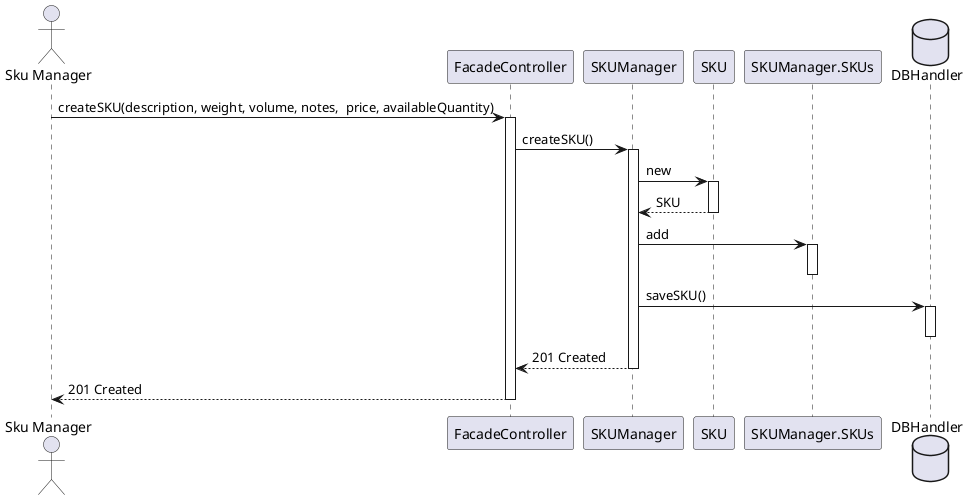

## UC2

### Scenario 2.2
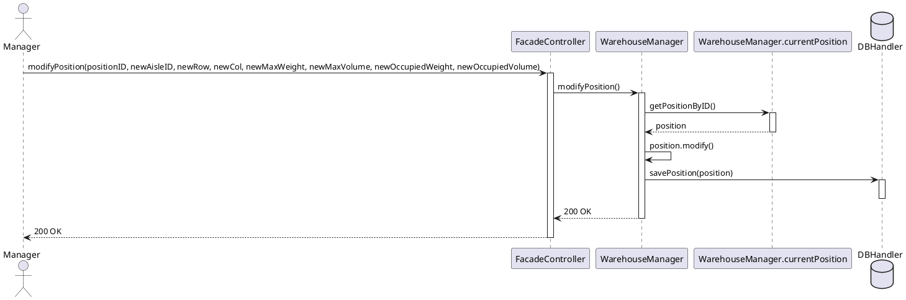
## UC3

### Scenario 3.1
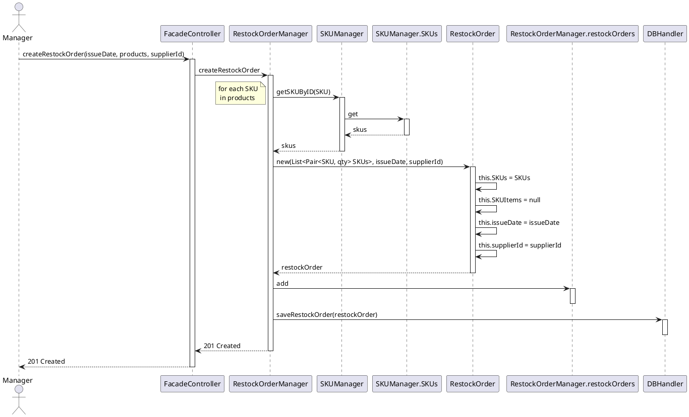
## UC4

### Scenario 4.1

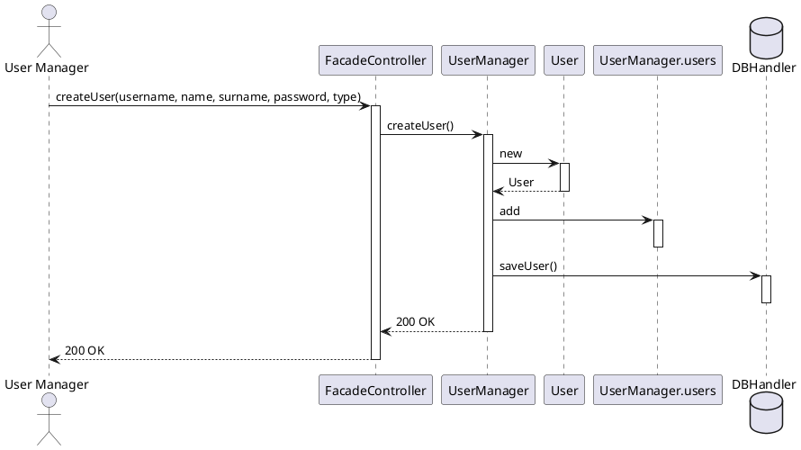
## UC5

### Scenario 5.1.1

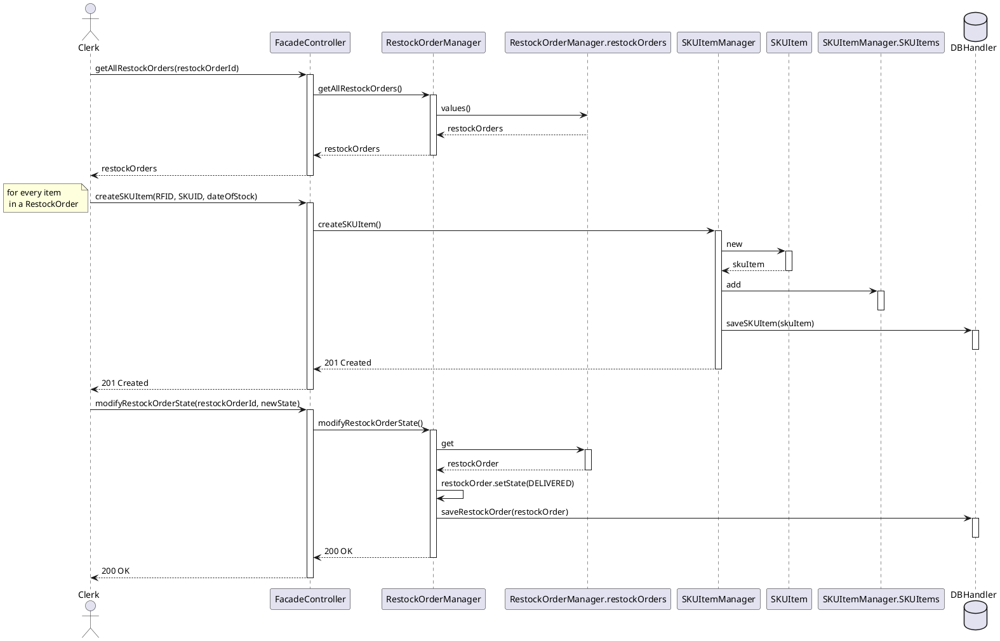
### Scenario 5.2.3

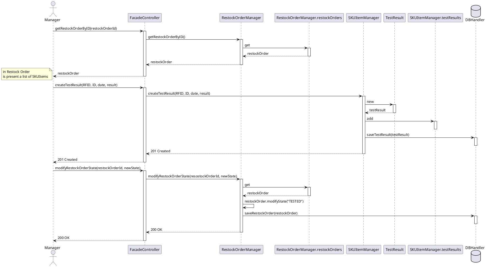
### Scenario 5.3.1
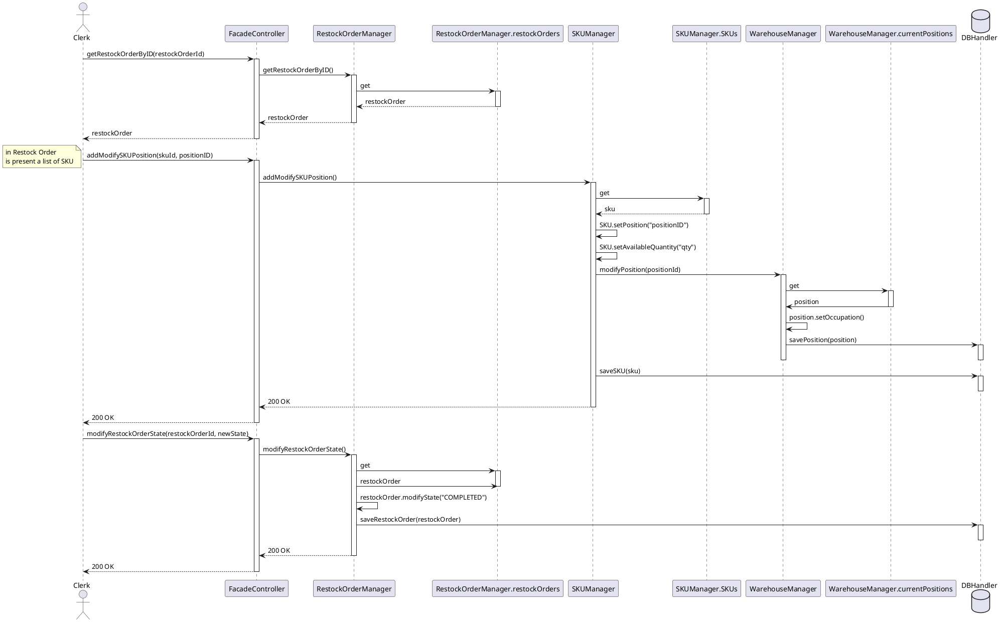
## UC6

### Scenario 6.1

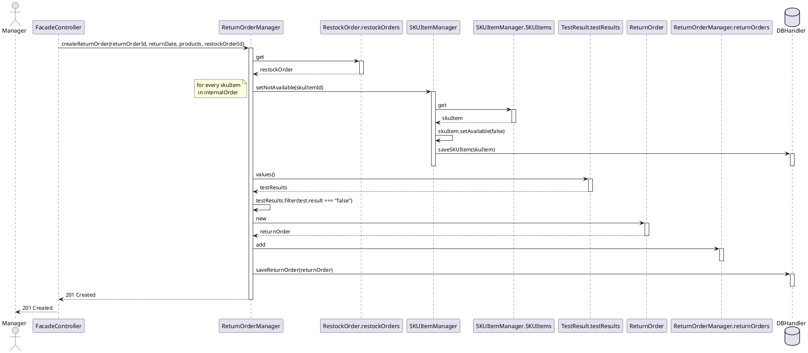
## UC7

### Scenario 7.1

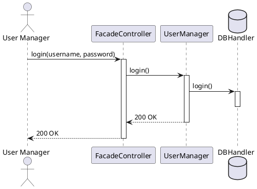
## UC9

### Scenario 9.2

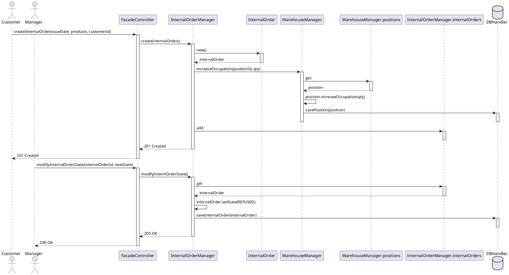
## UC10

### Scenario 10.1

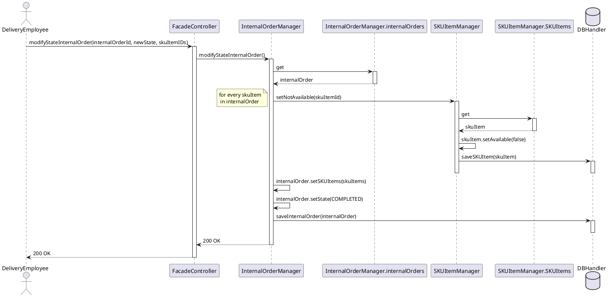
## UC11

### Scenario 11.1

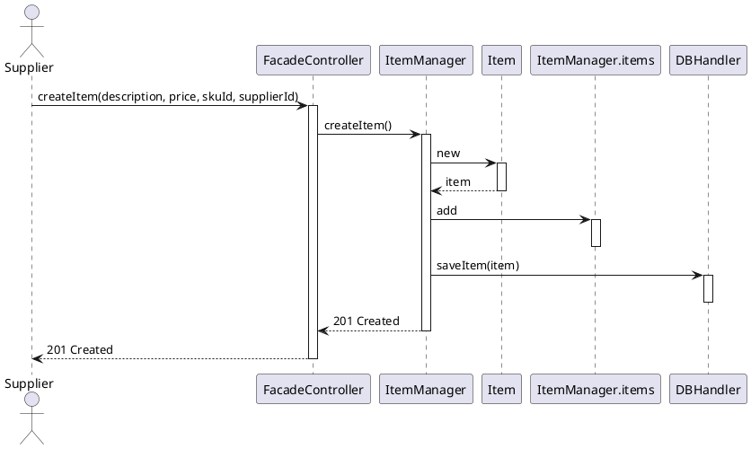
## UC12

### Scenario 12.3

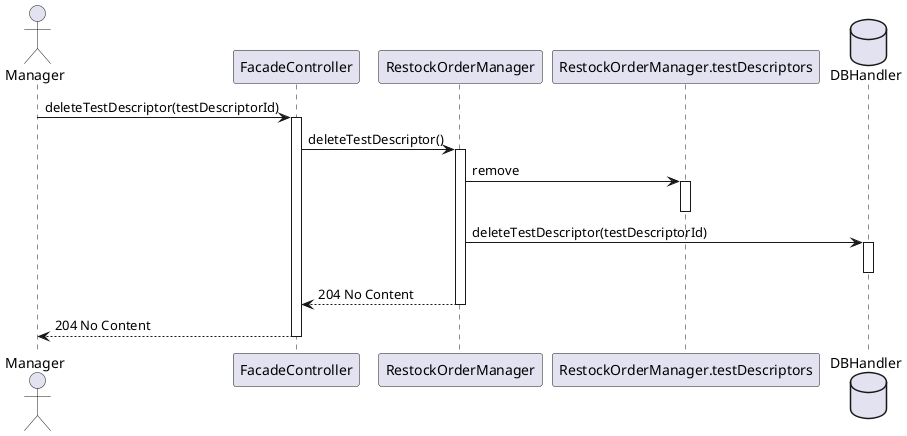
