# Design Document 

Authors:
- Fabio Orazio Mirto
- Roberto Sirigu
- Peter Alhachem
- Stefano De Venuto

Date: 25-04-2022

Version: 1.0

# Contents

- [Design Document](#design-document)
- [Contents](#contents)
- [Instructions](#instructions)
- [High level design](#high-level-design)
- [Low level design](#low-level-design)
  - [Manager Package](#manager-package)
  - [Busines Logic Package](#busines-logic-package)
- [Verification traceability matrix](#verification-traceability-matrix)
- [Verification sequence diagrams](#verification-sequence-diagrams)
  - [Scenario 1.1](#scenario-11)
  - [Scenario 2.2](#scenario-22)
  - [Scenario 3.1](#scenario-31)
  - [Scenario 4.1](#scenario-41)
  - [Scenario 5.1.1](#scenario-511)
  - [Scenario 5.2.3](#scenario-523)
  - [Scenario 5.3.1](#scenario-531)
  - [Scenario 6.1](#scenario-61)
  - [Scenario 7.1](#scenario-71)
  - [Scenario 9.2](#scenario-92)
  - [Scenario 10.1](#scenario-101)
  - [Scenario 11.1](#scenario-111)
  - [Scenario 12.3](#scenario-123)

# Instructions

The design must satisfy the Official Requirements document, notably functional and non functional requirements, and be consistent with the APIs

# High level design 

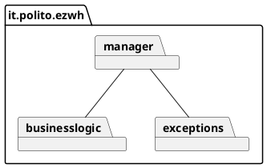
The architetural pattern choosed is MVC + 3 tier. 
it.polito.ezwh.exceptions contains the exceptions used in the API.

# Low level design

## Manager Package

```plantuml
@startuml LowLevelDesign
package it.polito.ezwh.manager{

    note "The HashMap inside every Manager class acts \nhas a decentralized cache towards the database calls.\n In that way, all the query that selects one or more objects\n can directly be fulfilled by the Hashmaps,\n and so no connection with the database is needed" as hashmap_note

    Class FacadeController {
        /' Delegated to SKU Manager'/
        + List<SKU> getAllSKUs()
        + SKU getSKU(String SKUID)
        + void deleteSKU(String SKUID)

        + SKU createSKU(String description, int weight, int volume, String notes, float price, int availableQuantity)
        + void modifySKU(String SKUID, String newDescription, int newWeight, int newVolume, Sting newNotes, float newPrice, int newAvailableQuantity)
        + void addModifySKUPosition(String SKUID, String positionID)

        /' Delegated to Restock Order Manager'/
        + List<RestockOrder> getAllRestockOrders()
        + List<RestockOrder> getAllIssuedRestockOrders()
        + RestockOrder getRestockOrderByID(String ID)
        + List<SKUItem> getRestockOrderItems(String ID)
        + void deleteRestockOrder(int ID)

        + RestockOrder createRestockOrder(String ID, Date issueDate, List<<Pair<SKU, int>> products, int supplierId)
        + void modifyRestockOrderState(String ID, String newState)
        + void addRestockOrderSKUItems(String ID, List<SKUItem> skuItems)
        + void addRestockOrderTransportNote(String ID, Date transportNote)

        + List<TestDescriptor> getAllTestDescriptors()
        + TestDescriptor getTestDescriptor(String ID)
        + void deleteTestDescriptor(String ID)

        + void createTestDescriptor(String ID, String name, String procedureDescription, String IdSKU)
        + void modifyTestDescriptor(String ID, String newName, String newProcedureDescription, String newIdSKU)

        /' Delegated to Internal Order Manager'/
        + List<InternalOrder> getAllInternalOrders()
        + List<InternalOrder> getAllIssuedInternalOrders()
        + List<InternalOrder> getAllAcceptedInternalOrders()
        + InternalOrder getInternalOrderByID(String ID)
        + void deleteInternalOrder(String ID)

        + InternalOrder createInternalOrder(Date issueDate, List<<Pair<SKU, int>> products)
        + void modifyStateInternalOrder(String ID, String newState, List<String> RFIDs)

        /' Delegated to Return Order Manager'/
        + List<ReturnOrder> getAllReturnOrders()
        + ReturnOrder getReturnOrderByID(String ID)
        + void deleteReturnOrder(String ID)

        + void createReturnOrder(String ID, Date returnDate, List<<Pair<SKU, SKUItem>> products, String restockOrderId)
        + void modifyReturnOrderState(String ID, String newState)

        /' Delegated to Warehouse Manager'/
        + List<Position> getAllPositions()
        + Position getPositionByID()
        + void deletePosition(String positionID)

        + void createPosition(String positionID, String aisleID, int row, int col, int maxWeight, int maxVolume)
        + void modifyPosition(String positionID, String newAisleID, int newRow, int newCol, int newMaxWeight, int newMaxVolume, int newOccupiedWeight, int newOccupiedVolume)
        + void modifyPositionID(String oldPositionID, String newPositionID)

        /' Delegated to Item Manager'/
        + List<Item> getAllItems()
        + Item getItem(String ID)
        + void deleteItem(String ID)

        + void createItem(String description, float price, String SKUId, String supplierId)
        + void modifyItem(String newDescription, float newPrice)

        /' Delegated to SKU Item Manager'/
        + List<SKUItem> getAllSKUItems()
        + List<SKUItem> getAllSKUItemsBySKUID(String SKUID)
        + List<SKUItem> getSKUItem(String RFID)

        + void createSKUItem(String RFID, String SKUID, Date dateOfStock)
        + void modifySKUItem(String newRFID, boolean newAvailable, newDateOfStock)
        + void deleteSKUItem(String RFID)

        /' Delegated to Test Result Manager'/
        + List<TestResult> getAllTestResults(String RFID)
        + TestResult getTestResult(String RFID, String ID)

        + TestResult createTestResult(String RFID, String ID, Date date, boolean result)
        + void modifyTestResult(String RFID, String ID, String newIdTestDescriptor, Date newDate, newResult)
        + void deleteTestResult(String RFID, String ID)

        /' Delegated to User Manager'/
        + List<User> getAllUsers()
        + List<User> getAllSuppliers()
        + void deleteUser(String username, String type)

        + User login(String username, String password)
        + void logout()

        + User createUser(String username, String name, String surname, String password, String type)
        + void modifyUserRights(String username, String oldType, String newType)
    }

    ' User management
    Class UserManager {
        + HashMap<User> users

        + List<User> getAllUsers()
        + List<User> getAllSuppliers()
        + void deleteUser(String username, String type)

        + User login(String username, String password)
        + void logout()

        + User createUser(String username, String name, String surname, String password, String type)
        + void modifyUserRights(String username, String oldType, String newType)
    }

    ' SKU Item & Test Result Management
    Class SKUItemManager {
        + HashMap<SKUItem> SKUItems
        + HashMap<TestResult> testResults

        + List<SKUItem> getAllSKUItems()
        + List<SKUItem> getAllSKUItemsBySKUID(String SKUID)
        + List<SKUItem> getSKUItem(String RFID)

        + void createSKUItem(String RFID, String SKUID, Date dateOfStock)
        + void modifySKUItem(String newRFID, boolean newAvailable, newDateOfStock)
        + void deleteSKUItem(String RFID)
        + void setNotAvailable(String RFID)

        .. Test Result ..
        + List<TestResult> getAllTestResults(String RFID)
        + TestResult getTestResult(String RFID, String ID)

        + TestResult createTestResult(String RFID, String ID, Date date, boolean result)
        + void modifyTestResult(String RFID, String ID, String newIdTestDescriptor, Date newDate, newResult)
        + void deleteTestResult(String RFID, String ID)
    }

    SKUItemManager .. hashmap_note
    SKUItemManager .[hidden]. hashmap_note

    ' Item Management
    Class ItemManager {
        + HashMap<Item> items

        + List<Item> getAllItems()
        + Item getItem(String ID)
        + void deleteItem(String ID)

        + void createItem(String ID, String description, float price, String SKUId, String supplierId)
        + void modifyItem(String ID, String newDescription, float newPrice)
    }

    ' Warehouse Management
    Class WarehouseManager {
        + HashMap<Position> currentPositions

        + List<Position> getAllPositions()
        + Position getPositionByID()
        + void deletePosition(String positionID)

        + void createPosition(String positionID, String aisleID, int row, int col, int maxWeight, int maxVolume)
        + void modifyPosition(String positionID, String newAisleID, int newRow, int newCol, int newMaxWeight, int newMaxVolume, int newOccupiedWeight, int newOccupiedVolume)
        + void modifyPositionID(String oldPositionID, String newPositionID)
        + increaseOccupation(String positionID, int qty)
    }

    ' Return Order Management
    Class ReturnOrderManager {
        + HashMap<ReturnOrder> returnOrders

        + List<ReturnOrder> getAllReturnOrders()
        + ReturnOrder getReturnOrderByID(String ID)
        + void deleteReturnOrder(String ID)

        + void createReturnOrder(String ID, Date returnDate, List<<Pair<SKU, SKUItem>> products, String restockOrderId)
        + void modifyReturnOrderState(String ID, String newState)
    }

    ' Internal Order Management
    Class InternalOrderManager {
        + HashMap<InternalOrder> internalOrders

        + InternalOrder getInternalOrderByID(String ID)
        + List<InternalOrder> getAllInternalOrders()
        + List<InternalOrder> getAllIssuedInternalOrders()
        + List<InternalOrder> getAllAcceptedInternalOrders()
        + void deleteInternalOrder(String ID)

        + InternalOrder createInternalOrder(String ID, Date issueDate, List<<Pair<SKU, int>> products)
        + void modifyStateInternalOrder(String ID, String newState, List<String> RFIDs)
    }

    Class RestockOrderManager {
        - HashMap<RestockOrder> restockOrders
        - HashMap<TestDescriptor> testDescriptors

        + RestockOrder getRestockOrderByID(String ID)       /' If you have it in the list, return; otherwise contact DB handler'/
        + List<RestockOrder> getAllRestockOrders()          /' Return from the hashmap '/
        + List<RestockOrder> getAllIssuedRestockOrders()    /' Return from the hashmap '/

        + RestockOrder createRestockOrder(Date issueDate, List<<Pair<SKU, int>> products, int supplierId)
        + void modifyRestockOrderState(RestockOrder restockOrder, String newState)
        + void addRestockOrderSKUItems(RestockOrder restockOrder, List<SKUItem> skuItems)
        + void addRestockOrderTransportNote(RestockOrder restockOrder, Date transportNote)

        .. Test Descriptor ..
        + List<TestDescriptor> getAllTestDescriptors()
        + TestDescriptor getTestDescriptor(String ID)

        + void createTestDescriptor(String ID, String name, String procedureDescription, String IdSKU)
        + void modifyTestDescriptor(String ID, String newName, String newProcedureDescription, String newIdSKU)
        + void deleteTestDescriptor(String ID)
    }

    ' SKU Management
    Class SKUManager {
        - HashMap<SKU> skus 

        + SKU getSKUByID(String SKUID)
        + List<SKU> getAllSKUs()
        + void deleteSKU(String SKUID)

        + SKU createSKU(String ID, String description, int weight, int volume, String notes, float price, int availableQuantity)
        + void modifySKU(SKU sku, String newDescription, int newWeight, int newVolume, Sting newNotes, float newPrice, int newAvailableQuantity)
        + void addModifySKUPosition(SKU sku, String positionID)
    }

    ' Persistence Management
    Class DBHandler {
        + List<SKU> getAllSKUs()
        + SKU getSKUByID(String SKUID)
        + void saveSKU(SKU sku)
        + void deleteSKU(String SKUID)

        + List<User> getAllUsers()
        + User login(String username, String password)
        + User createUser(User user)
        + void modifyUserRights(String username, String oldType, String newType)

        + List<RestockOrder> getAllRestockOrders()
        + RestockOrder getRestockOrderByID(String ID)
        + void saveRestockOrder(RestockOrder restockOrder)
        + void deleteRestockOrder(String ID)

        + List<InternalOrder> getAllInternalOrders()
        + InternalOrder getInternalOrderByID(String ID)
        + void saveInternalOrder(InternalOrder internalOrder)
        + void deleteInternalOrder(String ID)

        + List<Position> getAllPositions()
        + Position getPositionByID(String ID)
        + void savePosition(Position position)
        + void deletePosition(String ID)

        + List<Position> getAllReturnOrders()
        + ReturnOrder getReturnOrderByID(String ID)
        + void saveReturnOrder(ReturnOrder returnOrder)
        + void deleteReturnOrder(String ID)

        + List<TestDescriptor> getAllTestDescriptors()
        + TestDescriptor getTestDescriptorByID(String ID)
        + void saveTestDescriptor(TestDescriptor testDescriptor)
        + void deleteTestDescriptor(String ID)

        + List<Item> getAllItems()
        + Item getItemByID(String ID)
        + void saveItem(Item item)
        + void deleteItem(String ID)

        + List<SKUItem> getAllSKUItem()
        + SKUItem getSKUItemByID(String ID)
        + void saveSKUItem(SKUItem SKUitem)
        + void deleteSKUItem(String ID)

        + List<TestResult> getAllTestResults()
        + TestResult getTestResultByID(String ID)
        + void saveTestResult(TestResult testResult)
        + void deleteTestResult(String ID)
    }

    ' Database connections
    DBHandler <-up- ItemManager
    DBHandler <-up- SKUItemManager
    DBHandler <-up- WarehouseManager
    DBHandler <-up- ReturnOrderManager
    DBHandler <-up- RestockOrderManager
    DBHandler <-up- InternalOrderManager
    DBHandler <-up- UserManager

    ' FacadeController connections
    FacadeController --> SKUManager
    FacadeController --> RestockOrderManager
    FacadeController --> InternalOrderManager
    FacadeController --> ReturnOrderManager
    FacadeController --> WarehouseManager
    FacadeController --> ItemManager
    FacadeController --> SKUItemManager
    FacadeController --> UserManager

    ' Managers' -- Managers' connections
    SKUItemManager <-left- RestockOrderManager
    SKUManager <-right- RestockOrderManager
    SKUItemManager <-left- ReturnOrderManager
    SKUManager <-right- ReturnOrderManager
    SKUManager <-right- InternalOrderManager
}
    
@enduml
```

## Busines Logic Package

```plantuml
@startuml LowLevelDesign
top to bottom direction

package it.polito.ezwh.businesslogic{
    Class RestockOrderManager
    Class InternalOrderManager
    Class ReturnOrderManager
    Class WarehouseManager
    Class ItemManager
    Class SKUItemManager
    Class UserManager

    note "The various Order classes contains a whole list of references to SKU and SKUItems to which are related, \nin order to make the overall application scalable. Despite the fact those verbose information are not needed now\n(only few attributes are mandatory), in the future the APIs can change, resulting in more fields needed." as more_info

    Class User {
        + id
        + role
        + username
        + password
        + type: [MANAGER, CUSTOMER, CLERK, QUALITY, SUPPLIER, DELIVERY]

        + User(String username, String name, String surname, String password, String type)
        + void modifyRights(String newType)
    }

    Class SKUItem {
        + RFID (idSKUItem)
        + SKUid
        + boolean Available
        + DateOfStock

        + SKUItem(String RFID, String SKUID, Date dateOfStock)
        + void modify(boolean newAvailable, newDateOfStock)
    } 

    Class TestResult {
        + uniqueID
        + id
        + idTestDescriptor
        + RFID (idSKUItem)
        + date
        + result

        + TestResult(String RFID, String ID, Date date, boolean result)
        + void modify(String newIdTestDescriptor, Date newDate, boolean newResult)
    }

    Class Item {
        + id
        + description
        + price
        + SKUId
        + supplierId

        + Item(String ID, String description, float price, String SKUId, String supplierId)
        + void modify(String newDescription, float newPrice)
    }

    Class Position {
        + id
        + aisleID
        + row
        + col
        + maxWeight
        + maxVolume
        + occupiedWeight
        + occupiedVolume                                    
        
        + Position(String positionID, String aisleID, int row, int col, int maxWeight, int maxVolume);
        + void modify(String newAisleID, int newRow, int newCol, int newMaxWeight, int newMaxVolume, int newOccupiedWeight, int newOccupiedVolume)
        + void modifyID(String newPositionID)
        + void increaseOccupation(int qty)
    }

    Class ReturnOrder {
        + id
        + returnDate
        + List<Pair<SKU, int>>
        + List<SKUItem>
        + restockOrderId

        + ReturnOrder(Date returnDate, List<<Pair<SKU, SKUItem>> products, String restockOrderId)
        + void modifyState(String newState)
    }

    Class InternalOrder {
        + id
        + List<Pair<SKU, int>>
        + state: [ISSUED, ACCEPTED, REFUSED, CANCELED, COMPLETED]

        + InternalOrder(Date issueDate, List<<Pair<SKU, int>> products)
        + void modifyState(String newState, List<String> RFIDs)
    }

    Class RestockOrder {
        + id
        + List<Pair<SKU, int>>
        + List<SKUItem>
        + issueDate
        + transportNote
        + state: [ISSUED, DELIVERY, DELIVERED, TESTED, COMPLETEDRETURN, COMPLETED]

        + RestockOrder(Date issueDate, List<<Pair<SKU, int>> products, int supplierId)
        + List<SKUItem> getItems()
        + void modifyState(String newState)
        + void addSKUItems(List<SKUItem> skuItems)
        + void addTransportNote(Date transportNote)
    }

    RestockOrder .. more_info
    RestockOrder .[hidden]. more_info

    Class TestDescriptor {
        + id
        + name
        + procedureDescription
        + SKUId
        
        + TestDescriptor(String ID, String name, String procedureDescription, String IdSKU)
        + void modify(String newName, String newProcedureDescription, String newIdSKU)
    }

    Class SKU {
        + id
        + description
        + weight
        + volume
        + notes
        + price
        + availableQuantity
        + List<TestDescriptor>

        + SKU(String ID, String description, int weight, int volume, String notes, float price, int availableQuantity)
        + void modify(String newDescription, int newWeight, int newVolume, Sting newNotes, float newPrice, int newAvailableQuantity)
        + void addModifyPosition(String positionID)

        + void addTestDescriptor(TestDescriptor testDescriptor)
    }

    ' Managers' -- Business Logic connections: 
    SKUManager -- "*" SKU
    RestockOrderManager -- "*" RestockOrder
    RestockOrderManager -- "*" TestDescriptor
    InternalOrderManager -- "*" InternalOrder
    ReturnOrderManager -- "*" ReturnOrder
    WarehouseManager -- "*" Position
    ItemManager -- "*" Item
    SKUItemManager -- "*" SKUItem
    SKUItemManager -- "*" TestResult
    UserManager -- User

    ' Application Logic connections
    SKU --right- TestDescriptor
}

@enduml
```

# Verification traceability matrix

|       FR Code        |  FR1  |  FR2  |  FR3  |  FR4  |  FR5  |  FR6  |  FR7  |
| :------------------: | :---: | :---: | :---: | :---: | :---: | :---: | :---: |
|         EZWH         |   X   |   X   |   X   |   X   |   X   |   X   |   X   |
|     UserManager      |   X   |       |       |   X   |       |       |       |
|         User         |   X   |   X   |   X   |   X   |   X   |   X   |   X   |
|    SKUItemManager    |       |       |       |       |   X   |   X   |       |
|       SKUItem        |       |       |       |       |   X   |   X   |       |
|      TestResult      |       |       |       |       |   X   |       |       |
|     ItemManager      |       |       |       |       |       |       |   X   |
|         Item         |       |       |       |       |       |       |   X   |
|   WarehouseManager   |       |       |   X   |       |       |       |       |
|       Position       |       |       |   X   |       |       |       |       |
|  ReturnOrderManager  |       |       |       |       |   X   |       |       |
|     ReturnOrder      |       |       |       |       |   X   |       |       |
| InternalOrderManager |       |       |       |       |       |   X   |       |
|    InternalOrder     |       |       |       |       |       |   X   |       |
| RestockOrderManager  |       |       |   X   |       |   X   |       |       |
|     RestockOrder     |       |       |       |       |   X   |       |       |
|    TestDescriptor    |       |       |   X   |       |       |       |       |
|      SKUManager      |       |   X   |       |       |   X   |   X   |       |
|         SKU          |       |   X   |       |       |   X   |   X   |       |

# Verification sequence diagrams

## UC1

### Scenario 1.1
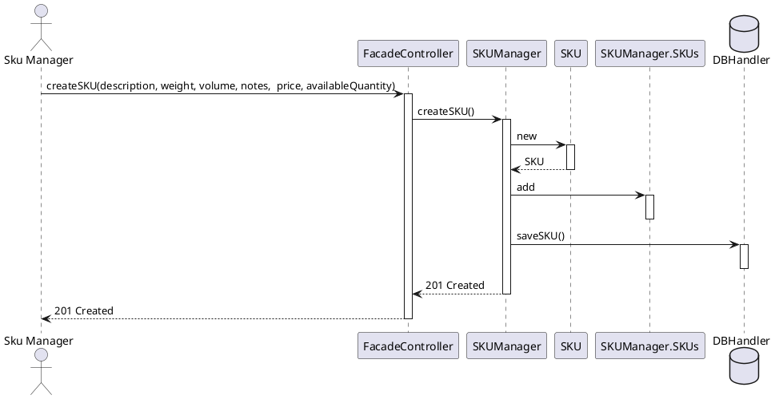

## UC2

### Scenario 2.2
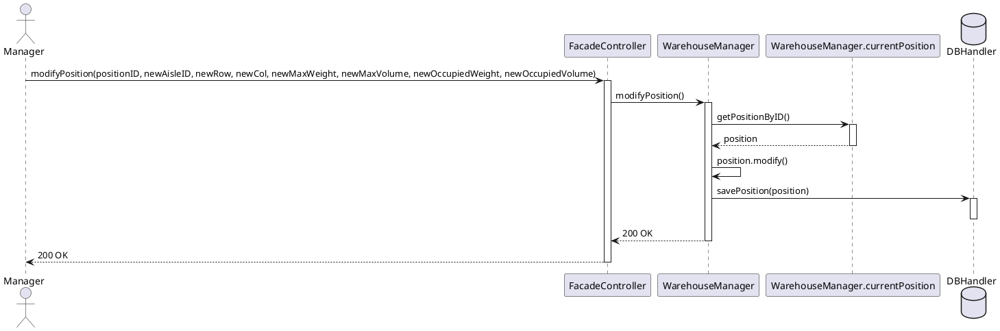
## UC3

### Scenario 3.1
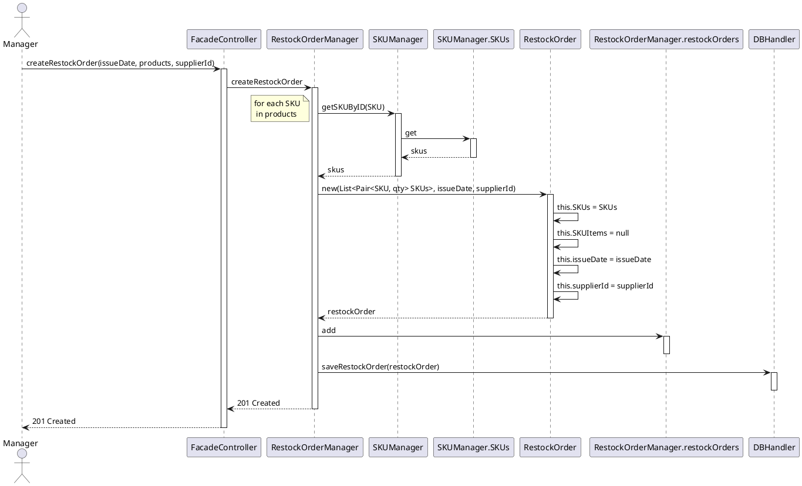
## UC4

### Scenario 4.1

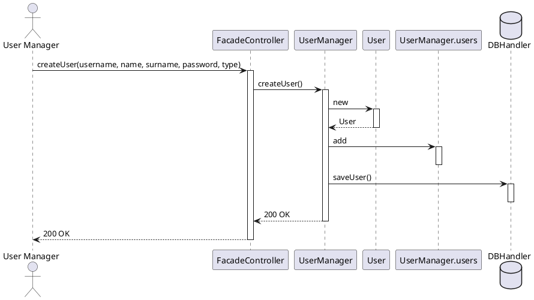
## UC5

### Scenario 5.1.1

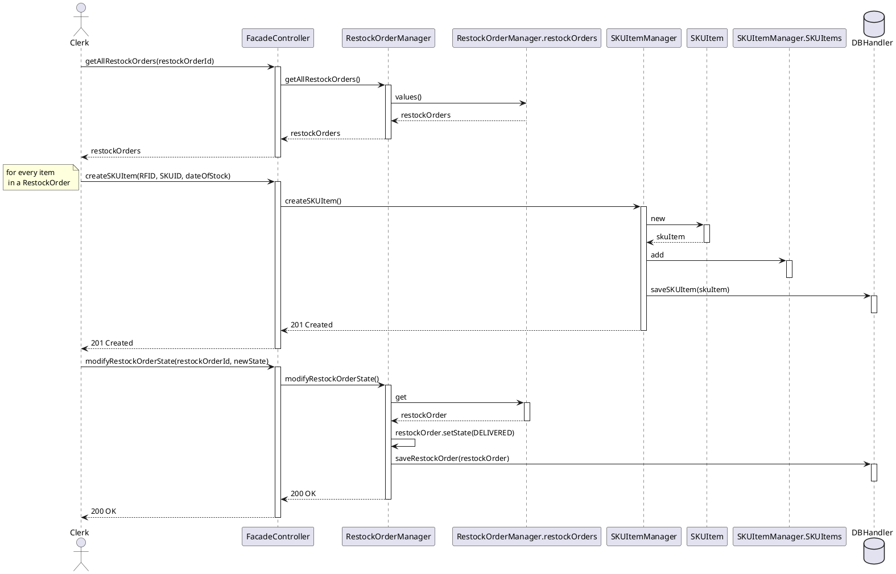
### Scenario 5.2.3

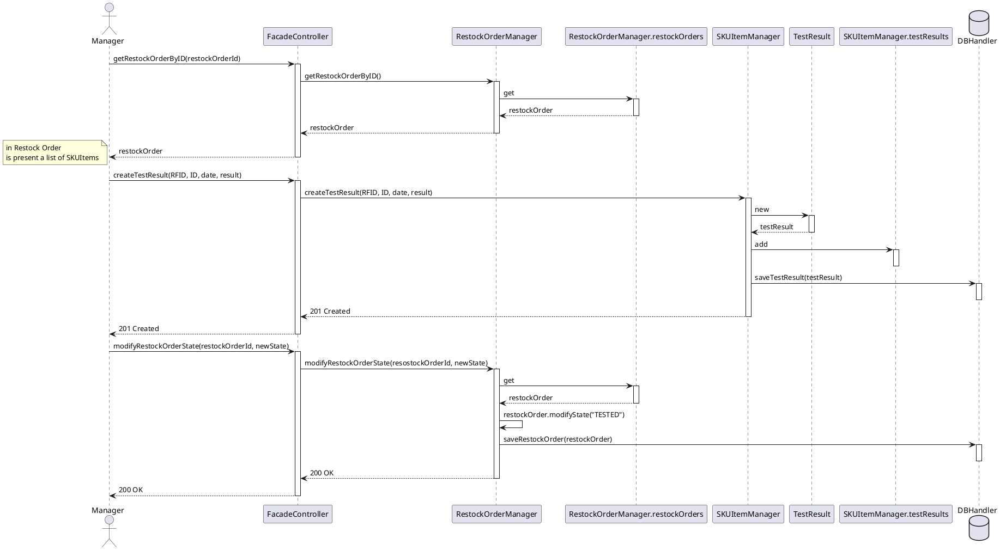
### Scenario 5.3.1
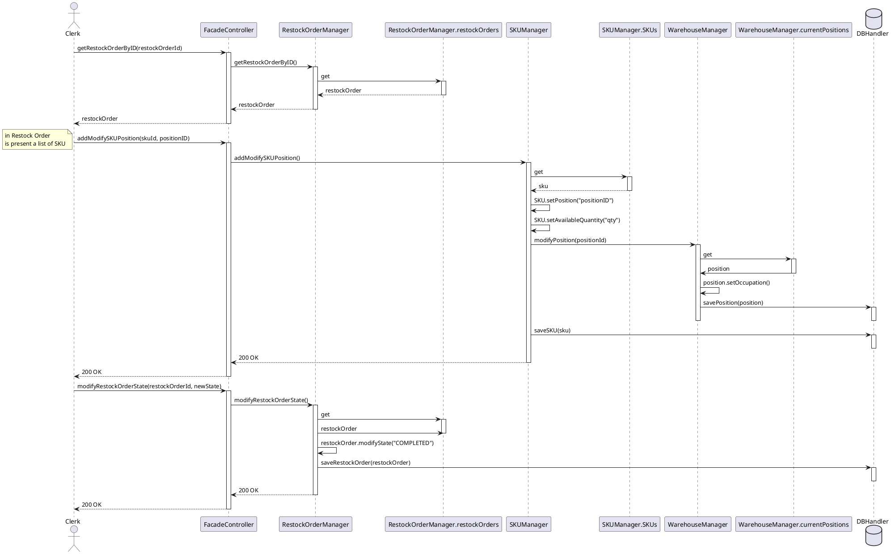
## UC6

### Scenario 6.1

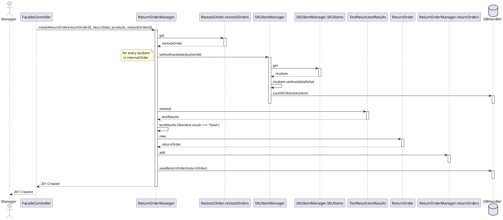
## UC7

### Scenario 7.1

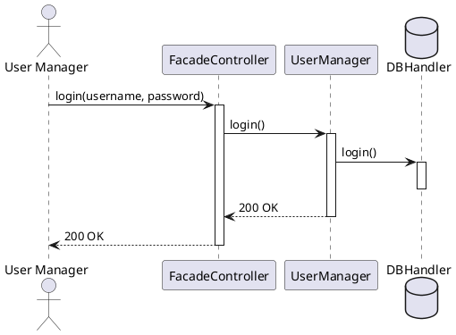
## UC9

### Scenario 9.2

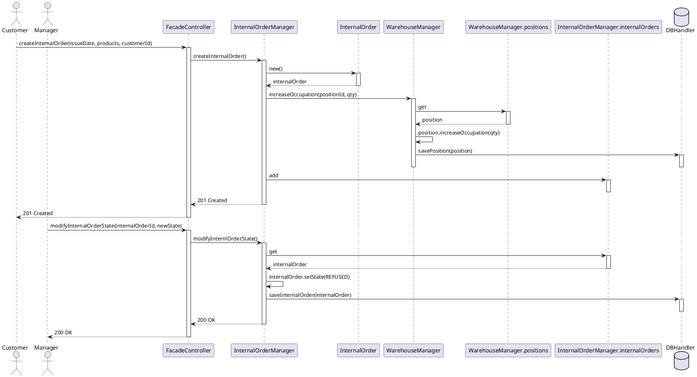
## UC10

### Scenario 10.1

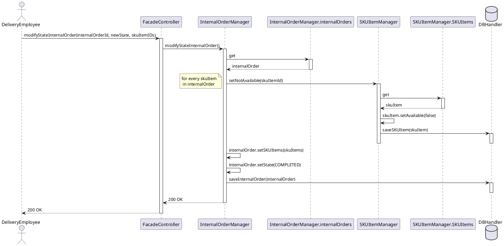
## UC11

### Scenario 11.1

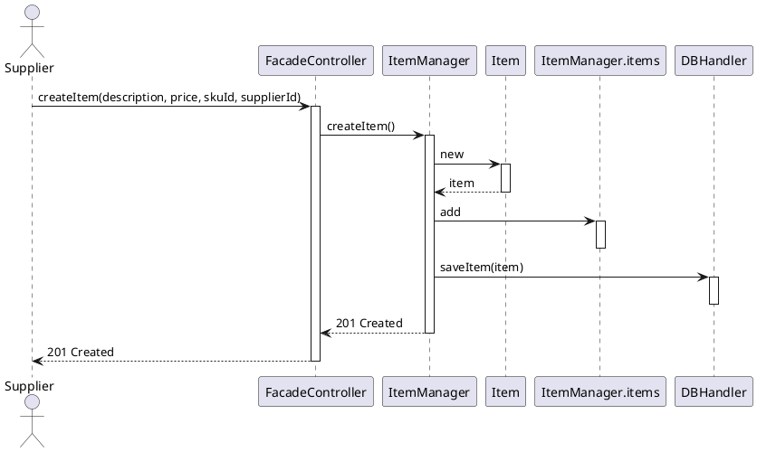
## UC12

### Scenario 12.3

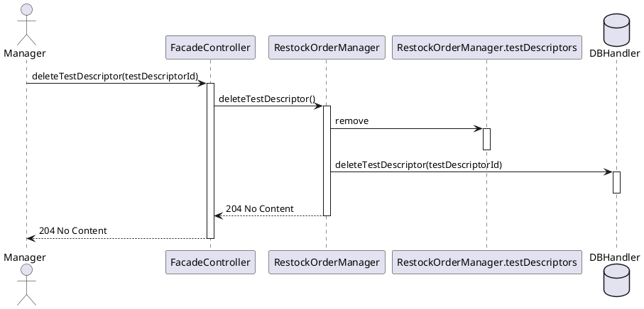
