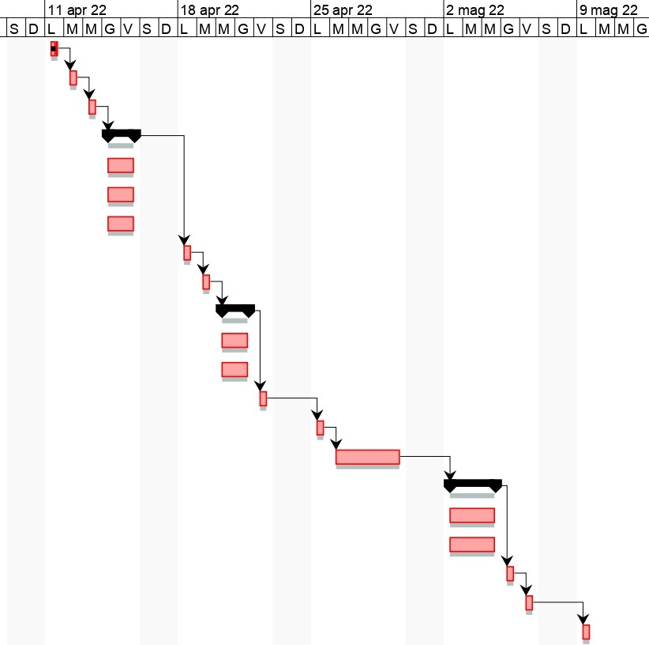

# Project Estimation  
Date: 09/04/2022

Version: 0.0

# Estimation approach
Consider the EZWH  project as described in YOUR requirement document, assume that you are going to develop the project INDEPENDENT of the deadlines of the course
# Estimate by size
### 
|                                                       | Estimate                          |             
| ----------------------------------------------------- | --------------------------------- |  
| NC =  Estimated number of classes to be developed     |   40                              |             
| A = Estimated average size per class, in LOC          |   100                             | 
| S = Estimated size of project, in LOC (= NC * A)      |   4000                            |
| E = Estimated effort, in person hours (here use productivity 10 LOC per person hour)  |    400                                 |   
| C = Estimated cost, in euro (here use 1 person hour cost = 30 euro)                   |    12000                               | 
| Estimated calendar time, in calendar weeks (Assume team of 4 people, 8 hours per day, 5 days per week ) |  2.5 calendar weeks  |               

# Estimate by product decomposition
### 
| component name            | Estimated effort (person hours)   |             
| ------------------------- | --------------------------------- | 
| requirement document      |                 50                |
| GUI prototype             |                 30                |
| design document           |                 40                |
| code                      |                 120               |
| unit tests                |                 30                |
| api tests                 |                 30                |
| management documents      |                 20                |

# Estimate by activity decomposition
### 
| Activity name             | Sub-activity name          | Estimated effort (person hours) |           
| ------------------------- | -------------------------- | ------------------------------- |
| Requirements planning     |                            |                                 |
|                           | Review existing systems    | 5                               |
|                           | Perform work analysis      | 5                               |
|                           | Model process              | 10                              |
|                           | Identify user requirements        | 10                       |
|                           | Identify performance requirements | 5                        |
|                           | Identify interface requirements   | 5                        |
|                           | Prepare software requirements Specification | 10             |
| Design                    |                           |                                  |
|                           | Formalize the architecture | 10                              |
|                           | Define software modules & interactions | 10                  |
|                           | Design patterns               | 10                           |
|                           | Check that they satisfy FR & NFR | 10                        |
|                           | Build prototype           | 10                               |
| Implementation            |                           |                                  |
|                           | Coding                    | 120                              |
|                           | Unit testing              | 30                               |
|                           | API testing               | 20                               |
| Integration               |                           |                                  |
|                           | Integrate all components  | 10                               |
|                           | Testing complete system   | 10                               |
|                           | Software release          | 15                               |

###
###

# Summary

Report here the results of the three estimation approaches. The  estimates may differ. Discuss here the possible reasons for the difference

|                                       | Estimated effort                        |   Estimated duration |          
| ------------------------------------- | --------------------------------------- | -------------------- |
| estimate by size                      | 400 ph                                  | 2.5 calendar weeks   |
| estimate by product decomposition     | 320 ph                                  | 2.0 calendar weeks   |
| estimate by activity decomposition    | 305 ph                                  | 1.9 calendar weeks   |

