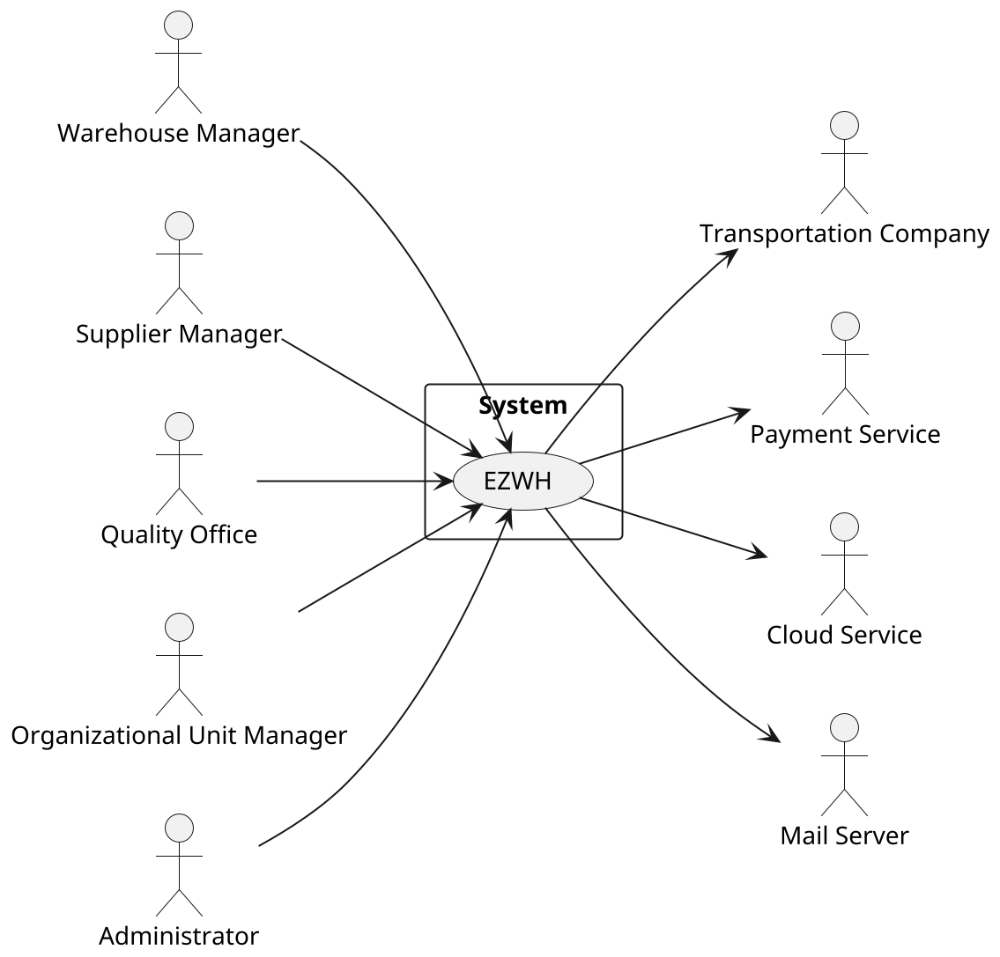
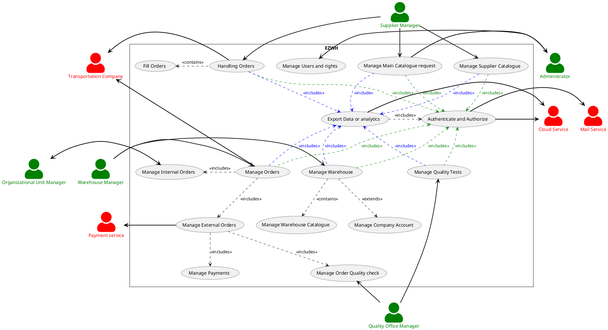
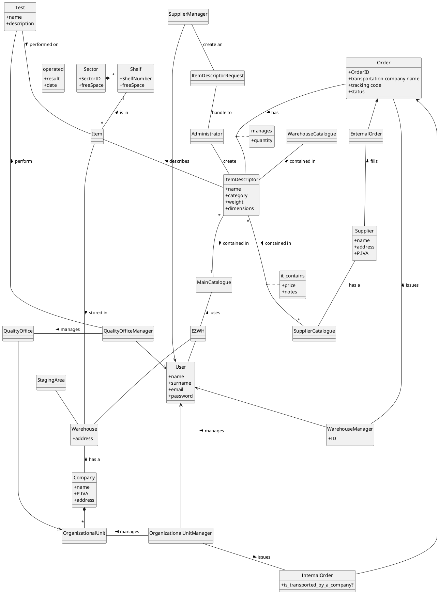
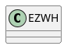
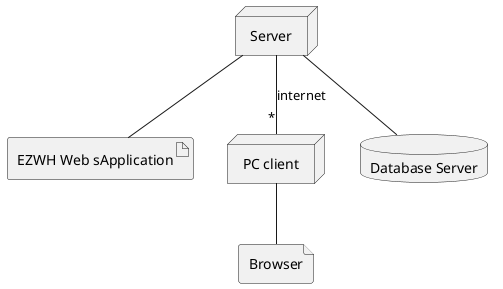

# Requirements Document 

Authors: 
- Fabio Orazio Mirto
- Roberto Sirigu
- Peter Alhachem
- Stefano De Venuto

Date: 13 april 2022

Version: 1.0

| Version number | Change                                                       |
|----------------|:-------------------------------------------------------------|
| 0.1              | Added Stakeholders and some interfaces |
| 0.2              | Completed interfaces and added context diagram |
| 0.3              | Fixed Context Diagram and added Stories and Functional Requirements |
| 0.4              | Added Non Functional Requirements |
| 0.5              | Added Use Case Diagram and Use Cases |
| 0.6              | Fixed some Use Cases and added Glossary |
| 0.7              | Added Deployment Diagram |
| 1                | Minor fix|

# Contents

- [Informal description](#informal-description)
- [Stakeholders](#stakeholders)
- [Context Diagram and interfaces](#context-diagram-and-interfaces)
	+ [Context Diagram](#context-diagram)
	+ [Interfaces](#interfaces) 
	
- [Stories and personas](#stories-and-personas)
- [Functional and non functional requirements](#functional-and-non-functional-requirements)
	+ [Functional Requirements](#functional-requirements)
	+ [Non functional requirements](#non-functional-requirements)
- [Use case diagram and use cases](#use-case-diagram-and-use-cases)
	+ [Use case diagram](#use-case-diagram)
	+ [Use cases](#use-cases)
    	+ [Relevant scenarios](#relevant-scenarios)
- [Glossary](#glossary)
- [System design](#system-design)
- [Deployment diagram](#deployment-diagram)

# Informal description
Medium companies and retailers need a simple application to= manage the relationship with suppliers and the inventory of physical items stocked in a physical warehouse. 
The warehouse is supervised by a manager, who supervises the availability of items. When a certain item is in short supply, the manager issues an order to a supplier. In general the same item can be purchased by many suppliers. The warehouse keeps a list of possible suppliers per item. 

After some time the items ordered to a supplier are received. The items must be quality checked and stored in specific positions in the warehouse. The quality check is performed by specific roles (quality office), who apply specific tests for item (different items are tested differently). Possibly the tests are not made at all, or made randomly on some of the items received. If an item does not pass a quality test it may be rejected and sent back to the supplier. 

Storage of items in the warehouse must take into account the availability of physical space in the warehouse. Further the position of items must be traced to guide later recollection of them.

The warehouse is part of a company. Other organizational units (OU) of the company may ask for items in the warehouse. This is implemented via internal orders, received by the warehouse. Upon reception of an internal order the warehouse must collect the requested item(s), prepare them and deliver them to a pick up area. When the item is collected by the other OU the internal order is completed. 

EZWH (EaSy WareHouse) is a software application to support the management of a warehouse.

# Stakeholders

| Stakeholder Name | Description |
|:-----|:------------|
| Companies | Establishment made of several departments whose main objective is to sell items; "Retailers" is a synonym |
| Suppliers | The emobodiement of an entity that provides a certain product to a company; "Manufacturers" could be an  example of a supplier |
| Warehouse Manager | Person in charge of making order requests to the suppliers and supervising the work of the warehouse's workers|
| Supplier Manager | Person in charge of handling the order requests received|
| Administrator | Manages the addition of Companies to the software |
| Warehouse Workers | Employees that execute the directions of the manager(item unpacking,item positioning,quantity check)  |
| Quality Office | Check the quality of the product upon arrival to the warehouse |
| Organizational unit | Different branch or department of a Company |
| Organizational unit Manager | The head of a organizational unit that can start an internal order procedure |
| Competitors | Any company that produces Warehouse Management applications|
| StartUp Owner | The founder/creator of the startup company "EZWH" |
| Startup Financer | Group or individuals funding the startup "EZWH" |
| Cloud Service | Service to store data and perform calculations on cloud |
| Payment service | Service to allow payment of orders |
| Transportation Service | Service that takes care of the external and internal orders |
| Mail Service | Service that generate mails for reset password requests |

# Context Diagram and interfaces

## Context Diagram

## Interfaces

| Actor | Logical Interface | Physical Interface |
|:------|:------------------|:-------------------|
| Warehouse Manager | GUI | M&K |
| Supplier Manager | GUI | M&K |
| Administrator | GUI | M&K |
| Quality Office Manager      | GUI                 | M&K                |
| Organizational Unit Manager | GUI | M&K |
| Payment Service | Internet Connection | API |
| Cloud Service | Internet Connection | API |
| Transportation Service | Internet Connection | M&K |
| Mail Service | Internet Connection | API |

# Stories and personas

Clara,47, has recently made a drastic change in her career recently transitioning to a company that sells mechanical components to other establishments, which she acquired the job of manager there. But to her surprise, she realized that the work in her new job is much harder since everything is done manually while she was used to an autonomous work bark in her old job. She was used to an implemented software which helps her handle orders coming from retail stores and track the transportation of the orders as well as giving frequent update to her clients about the shipment status. Clara would like to share her previous experience with this new company

Erzo ,30, is the Chief Executive of the marketing department inside of multibillion toy company.The main part of his job is to try the toys with his team so he can actually come up with an idea to attract kids towards buying their several products. However, everytime he has to ask for a toy from the warehouse he has to ask his superior to send an email to warehouse and he is not able to know when does the toys arrive to their headquarters. Erzo would prefer to have a direct contact with the warehouse, with possibly a tracking algorithm

Katia, 32 ,is the executive manager of the quality office department of a phone franchise in the US. Katia has been in this position for 5 years now and since her appointing, every time Katia wants to test the boards,processors and components that are sent by IBM and Intel, she is merely able to do her job since she’s notified 2-4 weeks after their arrival in average which actives the non-refundable clause that are stated in the contracts with these companies. Katia would really use a software that notifies her with the arrival of the products with the result of the tests that she performs

Lucy, 22, is part of the head quality team of a little firm that checks the specifications of each order arriving in his stockroom. As part of is mansion, she has to create all the needed tests on paper, perform the test and then report the result on the same sheet. She would like to operate in a digitalize version of this process, convenient enough to remember the tests inserted and to re-apply them to different future orders.

Fabio, 35, is the sytem administrator of Turbance, a company specialized in electronical components. The typical routine of his normal work day consists in keeping all in control, either the ebnormous amount of users in their system, along with his rights and permissions, and all the requests coming from them. Currently is handling all of this using an old management tool, which permits to handle the administrative burden of users, but not any kind of request or permission. He would like to have a complete tool from where he can do all of that

# Functional and non functional requirements

## Functional Requirements

| FR      | Description                                                                     |
| :------ | :------------------------------------------------------------------------------ |
| **FR1** | **Manage Orders**                                                               |
| FR1.1   | &emsp; Manage External orders                                                   |
| FR1.1.1 | &emsp;&emsp; Display the Supplier's list                                        |
| FR1.1.2 | &emsp;&emsp; Show all the items in the catalogue of a specific supplier         |
| FR1.1.3 | &emsp;&emsp; Place new external order                                           |
| FR1.1.4 | &emsp;&emsp; Cancel the external order                                          |
| FR1.1.5 | &emsp;&emsp;Add an item to the external order                                   |
| FR1.1.6 | &emsp;&emsp;Remove an item from the external order                              |
| FR1.1.7 | &emsp;&emsp; Display an external order                                          |
| FR1.1.8 | &emsp;&emsp; Manage the status an external order                                |
| FR1.1.9 | &emsp;&emsp; Send the items of an order back                                    |
| FR1.2   | &emsp; Manage Internal order                                                    |
| FR1.2.1 | &emsp;&emsp; Display the list of items in the Warehouse                         |
| FR1.2.2 | &emsp;&emsp; Place a new internal order                                         |
| FR1.2.3 | &emsp;&emsp; Cancel an interal order                                            |
| FR1.2.4 | &emsp;&emsp; Add an item to the interal order                                   |
| FR1.2.5 | &emsp;&emsp; Remove an item to the interal order                                |
| FR1.2.6 | &emsp;&emsp; Display an interal order                                           |
| FR1.2.7 | &emsp;&emsp; Manage the status of an internal order                             |
| FR1.2.8 | &emsp;&emsp;Manage transportation method                                        |
| **FR2** | **Manage Warehouse**                                                            |
| FR2.1   | &emsp;&emsp; Track the position of every item                                   |
| FR2.2   | &emsp;&emsp; Update quantity of an item                                         |
| FR2.3   | &emsp;&emsp; Track remaining free space for every item                          |
| FR2.4   | &emsp;&emsp; Modify item location                                               |
| FR2.5   | &emsp;&emsp;Display suppliers' list                                             |
| FR2.6   | &emsp;&emsp;Manage Warehouse catalogue                                          |
| FR2.6.1 | &emsp;&emsp; Add an item                                                        |
| FR2.6.2 | &emsp;&emsp;&emsp;&emsp;Remove an item                                          |
| FR2.6.3 | &emsp;&emsp;&emsp;&emsp; Search an item                                         |
| **FR3** | **Manage Warehouse Account from Administrator**                                 |
| FR3.1   | &emsp;&emsp;Add account                                                         |
| FR3.2   | &emsp;&emsp; Remove account                                                     |
| FR3.3   | &emsp;&emsp;Update account                                                      |
| FR3.4   | &emsp;&emsp; Modify privileges                                                  |
| FR3.5   | &emsp;&emsp; List of the user                                                   |
| FR3.6   | &emsp;&emsp; Search a user                                                      |
| **FR4** | **Manage Quality**                                                              |
| FR4.1   | &emsp;  Manage a test                                                           |
| FR4.1.1 | &emsp;&emsp;Add a test with its description                                     |
| FR4.1.2 | &emsp;&emsp;Update the test's description                                       |
| FR4.1.3 | &emsp;&emsp;Delete a test                                                       |
| FR4.2   | &emsp; Manage order quality check                                               |
| FR4.2.1 | &emsp;&emsp;Display orders (and within items) in the staging area               |
| FR4.2.2 | &emsp;&emsp; Display the list of possible tests for every item inside the order |
| FR4.2.3 | &emsp;&emsp;Add a test to the item                                              |
| FR4.2.4 | &emsp;&emsp;Remove a test from the item                                         |
| FR4.2.5 | &emsp;&emsp;Report the result of a test                                         |
| FR4.2.6 | &emsp;&emsp;Report the result of an order                                       |
| FR4.2.7 | &emsp;&emsp;Ignore an order                                                     |
| FR4.2.8 | &emsp;&emsp;Send the items of an order back                                     |
| **FR5** | **Manage Supplier Catalogue**                                                   |
| FR5.1   | &emsp;&emsp;Add an item                                                         |
| FR5.2   | &emsp;&emsp;Remove an item                                                      |
| FR5.3   | &emsp;&emsp; Show items in the catalogue                                        |
| FR5.4   | &emsp;&emsp;Filter items in the catalogue                                       |
| FR5.5   | &emsp;&emsp;Update an item's attribute                                          |
| FR5.6   | &emsp;&emsp;Create a request for a new item                                     |
| **FR6** | **Manage Authentication**                                                       |
| FR6.1   | &emsp;&emsp; Login                                                              |
| FR6.2   | &emsp;&emsp;Logout                                                              |
| FR6.3   | &emsp;&emsp;Restore password                                                    |
| **FR7** | **Manage Payment**                                                              |
| FR7.1   | &emsp;&emsp; Manage Payment for external order                                  |
| **FR8** | **Export data or analytics**                                                    |
| FR8.1   | &emsp;&emsp;Export data or analytics from warehouse items                       |
| FR8.2   | &emsp;&emsp;Export data or analytics from orders                                |
| FR8.3   | &emsp;&emsp;Export data or analytics from suppliers                             |
| **FR9** | **Manage item requests**                                                        |
| FR9.1   | &emsp;&emsp; Accept an item request                                             |
| FR9.2   | &emsp;&emsp;Reject item request                                                 |

## Non Functional Requirements

| ID    | Type        | Description  | Refers to |
|:------|:-----------:|:-------------| ----------|
| NFR1 | Privacy      | Users' passwords must not be saved in the system | FR3 |
| NFR2 | Privacy      | The data of a customer should not be disclosed outside the application | All FR |
| NFR3 | Usability    | The user must learn how to use the application in less than 20 minutes | All FR |
| NFR3 | Portability |The application should be accessed by Chrome (version 81 and more recent), and Safari (version 13 and more recent) (this covers around 80% of installed browsers); and from the operating systems where these browsers are available (Android, IoS, Windows, MacOS, Unix). As for devices, the application should be usable on smartphones (portrait) and PCs (landscape). | All FR |
| NFR4 | Performance  | The Suppliers' list must be retrieved in less than 1 seconds | FR1.2 |
| NFR2 | Performance  | All functions should complete in leass than 0.5 second | All FR |
| NFR5 | Localisation | Decimal numbers use . (dot) as decimal separator | All FR |
| NFR6 | Domain       | Currency is Euro | All FR |

# Use case diagram and use cases

## Use case diagram

## Use cases

### Use case 1, UC1 - Manage Supplier catalogue

| Actors Involved  | Supplier Manager |
|:-----------------|:----------------:|
| Precondition     |  |
| Post condition   |  |
| Nominal Scenario | SupplierManager creates a new item descriptor IT populating its fields |
| Variants         | IT exists already, SupplierManager modifies its fields                 |
|                  | Add item descriptor X in the catalogue |
|                  | Modify item descriptor's price per unit |
|                  | Modify item descriptor's notes |
|                  | Filter Items' Desciptors |
|                  | Delete Item X from SupplierCatalogue SC |
| Exception        | New price < 0 |
|                  | The Item to be added is not in the Main Catalogue |

##### Scenario 1-1, Nominal Scenario

| Scenario       | Create a new item descriptor request |
|:---------------|:-------------------:| 
| Precondition   | Supplier Manager SM exists and is logged in |
| Post condition | Item Descriptor Request ITR exists and is in OPEN state and received by the administrator|
| Step#          | Description  |
| 1              | SM opens a new "Add item descriptor" request |
| 2              | SM inserts new item descriptor name |
| 3              | SM inserts new item descriptor characteristics |
| 4              | SM confirms the entered data |
| 5              | ITR is sent to the Administrator and recorded in the system in OPEN state |

##### Scenario 1-2, Add item descriptor X in the catalogue 

| Scenario       | Add item descriptor X in the catalogue |
|:---------------|:-------------------:| 
| Precondition   | Supplier Manager SM exists and is logged in |
|                | MainCatalogue MC exists |
| Post condition | X is added into the Supplier Catalogue SC along with is price |
| Step#          | Description  |
|  1             | SM selects an item descriptor X from MC |
|  2             | SM inserts new item price per unit |
|  3             | SM inserts new item notes |
|  4             | SM confirms the entered data |

##### Scenario 1-3, Add an item descriptor X not in the Main Catalogue 

| Scenario       | Add item descriptor X in the catalogue |
|:---------------|:-------------------:| 
| Precondition   | Supplier Manager SM exists and is logged in |
|                | MainCatalogue MC exists |
| Post condition | An error is generated |
| Step#          | Description  |
|  1             | SM selects an item descriptor X not from MC |
|  2             | An error is generated |

##### Scenario 1-4, Modify item descriptor's price per unit	

| Scenario       | Modify item descriptor price per unit |
|:---------------|:----------------------------------:| 
| Precondition   | Supplier Manager SM exists and is logged in |
|                | item descriptor X exists and is in SC |
| Post condition | X.pricePerUnit = new Price |
| Step#          | Description  |
| 1              | SM searches X via ID or name |
| 2              | SM selects X's record |
| 3              | SM inserts a new price |
| 4              | SM confirms the update |
| 5              | X is updated |

##### Scenario 1-5, Modify item descriptor's price with a negative amount

| Scenario       | Modify item descriptor price per unit |
|:---------------|:----------------------------------:| 
| Precondition   | Supplier Manager SM exists and is logged in |
|                | item descriptor X exists and is in SC |
| Post condition | An error is generated |
| Step#          | Description  |
| 1              | SM searches X via ID or name |
| 2              | SM selects X's record |
| 3              | SM inserts a new price < 0 |
| 4              | An error is generated |

##### Scenario 1-6, Modify item descriptor's notes

| Scenario       | Modify item descriptor's notes |
|:---------------|:----------------------------------:| 
| Precondition   | Supplier Manager SM exists and is logged in |
|                | item descriptor X exists |
| Post condition | X.notes = new Notes |
| Step#          | Description  |
| 1              | SM searches X via name |
| 2              | SM selects X's record |
| 3              | SM inserts new notes |
| 4              | SM confirms the update |
| 5              | X is updated |

##### Scenario 1-7, Filter Items' Desciptors

| Scenario       | Filter Items' Desciptors |
|:---------------|:----------------------------------:| 
| Precondition   | Software shows all the products, sorted by ID |
|                | item descriptor X exists in SC |
| Post condition | The resultant products are displayed |
| Step#          | Description  |
| 1              | User filters the products by writing in the search bar (ID,name..) and/or using filters |
| 2              | System displays products filtered by custom criteria |

#### Scenario 1-8, Delete Item X from SupplierCatalogue SC

| Scenario       | Delete Item X from SupplierCatalogue SC |
|:---------------|:----------------------------------:| 
| Precondition   | item descriptor X exists in SC |
| Post condition | Item is successfully deleted |
| Step#          | Description  |
| 1              | Item is found by writing in the search bar (ID,name..) and/or using filters |
| 2              | SM deletes the item|
| 3              | SM confirms the deletion of the item|
| 4              | Item is successfully deleted |

## Order Management

### Use case 2, UC2 - Manage Orders

| Actors Involved  | Warhouse Manager |
|:---------------- |:-------------:|
| Precondition     | Warehouse Manager WM has an account |
|                  | Warehouse Manager WM is authenticated |
| Post condition   | Order O has been issued |
| Nominal Scenario | WM creates a new order O with a list of item descriptor ITs that are chosen from a specific Supplier Catalogue SC. WM sends order to a selected supplier and pays the price visible in the supplier's catalogue through a pay button. When order arrives to the warehouse, WM records order arrival. |
| Variants         | Add items to an ongoing order |
|                  | Record order O arrival |
|                  | Record order O testing process as completed |
|                  | Record order O testing process as failed |
| Exceptions       | Payment failed to go through |
|                  | The item descriptor in O comes form different Suppliers |

##### Scenario 2-1, Nominal Scenario

| Scenario       |  Create a new order          |
|:---------------|:----------------------------:| 
| Precondition   | Warehouse Manager WS exists and is logged in |
|                | Staging area is not full                     |
| Post condition | Order O exists and is in ISSUED state        |
| Step#          | Description  |
| 1              | WM creates order O |
| 2              | For each item descriptor T to be added |
| 3              |   WM adds T to O |
| 4              |   WM fills the  quantity of T to be ordered  |
| 5              |   WM reserves the sector SEC and the Shelf SHE that will fill the items upon arrival |
| 6              | WM pays the order O |
| 7              | O is recorded in the system in ISSUED state |
| 8              | A new notification is sent to the Supplier S |

##### Scenario 2-2, Record order O arrival

| Scenario       | Record order O arrival |
|:---------------|:-------------:| 
| Precondition   | Warehouse Manager WS exists and is logged in |
|                | Order O exists and is in SHIPPED state  |
| Post condition | O is in TESTING state  |
| Step#          | Description   |
|  1             | O arrives to the staging area               |
|  2             | WS records O arrival in the system          |
|  3             | O is updated in the system in TESTING state |

##### Scenario 2-3, Record order O testing process as completed

| Scenario       | Record order O testing process as completed  |
|:---------------|:--------------------------------------------:| 
| Precondition   | Warehouse Manager WS exists and is logged in |
|                | Order O exists and is in TESTED or IGNORED state |
| Post condition | O is in COMPLETED state  |
| Step#          | Description   |
|  1             | O arrives to the warehouse             |
|  2             | WS records O arrival in the system          |
|  3             | For each item descriptor T in the order |
|  4             |   The system updates T available quantity   |
|  5             |   The system updates the Supplier list of T |
|  6             | O is updated in the system in COMPLETED state |

##### Scenario 2-4, Record order O testing process as failed

| Scenario       | Record order O testing process as completed  |
|:---------------|:--------------------------------------------:| 
| Precondition   | Warehouse Manager WS exists and is logged in |
|                | Order O exists and is in REJECTED state |
| Post condition | The order O is sent back to the Supplier and is in COMPLETED state |
| Step#          | Description   |
|  1             | WS inserts the name of the transportation company for the return |
|  2             | WS inserts the shipping code of the return |
|  3             | O is updated in the system in COMPLETED state |

##### Scenario 2-5, Item descriptors in order O come from different suppliers
| Scenario       | Item descriptors in order O come from different suppliers  |
|:---------------|:----------------------------:| 
| Precondition   | Warehouse Manager WM exists and is logged in |
| Post condition | Error message is displayed |
| Step#          | Description  |
| 1              | WM displays the list of items from the SupplierCatalogue SC1   |
| 2              | WM selects the items of SC1  |
| 3              | WM validates the items of order O  |
| 4              | WM displays the list of items from the SupplierCatalogue SC2   |
| 5		         | WM selects the items of SC2 |
| 6              | Error message is displayed about the diversity of suppliers in the same order | 
| 7              | A Message is displayed to perform another order O1 with the items selected from SC2|

##### Scenario 2-6, Modify Order O  
| Scenario       |  Modify order O |
|:---------------|:----------------------------:| 
| Precondition   | Warehouse Manager WM exists and is logged in |
|		         | Order O exists and is in ISSUED state|
| Post condition | Order O changes are registered |
| Step#          | Description  |
| 1              | WM displays the order that he wants to change |
| 2              | WM executes the changes on order O  |
| 3              | WM validates the changes made on order O  |
| 4              | WM submits order O |
| 5              | O changes are recorded in the system | 

##### Scenario 2-7, Delete Order O
| Scenario       | Delete Order O  |
|:---------------|:----------------------------:| 
| Precondition   | Warehouse Manager WM exists and is logged in |
|		         | Order O exists and is in ISSUED state |
| Post condition | Order O changes from the ISSUED to DELETED state|
| Step#          | Description  |
| 1              | WM displays the sent order O   |
| 2              | WM executes the deletion of the order O  |
| 3              | WM validates the deletion of the order O  |
| 4              | O is recorded in the system as DELETED state  |

##### Scenario 2-8, Payment fails to go through
| Scenario       | Payment fails to go through  |
|:---------------|:----------------------------:| 
| Precondition   | Warehouse Manager WM exists and is logged in |
|		         | Order O exists |
| Post condition | Error message is displayed|
| Step#          | Description  |
| 1              | WM creates order O  |
| 2              | WM enlists all the desired items from the Supplier Catalogue SC in the order O  |
| 3              | WM validates the list of items in order O  |
| 4              | WM pays for order O   |
| 5		         | Error message is displayed specifying the failure of transaction |

### Use case 3, UC3 -Handling Orders
| Actors Involved  | Supplier Manager |
|:-----------------|:----------------:|
| Precondition     | Supplier Manager SM exists and is logged in |
| Post condition   |  |
| Nominal Scenario | SM handles received orders |
| Variants         | SM Filters received orders |

##### Scenario 3-1, SupplierManager handles received orders 

| Scenario       | SM handles received orders |
|:---------------|:------------------------------:| 
| Precondition   | Supplier Manager SM exists and is logged in |
|		         | List of orders exists |
| Post condition | Order O changes from ISSUED state to ACCEPTED state |
| Step#          | Description  |
| 1              | SM displays the list of ongoing orders from new to old (by default) |
| 2              | SM accepts order O out of the list of orders  |
| 3              | O is updated in the system to ACCEPTED state |

##### Scenario 3-2, SupplierManager Filters received orders

| Scenario       | Filtering an order (1)  |
|:---------------|:--------------------------------------------:| 
| Precondition   | Supplier Manager SM exists and is logged in |
|                | List of orders exists |
| Post condition | List of orders O is filtered and displayed |
| Step#          | Description   |
|  1             | SM displays the list of orders O  |
|  2             | SM chooses a filter (display orders from old to new) |
|  3             | List of orders is displayed using the new filter |

##### Scenario 3-3, SupplierManager Filters received orders

| Scenario       | Filtering an order (2) |
|:---------------|:--------------------------------------------:| 
| Precondition   | Supplier Manager SM exists and is logged in |
|                | List of orders exists |
| Post condition | List of orders O is filtered and displayed |
| Step#          | Description   |
|  1             | SM displays the list of orders O  |
|  2             | SM chooses a filter (display orders before a certain date) |
|  3             | List of orders is displayed using the new filter |

##### Scenario 3-4, SupplierManager Filters received orders

| Scenario       | Filtering an order (3) |
|:---------------|:--------------------------------------------:| 
| Precondition   | Supplier Manager SM exists and is logged in |
|                | List of orders exists |
| Post condition | List of orders O is filtered and displayed |
| Step#          | Description   |
|  1             | SM displays the list of orders O  |
|  2             | SM chooses a filter (display orders based on the name of the company) |
|  3             | List of orders is displayed using the new filter |

##### Scenario 3-5, SupplierManager Filters received orders

| Scenario       | Filtering an order (4)  |
|:---------------|:--------------------------------------------:| 
| Precondition   | Supplier Manager SM exists and is logged in |
|                | List of orders exists |
| Post condition | List of orders O is filtered and displayed |
| Step#          | Description   |
|  1             | SM displays the list of orders O  |
|  2             | SM chooses a filter (display orders that are done Non longer in ACTIVE status) |
|  3             | List of orders is displayed using the new filter |

### Use case 4, UC4- Fill orders

| Actors Involved  | Supplier Manager |
|:-----------------|:----------------:|
| Precondition     | Supplier Manager SM exists and is logged in |
| Post condition   |  |
| Nominal Scenario | Fill an order |
| Variants         | |
| Exception        | Estimated date is in the past |

##### Scenario 4-1, Nominal Scenario

| Scenario       | SupplierManager Ships order O  |
|:---------------|:--------------------------------------------:| 
| Precondition   | Supplier Manager SM exists and is logged in |
|                | Order O exists and is in ACCEPTED state |
| Post condition | The order O is shipped and is in SHIPPED state |
| Step#          | Description   |
|  1             | SM inserts the name of transportation company used for filling the order |
|  2             | SM inserts the shipping code of the the order |
|  3             | SM inserts the estimated date of arrival of the order |
|  4             | O is updated in the system in SHIPPED state |
|  5             | A new notification is sent to issuer |

##### Scenario 4-2, Fill an order with estimation date in the past

| Scenario       | Fill an order with estimation date in the past  |
|:---------------|:--------------------------------------------:| 
| Precondition   | Supplier Manager SM exists and is logged in |
|                | Order O exists and is in REJECTED state |
| Post condition | The order O is shipped and is in SHIPPED state |
| Step#          | Description   |
|  1             | SM inserts the name of transportation company used for filling the order |
|  2             | SM inserts the shipping code of the the order |
|  3             | SM inserts an estimated date of arrival of the order past |
|  4             | An error is generated |

## Use case 5, UC5- Manage Warehouse

| Actors Involved  | Warhouse Manager |
|:-----------------|:----------------:|
| Precondition     | Warehouse Manager WM exists and is logged in |
|                  | Item exists and positioned in the warehouse  | 
| Post condition   |  |
| Nominal Scenario | WM tracks an item descriptor's location |
| Variants         | WM modifies Item descriptor's position |

#### Scenario 5-1, WM tracks an item descriptor's location

| Scenario       | WM tracks an item descriptor's location |
|:---------------|:--------------------------------------------:| 
| Precondition   | Warehouse Manager WM exists and is logged in |
|                | Item descriptor exists and is positioned |
| Post condition | Item descriptor's position is displayed |
| Step#          | Description   |
|  1             | Warehouse Manager WM displays the Warehouse Catalogue WC |
|  2             | WM selects an item descriptor  |
|  3		     | Item is displayed with the Sector Number, Shelf character and Position number |

#### Scenario 5-2, WM modifies an item descriptor's location

| Scenario       | WM modifies Item descriptor's position |
|:---------------|:--------------------------------------------:| 
| Precondition   | Warehouse Manager WM exists and is logged in |
|                | Item descriptor exists and is positioned |
| Post condition | Item descriptor's position is changed |
| Step#          | Description   |
|  1             | Warehouse Manager WM displays the Warehouse Catalogue WC |
|  2             | WM selects an item descriptor  |
|  3		     | Item descriptor is displayed with the Sector Number, Shelf character and Position number |
|  4             | WM selects a vacant position and assigns it to the item descriptor |
|  5             | WM validates the new position of the item descriptor | 
|  6             | Item descriptor's position is changed | 

### Use Case 6, UC6 - Managing Company Account

| Actors Involved  | Warhouse Manager |
|:-----------------|:----------------:|
| Precondition     | Warehouse Manager WM exists and is logged in |
| Post condition   |  |
| Nominal Scenario | WM creates a new account |
| Variants         | Display list of accounts |
|                  | Filter list of accounts |
|                  | Remove an account |
|                  | Modifying the rights of an account |

##### Scenario 6-1, WM creates a new account 

| Scenario       | Create a new account  |
|:---------------|:-------------:| 
| Precondition   | Warehouse Manager WM exists and is logged in |
| Post condition | A new account A is created |
| Step#          | Description  |
| 1              | WM create a new account A |
| 2              | WM inserts the email of A |
| 3              | WM inserts the password of A |
| 4              | WM selects the type of account (OU Manager or Quality Office Manager) |
| 5              | A is registered inside the system |

##### Scenario 6-2, Removing an account

| Scenario       | Remove an account A  |
|:---------------|:-------------:| 
| Precondition   | Warehouse Manager WM exists and is logged in |
|                | An account A exists |
| Post condition | A is deleted |
| Step#          | Description  |
| 1              | WM selectes a specific account A |
| 2              | WM deletes A |
| 3              | A is removed from the system |

#### Scenario 6-3, WM displays the list of accounts

| Scenario       | WN displays the list of accounts  |
|:---------------|:-------------:| 
| Precondition   | Warehouse Manager WM exists and is logged in |
| Post condition | List of accounts is displayed |
| Step#          | Description  |
| 1              | WM selects the List of accounts |
| 2              | list of accounts is displayed |

#### Scenario 6-4, WM modifies the right to an account

| Scenario       | WM modifies the right to an account |
|:---------------|:-------------:| 
| Precondition   | Warehouse Manager WM exists and is logged in |
| Post condition | Rights to an account are changed |
| Step#          | Description  |
| 1              | WM selects a specific account |
| 2              | WM changes the rights to this account |
| 3              | WM  validates the changes made |

#### Scenario 6-5, WM filters the accounts 

| Scenario       | WN filters the accounts (1)  |
|:---------------|:-------------:| 
| Precondition   | Warehouse Manager WM exists and is logged in |
| Post condition | Filter is applied and displayed |
| Step#          | Description  |
| 1              | WM selects the List of accounts |
| 2              | WM chooses a filter (display accounts by OU or Quality Office Manager) |
| 3              | List of accounts is displayed | 

#### Scenario 6-6, WM filters the accounts 

| Scenario       | WN filters the accounts (2)  |
|:---------------|:-------------:| 
| Precondition   | Warehouse Manager WM exists and is logged in |
| Post condition | Filter is applied and displayed |
| Step#          | Description  |
| 1              | WM selects the List of accounts |
| 2              | WM chooses a filter (display accounts by date of creation) |
| 3              | List of accounts is displayed |

### Use case 7, UC7 - Manage Warehouse Catalogue 
| Actors Involved  | Warhouse Manager |
|:-----------------|:----------------:|
| Precondition     | Warehouse Manager WM exists and is logged in |
|                  | Item descriptor exists | 
| Post condition   |  |
| Nominal Scenario | WM add an item descriptor to the warehouse catalogue |
| Variants         | WM modifies the item descriptor's quantity in the warehouse catalogue, WM deletes an item descriptor in the warhouse catalogue, WM filters the warehouse catalogue  |
| Exception        | Quantity modified is negative |

##### Scenario 7-1, Add item descriptor X in the Warehouse catalogue 

| Scenario       | Add item descriptor X in the Warehouse catalogue |
|:---------------|:-------------------:| 
| Precondition   | Warehouse Manager WM exists and is logged in |
| Post condition | X is added into the Warehouse Catalogue WC |
| Step#          | Description  |
|  1             | WM selects an item descriptor X in the warhouse|
|  2             | WM inserts new item notes |
|  3             | WM confirms the entered data |
|  4             | The system adds X in WC |

#### Scenario 7-2, Delete Item X from the Warehouse catalogue

| Scenario       | Delete Item X from the Warehouse catalogue |
|:---------------|:----------------------------------:| 
| Precondition   | Warehouse Manager WM exists and is logged in |
|                | Item descriptor X exists in WC |
| Post condition | X is successfully deleted |
| Step#          | Description  |
| 1              | Item is found by writing in the search bar (ID,name..) and/or using filters |
| 2              | WM deletes the item descriptor X|
| 3              | WM confirms the deletion of the item|
| 4              | X is successfully deleted |

#### Scenario 7-3, Modify an item descriptor's quantity

| Scenario       | Modifying an item descriptor's quantity to the warehouse catalogue WC |
|:---------------|:--------------------------------------------:| 
| Precondition   | Warehouse Manager WM exists and is logged in |
|                | Warehouse catalogue exists and Item descriptor exists |
| Post condition | Item descriptor is modified successfully |
| Step#          | Description   |
|  2             | WM selects an item descriptor IT from WC |
|  3		     | WM modifies IT's quantity |
|  5             | WM validates the new quantity of the item descriptor IT | 
|  6             | WM submits the item descriptor IT |

#### Scenario 7-4, Filtering Warehouse Catalogue

| Scenario       | Filtering Warehouse Catalogue (1) |
|:---------------|:--------------------------------------------:| 
| Precondition   | Warehouse Manager WM exists and is logged in |
|                | Warehouse catalogue exists|
| Post condition | Warehouse Catalogue is filtered and displayed |
| Step#          | Description   |
|  1             | WM displays the list of item descriptors ITs in WC  |
|  2             | WM chooses a filter (display items descriptor by name) |
|  3             | List is displayed using the new filter |

#### Scenario 7-5, Filtering Warehouse Catalogue

| Scenario       |  Filtering Warehouse Catalogue (2) |
|:---------------|:--------------------------------------------:| 
| Precondition   | Warehouse Manager WM exists and is logged in |
|                | Warehouse catalogue exists|
| Post condition | Warehouse Catalogue is filtered and displayed |
| Step#          | Description   |
|  1             | WM displays the list of item descriptors ITs in WC  |
|  2             | WM chooses a filter (display items by shelf number) |
|  3             | List is displayed using the new filter |

#### Scenario 7-6, Filtering Warehouse Catalogue

| Scenario       |  Filtering Warehouse Catalogue (3) |
|:---------------|:--------------------------------------------:| 
| Precondition   | Warehouse Manager WM exists and is logged in |
|                | Warehouse catalogue exists|
| Post condition | Warehouse Catalogue is filtered and displayed |
| Step#          | Description   |
|  1             | WM displays the list of item descriptors ITs in WC  |
|  2             | WM chooses a filter (display items by Sector number) |
|  3             | List is displayed using the new filter |

### Scenario 7-7, Quantity entered is negative

| Scenario       | Quantity entered is negative |
|:---------------|:--------------------------------------------:| 
| Precondition   | Warehouse Manager WM exists and is logged in |
|                | Warehouse catalogue exists and Item descriptor exists |
| Post condition | Error is displayed |
| Step#          | Description   |
|  2             | WM selects an item descriptor IT from WC |
|  3		     | WM modifies IT's quantity |
|  5             | WM validates the new quantity of the item descriptor IT | 
|  6             | Error is displayed about the quantity being negative | 

### Use case 8, UC8 - Manage quality tests

| Actors Involved  | Quality Office Manager |
|:-----------------|:-------------:|
| Precondition     | Quality Office Manager QOM exists and is logged in |
| Post condition   |  |
| Nominal Scenario | Create a new test |
| Variants         | Delete test |
|                  | Modify test |
| Exceptions       | Test to be deleted is currently used by an item |

##### Scenario 8-1, Nominal Scenario

| Scenario       |  Create test |
|:---------------|:------------------------------:| 
| Precondition   | Quality Office Manager QOM exists and is logged in |
| Post condition | A new test T is registered in the system |
| Step#          | Description  |
| 1              | QOM opens the list of all the existing tests |
| 2              | QOM selects the "Add a new test" button |
| 3              | QOM creates a new test T |
| 4              | QOM inserts the name of T |
| 5              | QOM inserts the description of T |
| 6              | T is recorded in the system |

##### Scenario 8-2. Delete test

| Scenario       |  Delete test |
|:---------------|:------------------------------:| 
| Precondition   | Admin A exists and is logged in |
| Post condition | The test T is deleted |
| Step#          | Description  |
| 1              | QOM opens the list of all the existing tests |
| 2              | QOM select one test T in particular |
| 3              | QOM deletes T |
| 4              | T is deleted from the system |

##### Scenario 8-3, Modify test

| Scenario       |  Modify test |
|:---------------|:------------------------------:| 
| Precondition   | Quality Office Manager QOM exists and is logged in |
| Post condition | A new test T is registered in the system |
| Step#          | Description  |
| 1              | QOM opens the list of all the existing tests |
| 2              | QOM select one test T in particular |
| 3              | QOM changes tha name or the description of T |
| 4              | T is updated in the system |

##### Scenario 8-4. Delete test in use

| Scenario       |  Delete test in use |
|:---------------|:------------------------------:| 
| Precondition   | Admin A exists and is logged in |
| Post condition | An error is generated |
| Step#          | Description  |
| 1              | QOM opens the list of all the existing tests |
| 2              | QOM select one test T in particular |
| 3              | QOM tries to delete T, but it's currently assigned to an item |
| 4              | An error is generated|

### Use case 9, UC9 - Manage orders quality

| Actors Involved  | Quality Office Manager |
|:-----------------|:-------------:|
| Precondition     | Quality Office Manager QOM exists and is logged in |
| Post condition   |  |
| Nominal Scenario | Display the list of orders in the staging area |
| Variants         | Display the list of items in a order |
|                  | Add a test to an item I |
|                  | Remove a test from an item I |
|                  | Report the result of a test |
|                  | Report the result of an order |
|                  | Ignore an order |

##### Scenario 9-1 Nominal Scenario

| Scenario       | Display the list of orders in the staging area |
|:---------------|:------------------------------:| 
| Precondition   | Quality Office Manager QOM exists and is logged in |
| Post condition | The list of all orders O is displayed, sorted by arrival date (default) |
| Step#          | Description  |
| 1              | QOM changes sort criteria |
| 2              | System displays products sorted by custom criteria  |

##### Scenario 9-2 Add a test to an item I

| Scenario       | Add a test to the item I |
|:---------------|:------------------------------:| 
| Precondition   | Quality Office Manager QOM exists and is logged in |
|                | An order O has been selected |
| Post condition | The item I must be tested with T |
| Step#          | Description |
| 1              | QOM selects an item I from O |  
| 2              | QOM selects a test T from the list of all tests |  
| 3              | QOM adds T to the list of tests to be performed on I | 

##### Scenario 9-3 Remove a test from an item I

| Scenario       | Remove a test from an item |
|:---------------|:------------------------------:| 
| Precondition   | Quality Office Manager QOM exists and is logged in |
|                | An order O has been selected |
| Post condition | T is removed from the list of tests of the item I |
| Step#          | Description |
| 1              | QOM selects an item I from O |  
| 2              | QOM selects a test T from the list of the tests of I |  
| 3              | QOM removes the test |

##### Scenario 9-4 Report the result of a test

| Scenario       | Report the result of a test |
|:---------------|:------------------------------:| 
| Precondition   | Quality Office Manager QOM exists and is logged in |
| Post condition | The result of T is set |
| Step#          | Description |
| 1              | QOM selects T from the list of tests of an item |  
| 2              | QOM select the result of the test, which can be PASSED or NOT PASSED |
| 3              | The state of T is updated accordingly in the system |

##### Scenario 9-5 Report the result of an order

| Scenario       | Report the result of an order |
|:---------------|:------------------------------:| 
| Precondition   | Quality Office Manager QOM exists and is logged in |
| Post condition | The result of O is set |
| Step#          | Description |
| 1              | QOM selects O from the list of orders |  
| 2              | QOM select the final result of O, which can be TESTED or REJECTED |
| 3              | The state of O is updated accordingly in the system |

##### Scenario 9-6 Ignore an order

| Scenario       | Report the result of an order |
|:---------------|:------------------------------:| 
| Precondition   | Quality Office Manager QOM exists and is logged in |
| Post condition | The result of O is set |
| Step#          | Description |
| 1              | QOM selects O from the list of orders |  
| 2              | QOM clicks on the "Ignore order" button |
| 3              | O is updated in the system in IGNORED state |

### Use case 10, UC10 - Manage internal orders

| Actors Involved  | Organizational Unit Manager, Warehouse Manager |
|:-----------------|:-------------:|
| Precondition     | |
| Post condition   | |
| Nominal Scenario | OUM creates a new internal order IO with a list of item descriptor ITs from the Warehouse Catalogue |
| Variants         | Add items to a new order |
|                  | Add items to an ongoing order |
|                  | Delete an internal order |
|                  | Remove item from IO |
|                  | Modify internal order |
|                  | Display the list of requested internal orders |
|                  | Fill an order with Transportation Company |
|                  | Fill an order by yourself |
| Exceptions       | / |

##### Scenario 10-1, Nominal Scenario

| Scenario       | Display the list of items in the Warehouse Catalogue |
|:---------------|:------------------------------:| 
| Precondition   | Organizational Unit Manager OUM exists and is logged in |
| Post condition | The list of all item descriptors ITs is displayed, sorted by ID (default) |
| Step#          | Description  |
| 1              | SM changes sort criteria |
| 2              | System displays ITs sorted by custom criteria  |

##### Scenario 10-2, Add items to a new order

| Scenario       |  Add items to a new order |
|:---------------|:----------------------------:| 
| Precondition   | Organizational Unit Manager OUM exists and is logged in |
| Post condition | Internal Order IO is created and has new item descriptors |
| Step#          | Description  |
| 1              | A new internal order IO is created |
| 2              | For each item descriptor T to be added |
| 3              |   OUM adds T to O |
| 4              |   OUM fills quantity of T to be ordered |
| 5              | IO is updated in the system |

##### Scenario 10-3, Modify Order O  
| Scenario       |  Modify order O |
|:---------------|:----------------------------:| 
| Precondition   | Organizational Unit Manager OUM exists and is logged in |
|		         | Internal Order IO exists and is in ISSUED state|
| Post condition | Internal Order IO changes changes are registered|
| Step#          | Description  |
| 1              | OUM displays the order that he wants to change |
| 2              | OUM executes the changes on order IO  |
| 3              | OUM validates the changes made on order IO  |
| 4              | OUM submits order IO |
| 5              | IO changes are recorded in the system | 

##### Scenario 10-4, Delete Order O
| Scenario       | Delete Order O  |
|:---------------|:----------------------------:| 
| Precondition   | Organizational Unit Manager OUM exists and is logged in |
|		         | Internal Order IO exists and is in ISSUED state |
| Post condition | Internal Order IO changes from the ISSUED to DELETED state|
| Step#          | Description  |
| 1              | OUM displays the sent order O   |
| 2              | OUM executes the deletion of the order O  |
| 3              | OUM validates the deletion of the order O  |
| 4              | O is recorded in the system as DELETED state  |

##### Scenario 10-5, Display the list of requested internal orders 

| Scenario       | Display the list of internal orders |
|:---------------|:------------------------------:| 
| Precondition   | Warehouse Manager WM exists and is logged in |
| Post condition | The list of all internal orders IO is displayed, sorted by arrival date (default) |
| Step#          | Description  |
| 1              | WM changes sort criteria |
| 2              | System displays orders sorted by custom criteria  |

##### Scenario 10-6, Fill an order with Transportation Company

| Scenario       | Fill an order  |
|:---------------|:--------------------------------------------:| 
| Precondition   | Warehouse Manager WM exists and is logged in |
|                | Internal Order IO exists and is in ISSUED state |
| Post condition | The internal order IO is shipped and is in COMPLETED state |
| Step#          | Description   |
|  1             | WM inserts the name of transportation company used for filling the order |
|  2             | WM inserts the shipping code of the the order |
|  3             | O is updated in the system in COMPLETED state |
|  4             | A new notification is sent to the issuer Organizational Unit |

##### Scenario 10-7, Fill an order by yourself

| Scenario       | Fill an order  |
|:---------------|:--------------------------------------------:| 
| Precondition   | Warehouse Manager WM exists and is logged in |
|                | Internal Order IO exists and is in ISSUED state |
| Post condition | The order O is shipped and is in COMPLETED state |
| Step#          | Description   |
|  1             | O is updated in the system in COMPLETED state |
|  2             | A new notification is sent to the issuer Organizational Unit |

### Use case 11, UC11 - Manage users and rights

| Actors Involved  | Administrator |
|:-----------------|:-------------:|
| Precondition     | Administrator A logged in |
| Post condition   |  |
| Nominal Scenario | A defines a new user and its access rights  |
| Variants         | Delete user |
|                  | Modiy user rights |

##### Scenario 11-1, Nominal Scenario

| Scenario       |  Create user and define rights |
|:---------------|:------------------------------:| 
| Precondition   | Admin A exists and is logged in |
| Post condition | Account X is created |
| Step#          | Description  |
| 1              | A defines the credentials of the new Account X |  
| 2              | A selects the access rights for the new account X |
| 3              | A confirms the inserted data |

##### Scenario 11-2, Delete user

| Scenario       |  Delete user |
|:---------------|:-------------:| 
| Precondition   | Admin A exists and is logged in |
|                | Account X exists |
| Post condition | Account X deleted |
| Step#          | Description  |
| 1              | A selects account X  |
| 2				 | A executes the deletion of account X |
| 3              | A validates the action |
| 4              | X is deleted from the system | 

##### Scenario 11-3, Modify user rights

| Scenario       |  Modify user rights |
|:---------------|:-------------:| 
| Precondition   | Admin A exists and is logged in |
|                | Account X exists |
| Post condition | X's rights updated |
| Step#          | Description  |
| 1              | A selects account X  |
| 2              | A selects the access rights for X |
| 3              | A confirms the inserted data |

### Use case 12, UC12 - Manage add item descriptor requests

| Actors Involved  | Administrator,Supplier Manager |
|:-----------------|:-------------:|
| Precondition     | Administrator A logged in |
| Precondition     | |
| Post condition   | A new item descriptor IT is added to the system |
| Nominal Scenario | A accepts the request  |
| Variants         | A reject the request |

##### Scenario 12-1, Nominal Scenario

| Scenario       | Accept an ITR |
|:---------------|:-------------:| 
| Precondition   | Admin A exists and is logged in |
|                | An item descriptor Request ITR is in state OPEN |
| Post condition | ITR state is ACCEPTED and a IT is added to the system |
| Step#          | Description  |
| 1              | A accepts ITR |
| 2              | A create a new IT |
| 3              | IT is recorded in the system |
| 4              | ITR is updated in the system in ACCEPTED state |

##### Scenario 12-2, Reject an ITR

| Scenario       | Reject an ITR |
|:---------------|:-------------:| 
| Precondition   | Admin A exists and is logged in |
|                | An item descriptor Request ITR is in state OPEN |
| Post condition | ITR state is REJECTED |
| Step#          | Description  |
| 1              | A rejects an ITR |
| 2              | ITR is updated in the system in REJECTED state |

### Use case 13, UC13 - Authenticate, authorize

| Actors Involved  | Administrator, Warehouse Manager, Supplier Manager, Quality Office Manager |
|:-----------------|:------------------------------------:|
| Precondition     |                                    |
| Post condition   |                                    |
| Nominal Scenario | Login: user enters credentials, system checks credentials, user is authenticated |
| Variants         | Logout |
|                  | Forgot password |
|                  | Reset password |
| Exceptions       | Login, credentials wrong, user not authenticated |

##### Scenario 13-1, Login

| Scenario       |  Login |
|:---------------|:-------------:| 
| Precondition   | Account for User U existing  |
| Post condition | U logged in  |
| Step#          | Description  |
|  1             | User inserts his username |
|  2             | User inserts his password |
|  3             | User logged in, system shows the functionalities offered by the access priviledges of  U |

##### Scenario 13-2, Logout

| Scenario       |  Logout |
|:---------------|:-------------:| 
| Precondition   | U logged-in  |
| Post condition | U logged-out  |
| Step#          | Description  |
| 1              | U logs out |
| 2              | The system shows the login/sign in page |

##### Scenario 13-3, Forgot password

| Scenario       |  Forgot password |
|:---------------|:-------------:| 
| Precondition   | Account for User U existing  |
| Post condition | An email with the reset link is sent to U's mail address  |
| Step#          | Description  |
| 1              | U inserts the mail address used for registration |
| 2              | The system sends an email with a reset link to U |

##### Scenario 13-4, Reset password

| Scenario       |  Reset password |
|:---------------|:-------------:| 
| Precondition   | Account for User U existing  |
|                | The reset password link for U sas been selected  |
| Post condition | The password of U has been changed correctly |
| Step#          | Description  |
| 1              | U inserts the new password |
| 2              | U repeats the new password |
| 3              | The system update the password of U |

# Glossary

# System Design

Not really meaningful in this case. Only software components are needed.

# Deployment Diagram 

Client server model. The application runs on a server or virtual machine, any client accesses it through PC.

