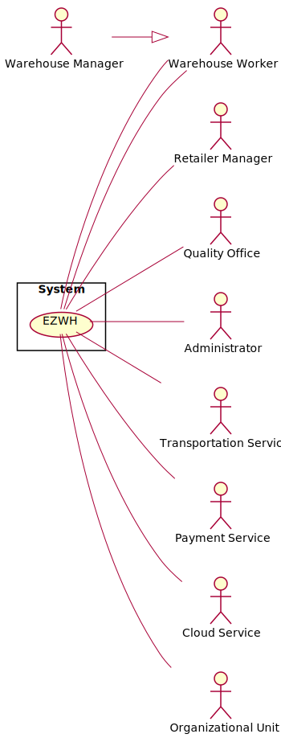
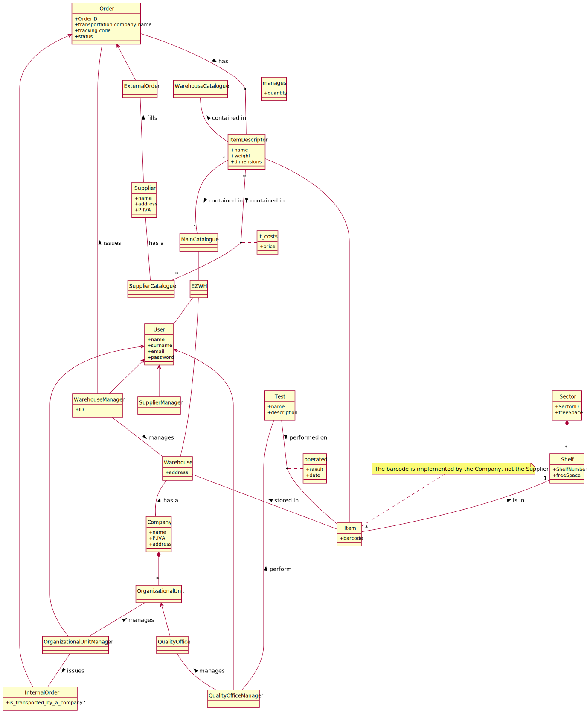

# Requirements Document 

Date: 22 march 2022

Version: 0.0

 
| Version number | Change |
| ----------------- |:-----------|
| | | 

# Contents

- [Informal description](#informal-description)
- [Stakeholders](#stakeholders)
- [Context Diagram and interfaces](#context-diagram-and-interfaces)
	+ [Context Diagram](#context-diagram)
	+ [Interfaces](#interfaces) 
	
- [Stories and personas](#stories-and-personas)
- [Functional and non functional requirements](#functional-and-non-functional-requirements)
	+ [Functional Requirements](#functional-requirements)
	+ [Non functional requirements](#non-functional-requirements)
- [Use case diagram and use cases](#use-case-diagram-and-use-cases)
	+ [Use case diagram](#use-case-diagram)
	+ [Use cases](#use-cases)
    	+ [Relevant scenarios](#relevant-scenarios)
- [Glossary](#glossary)
- [System design](#system-design)
- [Deployment diagram](#deployment-diagram)

# Informal description
Medium companies and retailers need a simple application to= manage the relationship with suppliers and the inventory of physical items stocked in a physical warehouse. 
The warehouse is supervised by a manager, who supervises the availability of items. When a certain item is in short supply, the manager issues an order to a supplier. In general the same item can be purchased by many suppliers. The warehouse keeps a list of possible suppliers per item. 

After some time the items ordered to a supplier are received. The items must be quality checked and stored in specific positions in the warehouse. The quality check is performed by specific roles (quality office), who apply specific tests for item (different items are tested differently). Possibly the tests are not made at all, or made randomly on some of the items received. If an item does not pass a quality test it may be rejected and sent back to the supplier. 

Storage of items in the warehouse must take into account the availability of physical space in the warehouse. Further the position of items must be traced to guide later recollection of them.

The warehouse is part of a company. Other organizational units (OU) of the company may ask for items in the warehouse. This is implemented via internal orders, received by the warehouse. Upon reception of an internal order the warehouse must collect the requested item(s), prepare them and deliver them to a pick up area. When the item is collected by the other OU the internal order is completed. 

EZWH (EaSy WareHouse) is a software application to support the management of a warehouse.

# Stakeholders

| Stakeholder Name | Description |
|:-----|:------------|
| Companies | Establishment made of several departments whose main objective is to sell items; "Retailers" is a synonym |
| Suppliers | The emobodiement of an entity that provides a certain product to a company; "Manufacturers" could be an  example of a supplier |
| Warehouse Manager | Person in charge of making order requests to the suppliers and supervising the work of the warehouse's workers|
| Supplier Manager | Person in charge of handling the order requests received|
| Administrator | Manages the addition of Companies to the software |
| Warehouse Workers | Employees that execute the directions of the manager(item unpacking,item positioning,quantity check)  |
| Quality Office | Check the quality of the product upon arrival to the warehouse |
| Organizational unit | Different branch or department of a Company |
| Organizational unit Manager | The head of a organizational unit that can start an internal order procedure |
| Competitors | Any company that produces Warehouse Management applications|
| StartUp Owner | The founder/creator of the startup company "EZWH" |
| Startup Financer | Group or individuals funding the startup "EZWH" |
| Cloud Service | Service to store data and perform calculations on cloud |
| Payment service | Service to allow payment of orders |
| Transportation Service | Service that takes care of the external and internal orders |

# Context Diagram and interfaces

## Context Diagram

## Interfaces

| Actor | Logical Interface | Physical Interface |
|:------|:------------------|:-------------------|
| Warehouse Manager | GUI | M&K |
| Supplier Manager | GUI | M&K |
| Administrator | GUI | M&K |
| Quality Office Manager      | GUI                 | M&K                |
| Organizational Unit Manager | GUI | M&K |
| Payment Service | Internet Connection | API |
| Cloud Service | Internet Connection | API |
| Transportation Service | Internet Connection | M&K |

# Stories and personas
Barbara, 30, is the manager of a big company's warehouse, handling hundresds of items per day. He has always managed the position of the goods by himself, leading to some management problems during the years. Also the re-fill process is handled by him, directly calling to different suppliers asking for availabilities of items. He would really like to use an application which can automatize this entire handling process. 

Rita, 45, has been recently hired as manager in a company that acts as a supplier for other companies or retailers, by selling mechanical components to them. In his previous job, he was used to a software which automatically checks if an order is satisfiable or not and contacts the transportation company. Now he has to manually check the availabilities for every item, and directly phone the transaportation company. He would like to emulate the same experience got in his previous mansion.

Ezio, 35, is the chief of one of the Organizational Unit that composes a worldwide company. Anytime he needs an item from the central warehouse, he send an internal order request to the headquarter offices, which will be only later sent to the warehouse, resulting in a huge delay of time due to burocracy. He would really appreciate a software that manages a direct communication with the warehouse manager. 

# Functional and non functional requirements

## Functional Requirements

| FR      | Description                                                        |
| :------ | :----------------------------------------------------------------- |
| FR1     | Manage Orders                                                      |
| FR1.1   | Manage External orders                                             |
| FR1.1.1 | Display the Supplier's list                                        |
| FR1.1.2 | Show all the items in the catalogue of a specific supplier         |
| FR1.1.3 | Place new external order                                           |
| FR1.1.4 | Cancel the external order                                          |
| FR1.1.5 | Add an item to the external order                                  |
| FR1.1.6 | Remove an item from the external order                             |
| FR1.1.8 | Display an external order                                          |
| FR1.2   | Manage Internal order                                              |
| FR1.2.1 | Display the list of items in the Warehouse                         |
| FR1.2.2 | Place a new internal order                                         |
| FR1.2.3 | Cancel an interal order                                            |
| FR1.2.4 | Add an item to the interal order                                   |
| FR1.2.5 | Remove an item to the interal order                                |
| FR1.2.6 | Display an interal order                                           |
| FR1.2.7 | Manage the status of the order                                     |
| FR1.2.8 | Manage transportation method                                       |
| FR2     | Manage Warehouse                                                   |
| FR2.1   | Track the position of every item                                   |
| FR2.2   | Update quantity of an item                                         |
| FR2.3   | Track remaining free space for every item                          |
| FR2.4   | Manage Wraehouse catalogue                                         |
| FR2.4.1 | Add an item                                                        |
| FR2.4.2 | Remove an item                                                     |
| FR2.4.3 | Search an item                                                     |
| FR3     | Manage Warehouse Account from Administrator                        |
| FR3.1   | Add account                                                        |
| FR3.2   | Remove account                                                     |
| FR3.3   | Update account                                                     |
| FR3.4   | Modify privileges                                                  |
| FR3.5   | List of the user                                                   |
| FR3.6   | Search a user                                                      |
| FR4     | Manage Quality                                                     |
| FR4.1   | Manage a test                                                      |
| FR4.1.1 | Add a test with its description                                    |
| FR4.1.2 | Update the test's description                                      |
| FR4.1.3 | Delete a test                                                      |
| FR4.2   | Manage order quality check                                         |
| FR4.2.1 | Display orders in the staging area                                 |
| FR4.2.2 | Display the list of possible tests for every item inside the order |
| FR4.2.3 | Add a test to the item                                             |
| FR4.2.4 | Remove a test from the item                                        |
| FR4.2.5 | Report the result of a test                                        |
| FR4.2.5 | Report the result of an order                                      |
| FR4.2.7 | Ignore an order                                                    |
| FR5     | Manage Supplier Catalogue                                          |
| FR5.1   | Add an item                                                        |
| FR5.2   | Remove an item                                                     |
| FR5.3   | Show items in the catalogue                                        |
| FR5.3   | Filter items in the catalogue                                      |
| FR5.4   | Update an item's attribute                                         |
| FR6     | Manage Authentication                                              |
| FR6.1   | Login                                                              |
| FR6.1   | Logout                                                             |
| FR6.3   | Restore password                                                   |
| FR7     | Manage Payment                                                     |
| FR7.1   | Manage Payment for internal order                                  |
| FR7.2   | Manage Payment for external order                                  |
| FR8     | Export data or analytics                                           |
| FR8.1   | Export data or analytics from inventory                            |
| FR8.2   | Export data or analytics from orders                               |
| FR8.3   | Export data or analytics from clients                              |
| FR9     | Manage return items                                                |
| FR9.1   | Send the items of an order back                                    |

## Non Functional Requirements

| ID    | Type        | Description  | Refers to |
|:------|:-----------:|:-------------| ----------|
| NFR1 | Privacy      | Users' passwords must not be saved in the system | FR3 |
| NFR2 | Privacy      | The data of a customer should not be disclosed outside the application | All FR |
| NFR3 | Usability    | The user must learn how to use the application in less than 20 minutes | All FR |
| NFR3 | Portability |The application should be accessed by Chrome (version 81 and more recent), and Safari (version 13 and more recent) (this covers around 80% of installed browsers); and from the operating systems where these browsers are available (Android, IoS, Windows, MacOS, Unix). As for devices, the application should be usable on smartphones (portrait) and PCs (landscape). | All FR |
| NFR4 | Performance  | The Suppliers' list must be retrieved in less than 1 seconds | FR1.2 |
| NFR2 | Performance  | All functions should complete in leass than 0.5 second | All FR |
| NFR5 | Localisation | Decimal numbers use . (dot) as decimal separator | All FR |
| NFR6 | Domain       | Currency is Euro |

# Use case diagram and use cases

## Use case diagram
\<define here UML Use case diagram UCD summarizing all use cases, and their relationships>

## Manage Catalogue

### Use case 1, UC1 - Manage Supplier catalogue

| Actors Involved  | Supplier Manager |
|:-----------------|:----------------:|
| Precondition     |  |
| Post condition   |  |
| Nominal Scenario | SupplierManager creates a new item descriptor IT populating its fields |
| Variants         | IT exists already, SupplierManager modifies its fields                 |
| Exception        | New price < 0 |
|                  | The Item to be added is not in the Main Catalogue |

##### Scenario 1-1, Create a new item descriptor request

| Scenario       | Create a new item descriptor request |
|:---------------|:-------------------:| 
| Precondition   | Supplier Manager SM exists and is logged in |
| Post condition | Item Descriptor Request ITR exists and is in OPEN state and received by the administrator|
| Step#          | Description  |
| 1              | SM opens a new "Add item descriptor" request |
| 2              | SM inserts new item descriptor name |
| 3              | SM inserts new item descriptor characteristics |
| 4              | SM confirms the entered data | 													//TODO: Peter
| 5              | ITR is sent to the Administrator and recorded in the system in OPEN state |

##### Scenario 1-2, Add item descriptor X in the catalogue 

| Scenario       | Add item descriptor X in the catalogue |
|:---------------|:-------------------:| 
| Precondition   | Supplier Manager SM exists and is logged in |
|                | MainCatalogue MC exists |
| Post condition | X is added into the Supplier Catalogue SC along with is price |
| Step#          | Description  |
|  1             | SM selects an item descriptor X from MC |
|  2             | SM inserts new item price per unit |
|  3             | SM inserts new item notes |
|  4             | SM confirms the entered data |

##### Scenario 1-3, Add an item descriptor X not in the Main Catalogue 

| Scenario       | Add item descriptor X in the catalogue |
|:---------------|:-------------------:| 
| Precondition   | Supplier Manager SM exists and is logged in |
|                | MainCatalogue MC exists |
| Post condition | An error is generated |
| Step#          | Description  |
|  1             | SM selects an item descriptor X not from MC |
|  2             | An error is generated |

##### Scenario 1-4, Modify item descriptor's price per unit	

| Scenario       | Modify item descriptor price per unit |
|:---------------|:----------------------------------:| 
| Precondition   | Supplier Manager SM exists and is logged in |
|                | item descriptor X exists and is in SC |
| Post condition | X.pricePerUnit = new Price |
| Step#          | Description  |
| 1              | SM searches X via ID or name |
| 2              | SM selects X's record |
| 3              | SM inserts a new price |
| 4              | SM confirms the update |
| 5              | X is updated |

##### Scenario 1-5, Modify item descriptor's price with a negative amount

| Scenario       | Modify item descriptor price per unit |
|:---------------|:----------------------------------:| 
| Precondition   | Supplier Manager SM exists and is logged in |
|                | item descriptor X exists and is in SC |
| Post condition | An error is generated |
| Step#          | Description  |
| 1              | SM searches X via ID or name |
| 2              | SM selects X's record |
| 3              | SM inserts a new price < 0 |
| 4              | An error is generated |

##### Scenario 1-6, Modify item descriptor's notes

| Scenario       | Modify item descriptor price per unit |
|:---------------|:----------------------------------:| 
| Precondition   | Supplier Manager SM exists and is logged in |
|                | item descriptor X exists |
| Post condition | X.notes = new Notes |
| Step#          | Description  |
| 1              | SM searches X via name |
| 2              | SM selects X's record |
| 3              | SM inserts new notes |
| 4              | SM confirms the update |
| 5              | X is updated |

##### Scenario 1-7, Filter Items' Desciptors

| Scenario       | Filter Items' Desciptors |
|:---------------|:----------------------------------:| 
| Precondition   | Software shows all the products, sorted by ID |
|                | item descriptor X exists in SC |
| Post condition | The resultant products are displayed |
| Step#          | Description  |
| 1              | User filters the products by writing in the search bar (ID,name..) and/or using filters |
| 2              | System displays products filtered by custom criteria |
| 3              | SM inserts new notes |
| 4              | SM confirms the update |
| 5              | X is updated |

#### Scenario 1-8, Delete Item X from SupplierCatalogue SC

| Scenario       | Delete Item X from SupplierCatalogue SC |
|:---------------|:----------------------------------:| 
| Precondition   | item descriptor X exists in SC |
| Post condition | Item is successfully deleted |
| Step#          | Description  |
| 1              | Item is found by writing in the search bar (ID,name..) and/or using filters |
| 2              | SM deletes the item|
| 3              | SM confirms the deletion of the item|
| 4              | Item is successfully deleted |

## Order Management

### Use case 2, UC2 - Manage Orders

| Actors Involved  | Warhouse Manager |
|:---------------- |:-------------:|
| Precondition     | Warehouse Manager WM has an account |
|                  | Warehouse Manager WM is authenticated |
| Post condition   | Order O has been issued |
| Nominal Scenario | WM creates a new order O with a list of item descriptor ITs that are chosen from a specific Supplier Catalogue SC. WM sends order to a selected supplier and pays the price visible in the supplier's catalogue through a pay button. When order arrives to the warehouse, WM records order arrival. |
| Variants         | Modify and Delete an order O |
| Exceptions       | Payment failed to go through |
|                  | The item has no available position(available shelf) to be put in upon arrival|
|                  | The item descriptor in O comes form different Suppliers |

##### Scenario 2-1, Nominal Scenario

| Scenario       |  Order issued                |
|:---------------|:----------------------------:| 
| Precondition   | Warehouse Manager WS exists and is logged in |
| Post condition | Order O exists and is in ISSUED state        |
| Step#          | Description  |
| 1              | WS creates order O |
| 2              | For each item descriptor T to be added |
| 2              |   WS adds T to O |
| 2              |   WS fills quantity of T to be ordered |
| 2              |   WS picks the location L |
| 3              | O is recorded in the system in ISSUED state |

##### Scenario 2-2, Record order O arrival

| Scenario       | Record order O arrival |
|:---------------|:-------------:| 
| Precondition   | Warehouse Manager WS exists and is logged in |
|                | Order O exists and is in SHIPPED state  |
| Post condition | O is in TESTING state  |
| Step#          | Description   |
|  1             | O arrives to the staging area               |
|  2             | WS records O arrival in the system          |
|  4             | O is updated in the system in TESTING state |

##### Scenario 2-3, Record order O testing process as completed

| Scenario       | Record order O testing process as completed  |
|:---------------|:--------------------------------------------:| 
| Precondition   | Warehouse Manager WS exists and is logged in |
|                | Order O exists and is in TESTING or IGNORED state |
| Post condition | O is in COMPLETED state  |
| Step#          | Description   |
|  1             | O arrives to the warehouse             |
|  2             | WS records O arrival in the system          |
| 2              | For each item descriptor T in the order |
|  3             |   The system updates T available quantity   |
|  3             |   The system updates the Supplier list of T |
|  4             | O is updated in the system in COMPLETED state |

##### Scenario 2-4, Record order O testing process as failed

| Scenario       | Record order O testing process as completed  |
|:---------------|:--------------------------------------------:| 
| Precondition   | Warehouse Manager WS exists and is logged in |
|                | Order O exists and is in REJECTED state |
| Post condition | The order O is sent back to the Supplier and is in COMPLETED state |
| Step#          | Description   |
|  2             | WS inserts the name of the transportation company for the return |
|  2             | WS inserts the shipping code of the return |
|  4             | O is updated in the system in COMPLETED state |

### Use case 3, UC3- Fill orders

| Actors Involved  | Supplier Manager |
|:-----------------|:----------------:|
| Precondition     | Supplier Manager SM exists and is logged in |
| Post condition   |  |
| Nominal Scenario | Display the list of requested orders |
| Variants         | SM fills an order |
| Exception        | / |

##### Scenario 3-1, Display the list of requested orders 

| Scenario       | Display the list of orders in the staging area |
|:---------------|:------------------------------:| 
| Precondition   | Supplier Manager SM exists and is logged in |
| Post condition | The list of all orders O is displayed, sorted by arrival date (default) |
| Step#          | Description  |
| 1              | SM changes sort criteria |
| 2              | System displays orders sorted by custom criteria  |

##### Scenario 3-2, Fill an order

| Scenario       | Fill an order  |
|:---------------|:--------------------------------------------:| 
| Precondition   | Supplier Manager SM exists and is logged in |
|                | Order O exists and is in REJECTED state |
| Post condition | The order O is shipped and is in SHIPPED state |
| Step#          | Description   |
|  2             | SM inserts the name of transportation company used for filling the order |
|  2             | SM inserts the shipping code of the the order |
|  4             | O is updated in the system in SHIPPED state |

---

### Use case 4, UC4- Manage warehouse

| Actors Involved  | Warhouse Manager |
|:-----------------|:----------------:|
| Precondition     | Warehouse Manager WM exists and is logged in |
| Post condition   |  |
| Nominal Scenario | WM modifies an item descriptor location |
| Variants         | IT exists already, SupplierManager modifies its fields           |
| Exception        | IT is assigned to an occupied location                           |

##### Scenario 4-1

| Scenario       | Modify item descriptor location |
|:---------------|:-------------:| 
| Precondition   | Warehouse Manager WM exists and is logged in |
|                | item descriptor X exists |
|                | Location L is free |
| Post condition | X.location = L |
| Step#          | Description  |
| 1              | WM searches X via name |
| 2              | WM selects X's record |
| 3              | WM selects a new product location |

---

### Use case 5, UC5 - Manage quality tests

| Actors Involved  | Quality Office Manager |
|:-----------------|:-------------:|
| Precondition     | Quality Office Manager QOM exists and is logged in |
| Post condition   |  |
| Nominal Scenario | QOM add a new test T in the system |
| Variants         | T already exists, QOM modifies its fields |
|                  | QOM deletes an existing test |

##### Scenario 5-1, Create test

| Scenario       |  Create test |
|:---------------|:------------------------------:| 
| Precondition   | Quality Office Manager QOM exists and is logged in |
| Post condition | A new test T is registered in the system |
| Step#          | Description  |
| 1              | QOM opens the list of all the existing tests |
| 1              | QOM selects the "Add a new test" button |
| 2              | QOM creates a new test T |
| 2              | QOM inserts the name of T |
| 6              | QOM inserts the description of T |
| 4              | T is recorded in the system |

##### Scenario 5-2. Delete test

| Scenario       |  Delete test |
|:---------------|:------------------------------:| 
| Precondition   | Admin A exists and is logged in |
| Post condition | The test T is deleted |
| Step#          | Description  |
| 1              | QOM opens the list of all the existing tests |
| 1              | QOM select one test T in particular |
| 3              | QOM deletes T |
| 3              | T is deleted from the system |

---

### Use case 6, UC6 - Manage orders quality

| Actors Involved  | Quality Office Manager |
|:-----------------|:-------------:|
| Precondition     | Quality Office Manager QOM exists and is logged in |
| Post condition   |  |
| Nominal Scenario | Add a test to an item I |
| Variants         | Display the list of orders in the staging area |
|                  | Display the list of items in a order |
|                  | Remove a test from an item I |
|                  | Report the result of a test |
|                  | Mark an item as tested |
|                  | Ignore an item |
|                  | Ignore an order |

##### Scenario 6-1 Display the list of orders in the staging area

| Scenario       | Display the list of orders in the staging area |
|:---------------|:------------------------------:| 
| Precondition   | Quality Office Manager QOM exists and is logged in |
| Post condition | The list of all orders O is displayed, sorted by arrival date (default) |
| Step#          | Description  |
| 1              | QOM changes sort criteria |
| 2              | System displays products sorted by custom criteria  |

##### Scenario 6-2 Display the list of items in a order

| Scenario       | Display the list of orders in the staging area |
|:---------------|:------------------------------:| 
| Precondition   | Quality Office Manager QOM exists and is logged in |
| Post condition | The list of all items in O is displayed, sorted by name (default) |
| Step#          | Description |
| 1              | QOM select an order O from the list |

##### Scenario 6-3 Add a test to an item

| Scenario       | Add a test to the item I |
|:---------------|:------------------------------:| 
| Precondition   | Quality Office Manager QOM exists and is logged in |
|                | An order O has been selected |
| Post condition | The item I must be tested with T |
| Step#          | Description |
| 1              | QOM selects an item I from O |  
| 1              | QOM selects a test T from the list of all tests |  
| 1              | QOM adds T to the list of tests to be performed on I | 

##### Scenario 6-4 Remove a test from an item

| Scenario       | Remove a test from an item |
|:---------------|:------------------------------:| 
| Precondition   | Quality Office Manager QOM exists and is logged in |
|                | An order O has been selected |
| Post condition | T is removed from the list of tests of the item I |
| Step#          | Description |
| 1              | QOM selects an item I from O |  
| 1              | QOM selects a test T from the list of the tests of I |  
| 1              | QOM removes the test |

##### Scenario 6-5 Report the result of a test

| Scenario       | Report the result of a test |
|:---------------|:------------------------------:| 
| Precondition   | Quality Office Manager QOM exists and is logged in |
| Post condition | The result of T is set |
| Step#          | Description |
| 1              | QOM selects T from the list of tests of an item |  
| 2              | QOM select the result of the test, which can be PASSED or NOT PASSED |
| 3              | The state of T is updated accordingly in the system |

##### Scenario 6-6 Report the result of an order

| Scenario       | Report the result of an order |
|:---------------|:------------------------------:| 
| Precondition   | Quality Office Manager QOM exists and is logged in |
| Post condition | The result of O is set |
| Step#          | Description |
| 1              | QOM selects O from the list of orders |  
| 2              | QOM select the final result of O, which can be TESTED or TESTS NOT PASSED |
| 3              | The state of O is updated accordingly in the system |

##### Scenario 6-7 Ignore an order

| Scenario       | Report the result of an order |
|:---------------|:------------------------------:| 
| Precondition   | Quality Office Manager QOM exists and is logged in |
| Post condition | The result of O is set |
| Step#          | Description |
| 1              | QOM selects O from the list of orders |  
| 2              | QOM clicks on the "Ignore order" button |
| 3              | O is updated in the system in IGNORED state |

---

### Use case 7, UC7 - Manage internal orders

| Actors Involved  | Organizational Unit Manager, Warehouse Manager |
|:-----------------|:-------------:|
| Precondition     | Organizational Unit Manager OUM exists and is logged in  |
| Post condition   |  |
| Nominal Scenario | OUM creates a new internal order IO with a list of item descriptor ITs from the Warehouse. OUM sends the internal order and, when it arrives to the warehouse, WM records order arrival.  |
| Variants         | / |

##### Scenario 7-1

| Scenario       | Create user and define rights |
|:---------------|:------------------------------:| 
| Precondition   | Admin A exists and is logged in |
| Post condition | Account X is created |
| Step#          | Description  |
| 1              | A defines the credentials of the new Account X |  
| 2              | A selects the access rights for the new account X |
| 3              | C confirms the inserted data |

# TODO

---

### Use case 8, UC8 - Manage users and rights

| Actors Involved  | Administrator |
|:-----------------|:-------------:|
| Precondition     | Administrator A logged in |
| Post condition   |  |
| Nominal Scenario | A defines a new user and its access rights  |
| Variants         | A modifies fields or access rights of an existing user |

##### Scenario 8-1, Create user and define rights

| Scenario       |  Create user and define rights |
|:---------------|:------------------------------:| 
| Precondition   | Admin A exists and is logged in |
| Post condition | Account X is created |
| Step#          | Description  |
| 1              | A defines the credentials of the new Account X |  
| 2              | A selects the access rights for the new account X |
| 3              | C confirms the inserted data |

##### Scenario 8-2, Delete user

| Scenario       |  Delete user |
|:---------------|:-------------:| 
| Precondition   | Admin A exists and is logged in |
|                | Account X exists |
| Post condition | Account X deleted |
| Step#          | Description  |
| 1              | A selects account X  |
| 2              | X deleted from the system |

##### Scenario 8-3, Modify user rights

| Scenario       |  Modify user rights |
|:---------------|:-------------:| 
| Precondition   | Admin A exists and is logged in |
|                | Account X exists |
| Post condition | X's rights updated |
| Step#          | Description  |
| 1              | A selects account X  |
| 2              | A selects the access rights for X |
| 3              | A confirms the inserted data |

---

### Use case 9, UC9 - Manage add item descriptor requests

| Actors Involved  | Administrator |
|:-----------------|:-------------:|
| Precondition     | Administrator A logged in |
| Precondition     | |
| Post condition   | A new item descriptor IT is added to the system |
| Nominal Scenario | A accepts the request  |
| Variants         | A reject the request |

##### Scenario 9-1, Accept an ITR

| Scenario       | Accept an ITR |
|:---------------|:-------------:| 
| Precondition   | Admin A exists and is logged in |
|                | An item descriptor Request ITR is in state OPEN |
| Post condition | ITR state is ACCEPTED and a IT is added to the system |
| Step#          | Description  |
| 1              | A accepts ITR |
| 2              | A create a new IT |
| 3              | IT is recorded in the system |
| 3              | ITR is updated in the system in ACCEPTED state |

##### Scenario 9-2, Reject an ITR

| Scenario       | Reject an ITR |
|:---------------|:-------------:| 
| Precondition   | Admin A exists and is logged in |
|                | An item descriptor Request ITR is in state OPEN |
| Post condition | ITR state is REJECTED |
| Step#          | Description  |
| 1              | A rejects an ITR |
| 3              | ITR is updated in the system in REJECTED state |

---

### Use case 10, UC10 - Authenticate, authorize

| Actors Involved  | Administrator, Warehouse Manager, Supplier Manager, Quality |
|:-----------------|:------------------------------------:|
| Precondition     |                                    |
| Post condition   |                                    |
| Nominal Scenario | Login: user enters credentials, system checks credentials, user is authenticated |
| Variants         | Logout                                                                           |
| Exceptions       | Login, credentials wrong, user not authenticated |

##### Scenario 10-1, Login

| Scenario       |  Login |
|:---------------|:-------------:| 
| Precondition   | Account for User U existing  |
| Post condition | U logged in  |
| Step#          | Description  |
|  1             | User inserts his username |
|  2             | User inserts his password |
|  3             | User logged in, system shows the functionalities offered by the access priviledges of  U |

##### Scenario 10-2, Logout

| Scenario       |  Logout |
|:---------------|:-------------:| 
| Precondition   | U logged-in  |
| Post condition | U logged-out  |
| Step#          | Description  |
| 1              | Employee logs out |
| 2              | The system shows the login/sign in page | 

# Glossary

# System Design
\<describe here system design>

\<must be consistent with Context diagram>

# Deployment Diagram 

\<describe here deployment diagram >

