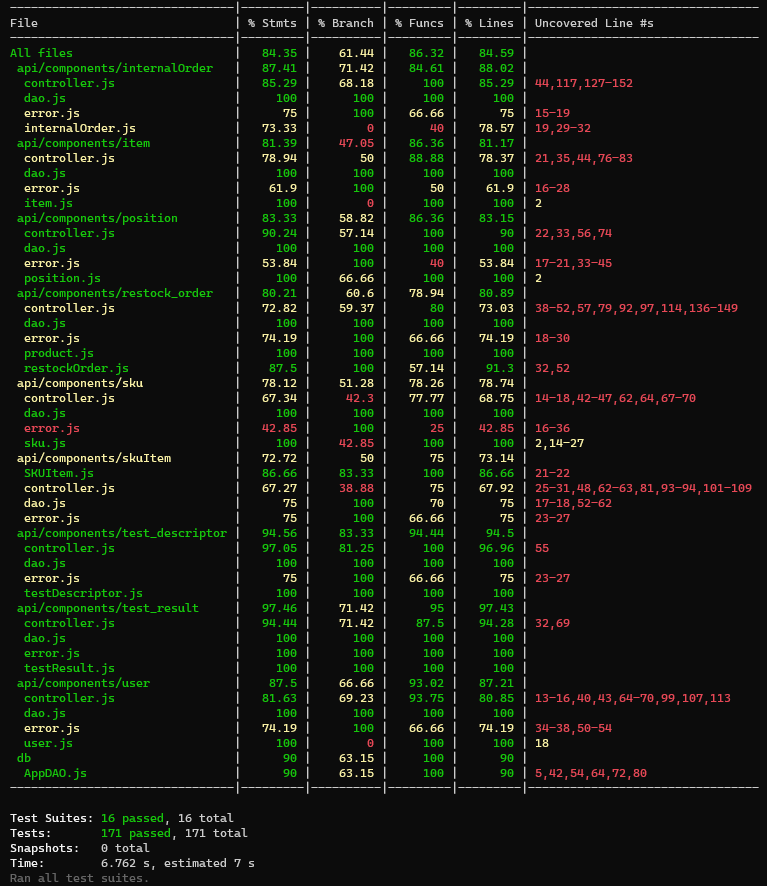

# Unit Testing Report

Date: 25/05/2022

Version: 1.0

# Contents

- [Black Box Unit Tests](#black-box-unit-tests)
- [White Box Unit Tests](#white-box-unit-tests)

# Black Box Unit Tests

### **Class *position.dao* - method *createPosition***

**Criteria for method *createPosition*:**
 - Sign of positionId 
 - number of digits of positionId
 - Sign of aisleId
 - number of digits of aisleId
 - Sign of row
 - number of digits of row
 - Sign of col
 - number of digits of col
 - Sign of maxWeight
 - Sign of maxVolume
 - Sign of occupiedWeight
 - Sign of occupiedVolume
 - OccupiedWeight
 - OccupiedVolume

**Predicates for method *createPosition*:**

| Criteria                      | Predicate             |
| ------------------------------| ----------------------|
|Sign of position ID            | Positive              |
|                               | Negative              |
|Number of digits of positionID | equal to 12           |  
|                               | different than 12     |
|Sign of aisleID                | Positive              |
|                               | Negative              |
|Number of digits of aisleID    | equal to 4            |    
|                               | different than 4      |
|Sign of row                    | Positive              |
|                               | Negative              |
|Number of digits of row        | equal to 4            |   
|                               | different than 4      |
|Sign of col                    | Positive              |
|                               | Negative              |
|Number of digits of col        | equal to 4            |           
|                               | different than 4      |
|Sign of maxWeight              | Positive              |
|                               | Negative              |
|Sign of maxVolume              | Positive              |
|                               | Negative              |
|Sign of occupiedWeight         | Positive              |
|                               | Negative              |
|Sign of occupiedVolume         | Positive              |
|                               | Negative              |
|OccupiedWeight                 | < maxWeight           |
|                               | > maxWeight           |
|OccupiedVolume                 | < maxVolume           |
|                               | > maxVolume           |
 
**Boundaries**:

| Criteria                       | Boundary values        |
| ------------------------------ | -----------------------|
|Sign of positionID              | 0                      |
|Number of digits of positionID  | === 12                 |
|Sign of aisleID                 | 0                      |
|Number of digits of aisleID     | === 4                  |
|Sign of row                     | 0                      |
|Number of digits of row         | === 4                  |
|Sign of col                     | 0                      |
|Number of digits of col         | === 4                  |
|Sign of maxWeight               | 0                      |
|Sign of maxVolume               | 0                      |
|Sign of occupiedWeight          | 0                      |
|Sign of occupiedVolume          | 0                      |
|OccupiedWeight                  | maxWeight              |
|OccupiedVolume                  | maxVolume              |

**Combination of predicates**:

| Sign of positionID | Number of digits of positionID | Sign of aisleID | Number of digits of aisleID | Sign of row  | Number of digits of row  | Sign of col | Number of digits of col | Sign of maxWeight | Sign of maxVolume | Sign of occupiedWeight | Sign of occupiedVolume | OccupiedWeight | OccupiedVolume | Valid / Invalid | Description of the test case | Jest test case |
|-------|-------|-------|-------|-------|-------|-------|-------|-------|-------|-------|-------|-------|-------|-------|-------|-------|
|positive|8|positive |4 |positive|4|positive|4|positive|positive|positive|positive|True|True|Valid|default input| T1("80023454","8002","3454","3412",1000,1000,300,150)|
|positive|12|positive |4 |positive|4|positive|4|positive|positive|positive|positive|True|True|Invalid|shorter position digit| T1("800234543412","8002","3454","3412",1000,1000,300,150)
|positive|12|positive |3 |positive|4|positive|4|positive|positive|positive|positive|True|True|Invalid|shorter aisle digit | T1("800234543412","800","3454","3412",1000,1000,300,150)|
|positive|12|positive |3 |positive|4|positive|4|positive|positive|positive|positive|True|True|Invalid|shorter row digit | T1("800234543412","800","345","3412",1000,1000,300,150)|
|positive|12|positive |3 |positive|4|positive|4|positive|positive|positive|positive|True|True|Invalid|shorter col digit | T1("800234543412","800","3454","412",1000,1000,300,150)|
|positive|12|positive |3 |positive|4|positive|4|positive|positive|positive|positive|True|True|Invalid|maxweight negative | T1("800234543412","800","3454","3412",-1000,1000,300,150)|
|positive|12|positive |3 |positive|4|positive|4|positive|positive|positive|positive|True|True|Invalid|maxvolume negative | T1("800234543412","800","3454","3412",1000,-1000,300,150)|
|positive|12|positive |3 |positive|4|positive|4|positive|positive|positive|positive|True|True|Invalid|occupied>max in weight | T1("800234543412","800","3454","3412",1000,1000,1200,150)|

### **Class *item.dao* - method *modifyItem***

**Criteria for method *modifyItem*:**
 - is_itemID_Present
 - sign of price
 - 

**Predicates for method *modifyItem*:**

| Criteria        | Predicate |
| --------        | --------- |
|is_itemID_present| True      |
|                 | False     |
|sign of price    | Positive  |
|                 | Negative  |

**Boundaries**:

| Criteria            | Boundary values |
| --------            | --------------- |
| Sign of price       |  0              |

**Combination of predicates**:

| is_itemID_present | Sign of Price | Valid / Invalid | Description of the test case | Jest test case |
|-------|-------|-------|-------|-------|
|True|>=0|Valid|Default input where the price is positive and the item we want to modify exists in the database|T2("a new item","10.99","1")|
|True|<0|Invalid|Price is negative|T2("a new item","-10.99","1")|
|False|>=0|Invalid|the item we want to modify is not present in the database since the id is not recognized |T2("a new item","10.99","15")|
|False|<0|Invalid|Item not recognized and price is negative|T2("a new item","-10.99","15")|

### **Class *sku.dao* - method *modifysku***

**Criteria for method *modifysku*:**
 - is_skuID_available
 - sign of newWeight
 - is_newWeight_correct
 - sign of newVolume
 - is_newVolume_Correct
 - sign of new price
 - sign of quantity

**Predicates for method *modifysku*:**

| Criteria              | Predicate             |
| --------              | ---------             |
| is_skuID_available    | True                  |
|                       | False                 |
|sign of newWeight      | Positive              |
|                       | Negative              |
|sign of newVolume      | Positive              |
|                       | Negative              |
|is_newWeight_correct   | True                  |
|                       | False                 |
|is_newVolume_correct   | True                  |
|                       | False                 |
|sign of new price      | Positive              |
|                       | Negative              |
|sign of new quantity   | Positive              |
|                       | Negative              |
|is_position_associated | True                  |
|                       | False                 |

**Boundaries**:

| Criteria                      | Boundary values |
| --------                      | --------------- |
|sign of newWeight              | 0               |
|sign of newVolume              | 0               |
|sign of new price              | 0               |
|sign of new quantity           | 0               |

**Combination of predicates**:

| is_skuID_available | sign of newWeight  | sign of newVolume | is_newWeight_correct | sign of newVolume | is_newVolume_Correct | sign of new price | sign of new quantity |is_position_associated| Valid / Invalid | Description of the test case | Jest test case |
|-------|-------|-------|-------|-------|-------|-------|-------|-------|-------|-------|-------|
|True|Positive|Positive|True|Positive|True|Positive|Positive|True|Valid|Default Input|T3(3,"a new description",11,10,"a new note",13.20, 10)|
|False|Positive|Positive|True|Positive|True|Positive|Positive|True|Invalid|the SKU demanded is not available in the database |T3(33,"a new description",11,10,"a new note",13.20, 10)|
|True|Positive|Positive|False|Positive|True|Positive|Positive|True|Invalid|The value of the modified weight is greater than the maximum weight|T3(3,"a new description",1000,10000,"a new note",13.20, 10)|
|True|Positive|Positive|True|Positive|False|Positive|Positive|True|Valid|The volume exceedes of values |T3(3,"a new description",1000,1000,"a new note",13.20, 10)|

### **Class *user.dao* - method *deleteUser***

**Criteria for method *deleteuser*:**
 - Username_exist
 - type_exist
 - 

**Predicates for method *deleteUser*:**

| Criteria | Predicate |
| -------- | --------- |
| Username_exist         | True          |
|                        | False         |
| type_exist             | True          |
|                        | False         |

**Boundaries**:

| Criteria | Boundary values |
| -------- | --------------- |
|          |                 |
|          |                 |

**Combination of predicates**:

| Useername_exist | type_exist | Valid / Invalid | Description of the test case | Jest test case |
|-------|-------|-------|-------|-------|
|True|True|Valid|Generic input |T4("user1@ezwh.com","customer")|
|True|False|Invalid|the type searched is not found in the database or the username and type do not martch|T4("user1@ezwh.com","example")|
|False|True|Invalid|the username searched is not found in the databse|T4("user4564564541@ezwh.com","customer")|
|False|False|Invalid|The username and type are not found in the database|T4("user15345@ezwh.com","employee")|

### **Class *skuitem.dao* - method *createSKUItem***

**Criteria for method *createSKUItem*:
 -Sign of RFID
 -Length of RFID
 -Format of Date
 -Sign of SKUID 
- 

**Predicates for method *createSKUItem*:**

| Criteria | Predicate |
| -------- | --------- |
| Sign of RFID       | Positive          |
|                    | Negative          |
| Length of RFID     | equal 32 digits   |
|                    | different from 32 digits |
| Format of date     | True              |
|                    | False             |
| Sign of SKUID      | Positive          | 
|                    | Negative          | 

**Boundaries**:

| Criteria              | Boundary values |
| --------              | --------------- |
| Sign of RFID          |  0              |
| Length of RFID        |  32 digits      |
| Sign of SKUID         |  0              |

**Combination of predicates**:

| Sign of RFID | Length of RFID | Format of Date | Sign of SKUID | Valid / Invalid | Description of the test case | Jest test case |
|-------|-------|-------|-------|-------|-------|-------|
|Positive| 32 | True | Positive | Valid | Default Input | T5("12341234123412341234123412341234", 1, "2022/02/02")|
|Negative| 32 | True | Positive | Invalid | RFID is negative| T5("-12341234123412341234123412341234", 1, "2022/02/02")|
|Positive| 30 | True | Positive | Invalid | RFID is not 32 digits | T5("123412341234123412341234123412", 1, "2022/02/02")|
|Positive| 32 | False | Positive | Invalid | The format of the date is wrong | T5("12341234123412341234123412341234", 1, "2022-02-02")|
|Positive| 32 | True | Negative | Invalid | SKUID is negative | T5("12341234123412341234123412341234", -1, "2022/02/02")|

### **Class *test_descriptor.dao* - method *modifyTestDescriptor***

**Criteria for method *modifyTestDescriptor*:**
 - Sign of TestDescriptorID
 - Sign of SKUID
 - 

**Predicates for method *modifyTestDescriptor*:**

| Criteria                        | Predicate |
| --------                        | --------- |
| Sign of TestDescriptorID        |Positive   |
|                                 | Negative  |
| Sign of SKUID                   | Positive  |
|                                 | Negative  |

**Boundaries**:

| Criteria                      | Boundary values |
| --------                      | --------------- |
| Sign of TestDescriptorID      |  0              |
| Sign of SKUID                 |  0              |

**Combination of predicates**:

| Sign of TestDescriptorID | sign of SKUID |Valid / Invalid | Description of the test case | Jest test case |
|-------|-------|-------|-------|-------|
|Positive | Positive | Valid | Default Input | T6(null, "test test descriptor", "test test descriptor", null)|
|Positive| Negative | Invvalid | SKUID is negative | T6(null, "test test descriptor", "test test descriptor", -1) |
|Negative | Positive | Invalid | TestDescriptorID is negative |T6(-1, "test test descriptor", "test test descriptor", null)|
|Negative| Negative | Invalid | TestDescriptorID is negative and SKUID is negative | T6(-1, "test test descriptor", "test test descriptor", -1)|

### **Class *test_result.dao* - method *createTestResult***

**Criteria for method *modifyTestDescriptor*:**
 - Sign of TestDescriptorID
 - Sign of RFID
 - Length of RFID
 - Format of date
 - 

**Predicates for method *createTestResult*:**

| Criteria                        | Predicate |
| --------                        | --------- |
| Sign of TestDescriptorID        | Positive  |
|                                 | Negative  |
| Sign of RFID                    | Positive  |
|                                 | Negative  |
| Length of RFID                  | equal 32 digits|
|                                 | different from 32 digits |
| Format of date                  | True              |
|                                 | False             |

**Boundaries**:

| Criteria                      | Boundary values |
| --------                      | --------------- |
| Sign of TestDescriptorID      |  0              |
| Sign of RFID                  |  0              |
| Length of RFID                |  32 digits      |

**Combination of predicates**:

| Sign of TestDescriptorID | sign of RFID | Length of RFID | Format of date |Valid / Invalid | Description of the test case | Jest test case |
|-------|-------|-------|-------|-------|-------|-------|
|Positive | Positive | 32 | True | Valid | Default Input | T7(null, "2022/02/02", true, null, skuItem.RFID)|
|Negative | Positive| 32 | True | Invvalid | TestDescriptorID is negative | T7(null, "2022/02/02", true, -1, skuItem.RFID) |
| Positive | Positive| 30 | True | Invalid | Length of RFID is not 32 |T7(null, "2022/02/02", true, null, skuItem.RFID)|
|Positive | Positive | 32 | False | Invalid | Form of date is wrong | T7(null, "2022-02-02", true, null, skuItem.RFID)|

### **Class *internalOrder.dao* - method *modifyStateInternalOrder***

**Criteria for method *modifyTestDescriptor*:**
 - Sign of InternalOrderID
 - State_is_present
 - Date Format

**Predicates for method *modifyStateInsternalOrder*:**

| Criteria                        | Predicate |
| --------                        | --------- |
| Sign of InternalOrder ID        | Positive  |
|                                 | Negative  |
| State_is_present                | True              |
|                                 | False             |
| Date Format                     | True              |
|                                 | False             |

**Boundaries**:

| Criteria                      | Boundary values |
| --------                      | --------------- |
| Sign of InternalOrderID       |  0              |

**Combination of predicates**:

| Sign of InternalOrderID | State_is_present |Date Format|Valid / Invalid | Description of the test case | Jest test case |
|-------|-------|-------|-------|-------|-------|
|Positive | True | True |Valid | Default Input | T8(null, "2022/11/04 05:30", "ISSUED", [{"SKUId":3138,"description":"a product","price":10.99,"qty":3},{"SKUId":3139,"description":"another product","price":11.99,"qty":3}], 1)|
|Negative | True | True | Invvalid |sign of internal order is negative | T8(-1, "2022/11/04 05:30", "ISSUED",[{"SKUId":3138,"description":"a product","price":10.99,"qty":3},{"SKUId":3139,"description":"another product","price":11.99,"qty":3}], 1) |
| Positive | True | False | Invalid | Wrong Format of date |T8(null, "2022-11-04 05:30", "ISSUED", [{"SKUId":3138,"description":"a product","price":10.99,"qty":3},{"SKUId":3139,"description":"another product","price":11.99,"qty":3}], 1)|
|Positive | False | True | InValid | Not found state |T8(null, "2022/11/04 05:30", "SOLD",[{"SKUId":3138,"description":"a product","price":10.99,"qty":3}, {"SKUId":3139,"description":"another product","price":11.99,"qty":3}], 1)|

# White Box Unit Tests

### Code coverage report

### Loop coverage analysis

|Unit name | Loop rows | Number of iterations | Jest test case |
|---|---|---|---|
|buildInternalOrders(rows)|104-122|//|internalOrder.test.js -->"Get All Internal Orders"|
|buildRestockOrders(rows)|126-151|//|restockOrder.test.js -->""Get All Restock Orders"|
||||||

