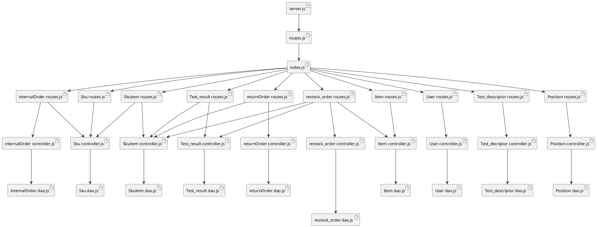

# Integration and API Test Report

Date: 25/05/2022

Version: 1.0

# Contents

- [Dependency graph](#dependency graph)

- [Integration and API Test Report](#integration-and-api-test-report)
- [Contents](#contents)
- [Dependency graph](#dependency-graph)
- [Integration approach](#integration-approach)
- [Integration Tests](#integration-tests)
  - [Step 1](#step-1)
  - [Step 2](#step-2)
  - [Step 3](#step-3)
- [API testing - Scenarios](#api-testing---scenarios)
  - [Scenario UCx.y](#scenario-ucxy)
- [Coverage of Scenarios and FR](#coverage-of-scenarios-and-fr)
- [Coverage of Non Functional Requirements](#coverage-of-non-functional-requirements)
    - 

- [Tests](#tests)

- [Scenarios](#scenarios)

- [Coverage of scenarios and FR](#scenario-coverage)
- [Coverage of non-functional requirements](#nfr-coverage)

# Dependency graph 

     
# Integration approach

The integration sequence we adopted is bottom-up. We started with unit-testing, where we tested leaf classes and their methods (Sku, Skuitem,user...), including the DB class (SQLiteDB). These test are documented in UnitTestReport.md. Then, we proceeded to test some middleware classes (such as InternalOrder,testdesciptor,testresult,...), followed by the API testing Which is based on testing some classes like internalOrderRouter,restockOrderRouter.

#  Integration Tests

Jest test cases are in: code/server/unit_test

## Step 1
| Classes  | mock up used |Jest test cases |
|--|--|--|
|Sku.dao|--|sku.test.js-->"Create Sku"|
|--|--|sku.test.js-->"Add Position to a inexistent Sku"|
|          |              |sku.test.js-->"Add inexistent Position to a Sku"|
|--|--|sku.test.js-->"Add a not occupied Position to Sku without a previous Position"|
|--|--|sku.test.js-->"Add occupied Position to Sku without a previous Position"|
|--|--|sku.test.js-->"Add Position to Sku with a previous Position"|
|--|--|sku.test.js-->"Add a Position to a Sku with Weight exceeding"|
|--|--|sku.test.js-->"Add a Position to a Sku with Volume exceding"|
|--|--|sku.test.js-->"Modify inexistent Sku"|
|--|--|sku.test.js-->"Modify Sku with no related Position"|
|--|--|sku.test.js-->"Modify Sku with a Position associated"|
|--|--|sku.test.js-->"Modify Sku with a Position associated exceeding Weight"|
|--|--|sku.test.js-->"Modify Sku with a Position associated exceeding Volume"|
|--|--|sku.test.js-->"Delete inexistent Sku"|
|--|--|sku.test.js-->"Delete existent Sku"|
|skuitem.dao|--|skuitem.test.js-->"Create SKUItem after check SKUId"|
|--|--|skuitem.test.js-->"Modify SKUItem after create"|
|--|--|skuitem.test.js-->"Delete inexistent SkuItem"|
|--|--|skuitem.test.js-->"Delete SKUItem after create"|
|user.dao|--|user.test.js-->"Create User"|
|--|--|user.test.js-->"Modify inexistent User"|
|--|--|user.test.js-->"Modify User"|
|--|--|user.test.js-->"Check inexistent User"|
|--|--|user.test.js-->"Check inexistent User"|
|--|--|user.test.js-->"Delete inexistent User"|
|--|--|user.test.js-->"Delete User"|
|testdescriptor.dao|--|testDescriptor.test.js --> "Get All Test Descriptors"|
|--|--|testDescriptor.test.js --> "Get Test Descriptor by Id"|
|--|--|testDescriptor.test.js --> "Creating Test Descriptor"|
|--|--|testDescriptor.test.js --> "Create test descriptor with inexistent sku"|
|--|--|testDescriptor.test.js --> "Create test descriptor with sku with an already assigned one"|
|--|--|testDescriptor.test.js --> "Create test descriptor"|
|--|--|testDescriptor.test.js --> "Modifing test descriptor"|
|--|--|testDescriptor.test.js --> "Modify test descriptor fields"|
|--|--|testDescriptor.test.js --> "Modify not existent test descriptor"|
|--|--|testDescriptor.test.js --> "Modify Test Descriptor with already assigned Sku"|
|--|--|testDescriptor.test.js --> "Deleting test descriptor"|
|--|--|testDescriptor.test.js --> "Deleting inexistent test descriptor"|
|testresult.dao|--|testResult.test.js --> "Get All Test Results"|
|--|--|testResult.test.js --> "Get Test Result"|
|--|--|testResult.test.js --> "Get inexistent Test Result"|
|--|--|testResult.test.js --> "Create Test Result with inexistent Test Descriptor"|
|--|--|testResult.test.js --> "Creating test result"|
|--|--|testResult.test.js --> "Modify existing test result"|
|--|--|testResult.test.js --> "Modifying Test Result with not existing Test Descriptor"|
|--|--|testResult.test.js --> "Modifying not existing Test Result"|
|--|--|testResult.test.js --> "Delete existing test result"|
|--|--|testResult.test.js --> "Delete not existing test result"|
|internalorder.dao|--|internalOrder.test.js --> "Create Internal Order with inexistent customer"|
|--|--|internalOrder.test.js --> "Create Internal Order with inexistent Sku"|
|--|--|internalOrder.test.js --> "Create valid Internal Order"|
|--|--|internalOrder.test.js --> "Modify inexistent Internal Order"|
|--|--|internalOrder.test.js --> "Modify Internal Order into COMPLETED state with inexistent Sku Items"|
|--|--|internalOrder.test.js --> "Modify Internal Order into a basic state "|
|--|--|internalOrder.test.js --> "Modify Internal Order into COMPLETED state with valid Sku Items"|
|--|--|internalOrder.test.js --> "Delete inexistent Internal Order"|
|--|--|internalOrder.test.js --> "Delete Internal Order after create"|
|restockorder.dao|--|restockOrder.test.js --> "Create a Restock Order"|
|--|--|restockOrder.test.js --> "Modify State of inexistent Restock Order"|
|--|--|restockOrder.test.js --> "Modify State of Restock Order"|
|--|--|restockOrder.test.js --> "Modify Sku Item list with valid Sku Items"|
|--|--|restockOrder.test.js --> "Modify Sku Item list of inexistent Restock Order"|
|--|--|restockOrder.test.js --> "Modify Sku Item list with inexistent Sku Items"|
|--|--|restockOrder.test.js --> "Modify Transport Note with Delivery Date before Issue Date"|
|--|--|restockOrder.test.js --> "Modify Transport Note of inexistent Restock Order"|
|--|--|restockOrder.test.js --> "Modify with valid Transport Note"|
|--|--|restockOrder.test.js --> "Delete Restock Order with inexistent id"|
|--|--|restockOrder.test.js --> "Delete valid Restock Order"|

## Step 2
| Classes  | mock up used |Jest test cases |
|--|--|--|
|Sku.controller|--|sku.test.js-->"Get All SKUs"|
|--|--|sku.test.js-->"Get SKUs by ID"|
|--|--|sku.test.js-->"Create valid SKU"|
|--|--|sku.test.js-->"Modify inexistent SKU"|
|--|--|sku.test.js-->"Add or modify position of a SKU"|
|--|--|sku.test.js-->"Add or modify position that does not exist of a SKU"|
|--|--|sku.test.js-->"Add or modify position of a SKU that does not exist"|
|--|--|sku.test.js-->"Delete inexistent SKU"|
|--|--|sku.test.js-->"Delete SKU t"|
|InternalOrder.controller||internalOrder.test.js -->"Create valid Internal Order"|
|--||internalOrder.test.js -->"Get All Internal Orders"|
|--|--|internalOrder.test.js -->"Get All ACCEPTED Internal Orders"|
|--|--|internalOrder.test.js -->"Get All ISSUED Internal Orders"|
|--|--|internalOrder.test.js -->"Get Internal Order by ID"|
|--|--|internalOrder.test.js -->"Create Restock Order with invalid Sku"|
|--|--|internalOrder.test.js -->"Create Restock Order with inexistent Customer"|
|--|--|internalOrder.test.js -->"Create valid Internal Order"|
|--|--|internalOrder.test.js -->"Modify Internal Order into COMPLETED state without products"|
|--|--|internalOrder.test.js -->"Modify Internal Order into COMPLETED state with inexistent Sku Items"|
|--|--|internalOrder.test.js -->"Modify inexistent Internal Order"|
|--|--|internalOrder.test.js -->"Modify Internal Order into a basic state "|
|--|--|internalOrder.test.js -->"Modify Internal Order into COMPLETED state with valid Sku Items"|
|--|--|internalOrder.test.js -->"Delete valid Internal Order"|
|--|--|internalOrder.test.js -->"Delete inexistent internal Order"|
|skuitem.controller|--|skuitem.test.js-->"Get All SKUItems"|
|--|--|skuitem.test.js-->"Get SKUItems by ID"|
|--|--|skuitem.test.js-->"Create invalid SKUItem"|
|--|--|skuitem.test.js-->"Create valid SKUItem"|
|--|--|skuitem.test.js-->"Create double SKUItem"|
|--|--|skuitem.test.js-->"Modify inexistent SKUItem"|
|--|--|skuitem.test.js-->"Modify valid SKUItem"|
|--|--|skuitem.test.js-->"Modify SKUItem with a RFID that already exist"|
|--|--|skuitem.test.js-->"Delete inexistent SKUitem"|
|--|--|skuitem.test.js-->"Delete SKUItem"|
|testdescriptor.controller|--|testDescriptor.test.js -->"Get all Test Descriptors"|
|--|--|testDescriptor.test.js -->"Get Test Descriptor by Id"|
|--|--|testDescriptor.test.js -->"Get inexistent Test Descriptor"|
|--|--|testDescriptor.test.js -->"Create a valid test descriptor"|
|--|--|testDescriptor.test.js -->"Create an invalid test descriptor (SKU not found)"|
|--|--|testDescriptor.test.js -->"Create an invalid test descriptor (provided SKU already assigned)"|
|--|--|testDescriptor.test.js -->"Modify test descriptor with an invalid id"|
|--|--|testDescriptor.test.js -->"Modify test descriptor with an invalid SKUId"|
|--|--|testDescriptor.test.js -->"Modify test descriptor of a SKU that have already a Test Descriptor"|
|--|--|testDescriptor.test.js -->"Delete test descriptor"|
|--|--|testDescriptor.test.js -->"Delete inexistent test descriptor"|
|testresult.controller|--|testResult.test.js -->"Get All Test Result"|
|--|--|testResult.test.js -->"Get Test Result by RFID and ID"|
|--|--|testResult.test.js -->"Create valid Test Result"|
|--|--|testResult.test.js -->"Create Test Result with inexistent Test Descriptor"|
|--|--|testResult.test.js -->"Modify inexistent Test Result"|
|--|--|testResult.test.js -->"Modify Test Result with inexistent Sku Item"|
|--|--|testResult.test.js -->"Modify Test Result with inexistent Test Descriptor"|
|--|--|testResult.test.js -->"Modify Test Result with all valid parameters"|
|--|--|testResult.test.js -->"Sku Item has some failed Test Result"|
|--|--|testResult.test.js -->"Sku Item has no failed Test Result"|
|restockorder.controller|--|restockOrder.test.js -->"Create Restock Order with invalid Item"|
|--|--|restockOrder.test.js -->"Create Restock Order"|
|--|--|restockOrder.test.js -->"Get All Restock Orders"|
|--|--|restockOrder.test.js -->"Get All ISSUED Restock Orders"|
|--|--|restockOrder.test.js -->"Get Restock Order by Id"|
|--|--|restockOrder.test.js -->"Create Restock Order with invalid Item"|
|--|--|restockOrder.test.js -->"Modify State of inexistent Restock Order"|
|--|--|restockOrder.test.js -->"Modify State of valid Restock Order"|
|--|--|restockOrder.test.js -->"Modify Sku Item list of Restock Order"|
|--|--|restockOrder.test.js -->"Modify Sku Item list of inexistent Restock Order"|
|--|--|restockOrder.test.js -->"Modify Sku Item list of Restock Order not in DELIVERED state"|
|--|--|restockOrder.test.js -->"Modify Sku Item list of Restock Order with invalid ones"|
|--|--|restockOrder.test.js -->"Modify Sku Item list with valid Sku Items"|
|--|--|restockOrder.test.js -->"Modify Transport Note of inexistent Restock Order"|
|--|--|restockOrder.test.js -->"Modify Transport Note of Restock Order not in DELIVERY state"|
|--|--|restockOrder.test.js -->"Modify Transport Note with Delivery Date before Issue Date"|
|--|--|restockOrder.test.js -->"Modify with valid Transport Note"|
|user.controller|--|user.test.js --> "Login Supplier" |
|--|--|user.test.js -->"Login Manager"|
|--|--|user.test.js -->"Login Quality Office"|
|--|--|user.test.js -->"Login Delivery Office"|
|--|--|user.test.js -->"Login Quality Office"|
|--|--|user.test.js -->"Get All Users"|
|--|--|user.test.js -->"Get All Suppliers"|
|--|--|user.test.js -->"Create valid User"|
|--|--|user.test.js -->"Create the same User two time"|
|--|--|user.test.js -->"Modify inexistent User"|
|--|--|user.test.js -->"Modify valid User with inexistent type|
|--|--|user.test.js -->"Modify valid User"|
|--|--|user.test.js -->"Check valid User"|
|--|--|user.test.js -->"Check invalid User"|
|--|--|user.test.js -->"Delete inexistent user"|
|--|--|user.test.js -->"Delete User"|
|item.controller|--|item.test.js --> "Get All Items"|
|--|--|item.test.js -->"Get Item by ID"|
|--|--|item.test.js -->"Create valid Item"|
|--|--|item.test.js -->"Create valid Item with invalid SKUID"|
|--|--|item.test.js -->"Create valid Item with invalid supplierID"|
|--|--|item.test.js -->"Modify inexistent Ite "|
|--|--|item.test.js -->"Delete inexistent Item"|
|--|--|item.test.js -->"Delete SKUItem"|
|position.controller|--|position.test.js --> "Get All Position"|
|--|--|position.test.js --> "Get Position by ID"|
|--|--|position.test.js --> "Create valid Position"|
|--|--|position.test.js --> "Create two time the same Position"|
|--|--|position.test.js --> "Modify SKU"|
|--|--|position.test.js --> "Modify inexistent Position"|
|--|--|position.test.js --> "Modify valid Position"|
|--|--|position.test.js --> "Modify Position ID"|
|--|--|position.test.js --> "Modify invalid Position ID"|
|--|--|position.test.js --> "Delete SKU"|
|--|--|position.test.js --> "Delete Position"|

## Step 3 

| Classes  | mock up used |Chai test cases |
|--|--|--|
|internalorderRouter.js|--|"Get Internal Order by Id"|
|--|--|"Create Internal Order"|
|--|--|"Modify State of inexistent Internal Order"|
|--|--|"Modify State (COMPLETED) of inexistent Internal Order"|
|--|--|"Modify State of Internal Order"|
|--|--|"Modify State (COMPLETED) of Internal Order"|
|--|--|"Delete inexistent Restock Order"|
|--|--|"Delete Restock Order"|
|restockorderrouter.js|--|"Get Restock Order by Id"|
|--|--|"Create Restock Order"|
|--|--|"Modify State of inexistent Restock Order"|
|--|--|"Modify State of Restock Order"|
|--|--|"Modify Sku Items list"|
|--|--|"Modify Sku Item list of inexistent Restock Order"|
|--|--|"Modify Sku Item list of Restock Order not in DELIVERED state"|
|--|--|"Modify Sku Item list with inexistent Sku Items"|
|--|--|"Modify Sku Item list with valid Sku Items"|
|--|--|"Modify Transport Note of inexistent Restock Order"|
|--|--|"Modify Transport Note of Restock Order not in DELIVERY state"|
|--|--|"Modify Transport Note with Delivery Date before Issue Date"|
|--|--|"Modify with valid Transport Note"|
|--|--|"Delete inexistent Restock Order"|
|--|--|"Delete Restock Order"|
|--|--|--|

# API testing - Scenarios

# Coverage of Scenarios and FR

| Scenario ID | Functional Requirements covered |   Test(s)      | 
| ----------- | ------------------------------- | -----------         | 
|  1-1        | FR2.1                             |"Create Sku"         |             
|  1-2        | FR2.1                             |"Modify Sku location"|             
|  1-3        |                                 |"Modify Sku weight and volume"|             
|  2-1        | FR3.1.1                                |"Create Position"    |             
|  2-2        | FR3.1.1                                |"Modify positionID of P" |             
|  2-3        | FR3.1.4                                |"Modify weight and volume of P"    |     
|  2-4        | FR3.1.4                                |"Modify aisle ID, row and column of P"             |
|  2-5        | FR3.1.2                                |"Delete position P"  |
|  3-1        | FR5.6                                |"Restock Order of SKU S issued by quantity / by supplier"             |
|  3-2        | FR5.6                                |"Restock Order of SKU S issued by quantity / by supplier"             |
|  4-1        | FR1.1                                |"Create user and define rights"             |
|  4-2        | FR1.1                               |"Modify user rights"             |        
|  4-3        | FR1.2                                |"Delete user"        |
|  5-1-1      | FR5.8                                |"Record restock order arrival"             |
|  5-2-1      | FR5.8                                |"Record positive and/or negative test results of all SKU items of a RestockOrder"             |
|  5-2-2      | FR5.8                                |"Record positive and/or negative test results of all SKU items of a RestockOrder"             |
|  5-2-3      | FR5.8.2                                |"Record positive and/or negative test results of all SKU items of a RestockOrder"             |
|  5-3-1      | FR5.8.3                                |"Stock all SKU items of a RO"             |
|  5-3-2      | FR5.8.3                                |"Stock zero SKU items of a RO"             |
|  5-3-3      | FR5.8.3                                |"Stock some SKU items of a RO"             |
|  9-1        | FR6.1                                |"Create Internal Order"             |
|  9-2        | FR6.6                                |"Create and Refuse Internal Order"             |
|  9-3        | FR6.4                                |"Create and Delete Internal Order"             |
| 10-1        | FR6.7                                |"Internal Order IO Completed"             |
| 11-1        | FR7                                |"Create Item I"            |
| 11-2        | FR7                                |"Modify Item description and price"             |
| 12-1        | FR3.2.1                                |"Create test description"             |
| 12-2        | FR3.2.2                                |"Update test description"             |
| 12-3        | FR3.2.3                                |"Delete test description"             |
